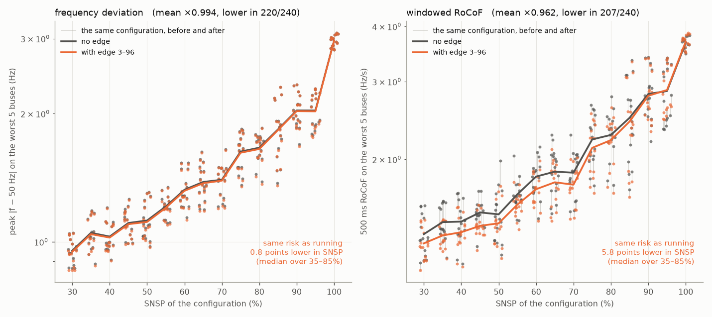
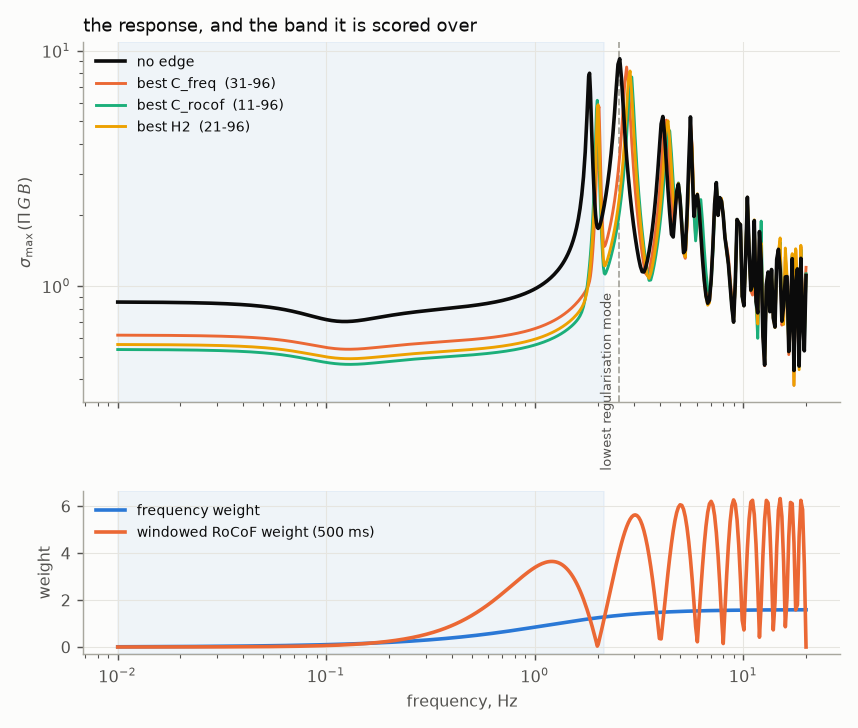
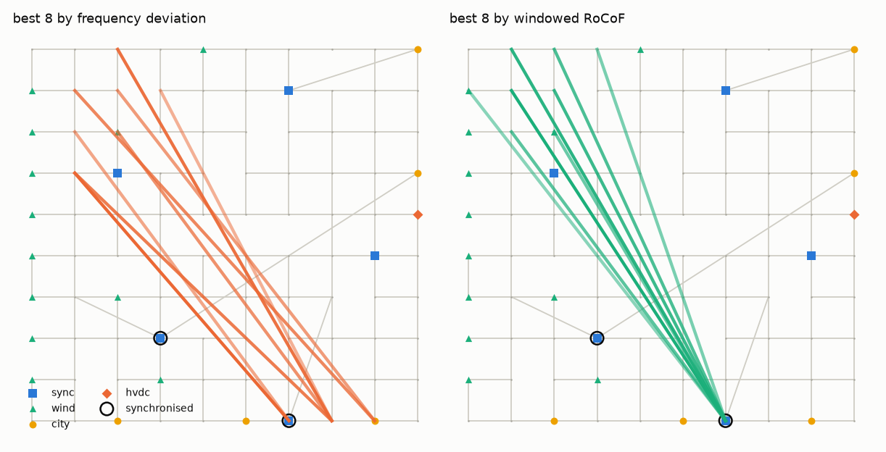
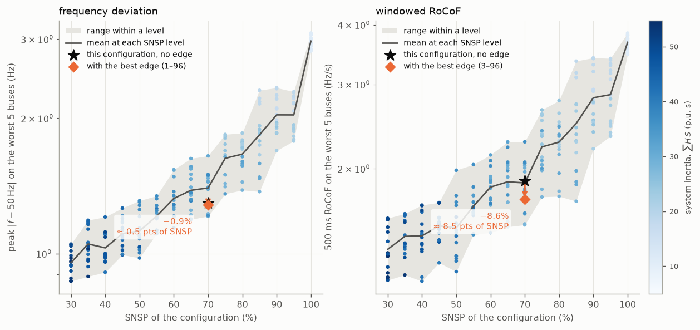
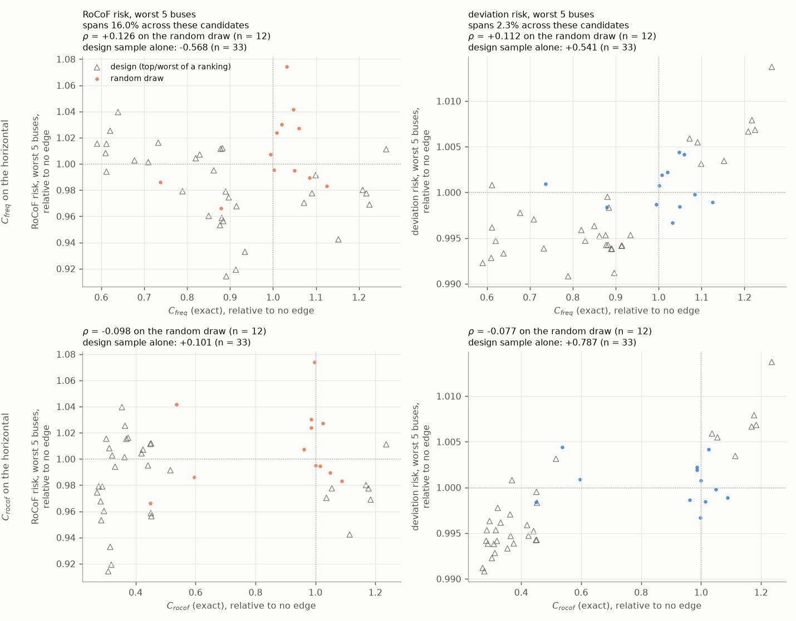
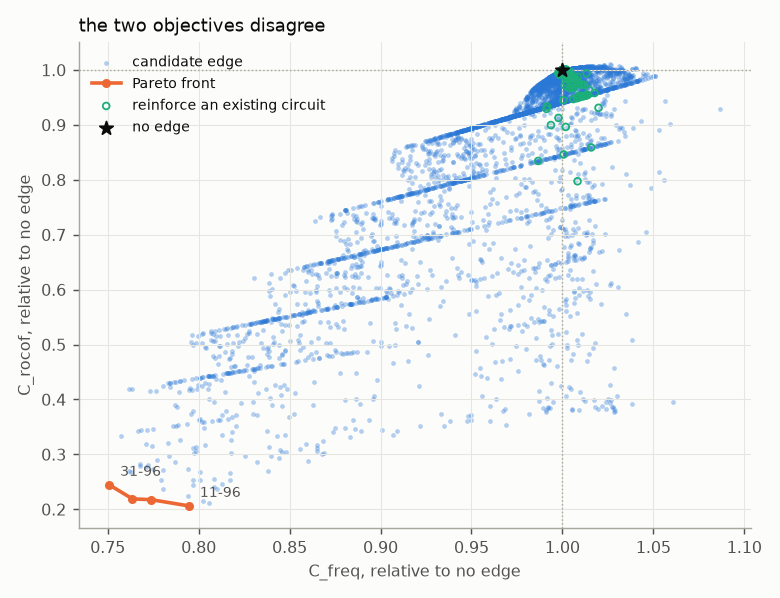

# Where should the one new line go?

Given a grid, a fixed operating point, and permission to build **exactly one**
new circuit of fixed strength κ — which pair of buses should it join, and how
much does the choice actually buy?

Asked on the same frozen 10×10 caricature of the all-island system the
[SNSP investigation](../snsp) runs on, so that an answer here is comparable with
what that study already knows about this grid. There are 4 950 pairs of buses;
166 are already joined, leaving **4 784 genuinely new edges** and 166
reinforcements of existing circuits as a separate comparison class.

The design follows [`../kuramoto_edge_placement_spec.md`](../kuramoto_edge_placement_spec.md);
the places this implementation departs from it are in
[Departures from the spec](#departures-from-the-spec).

## Two quantities, and why they do not share a letter

|  | what it is | where it comes from |
|---|---|---|
| **cost, `C`** | an H_∞ peak of the disturbance-to-frequency gain: `max_ω |Ω(ω)| σ_max(Π G(iω) B)` | the Green's function, [`sweep.py`](sweep.py) |
| **risk, `R`** | what the grid actually does: 500 ms RoCoF and peak `|f−50|` at the **five worst buses**, averaged over events | the full time-domain response, [`nonlinear.py`](nonlinear.py) |

The cost is cheap — about 0.5 s for all 4 950 candidates at one frequency — which
is the only reason an exhaustive search is possible. **It is not a risk.** It is
a quantity we reason physically *ought* to correlate with risk, and stage 5 is
where that reasoning gets tested rather than assumed.

`R_rocof5` and `R_dev5` are the vertical axes of
[`../snsp/figures/fig11_topbus_vs_predictor.png`](../snsp/figures/fig11_topbus_vs_predictor.png)
— the quantities that study drew its conclusions on, and therefore the ones an
added edge has to be judged against. Single-worst-bus versions are carried
alongside, because a grid code binds on one bus.

**Headline.** The best edge is a long line from the north-west corner into
**bus 96, the largest synchronous machine**. Built once and applied to **all 240
operating states** of the SNSP ensemble, it lowers worst-five-bus RoCoF in 207 of
them — by 3.9% on average, 8.6% at the configuration it was chosen on. That gain
is what **running 5.8 points lower in SNSP** would have bought. Worst-five-bus
frequency deviation barely moves (0.6%, equivalent to 0.8 points).

**The cost gets this backwards**: every variant of `C` tracks the deviation risk
well (ρ up to +0.85) and the RoCoF risk not at all (ρ between −0.22 and +0.14) —
it is well correlated with the risk an edge cannot move, and uncorrelated with
the risk it can. And the benefit vanishes above 85% SNSP, where the machine it
attaches to is often not running.

*SNSP itself does not move.* The dispatch is frozen and the share is computed
from the dispatch alone, so an added edge cannot touch it — verified identical to
0.000e+00 across all 240 states. Every comparison below is strictly vertical,
configuration by configuration; the "points of SNSP" readings are equivalences,
not movements.



## Why there is a band at all, and why it decides the answer

This is the part of the procedure easiest to mistake for a tuning knob.

**The band is part of the definition of the cost, not a parameter of it.** An
H_∞ norm *is* a maximum over frequency; `max_ω` is meaningless until you say
which ω are admitted. The reason to take a maximum at all is that the spectral
content of the disturbance is unknown — the worst case for a bounded input of
unknown shape is the largest gain the system has anywhere the input might live.
(If you *did* know the spectrum, the right object is an integral against it:
that is H₂, computed here too.) So a band is unavoidable, and it encodes a
modelling claim: *these are the frequencies at which a disturbance might have
power and at which the model is telling the truth.*

**It decides the answer because the gain is not flat.** σ_max(ω) is a resonance
spectrum. A maximum over such a function is, near enough, *the height of the
tallest resonance admitted*. Moving the band edge across a resonance does not
perturb the cost — it re-points it at a different mode, and a different mode
means a different physical mechanism and a different best edge. **The band is the
switch that selects which oscillation the optimiser is asked to suppress.**

**On this grid the switch sits between physics and numerics.** `../snsp` gives an
algebraic bus a small regularising mass so the equations stay an ODE. 93 of the
100 buses carry M ≈ 6×10⁻⁴ and ring against their own circuits at √(K/M),
populating everything above ~2.5 Hz with modes a real converter bus does not
have. A time-domain integral barely weights them — that study ran these same
buses throughout without trouble — but an H_∞ peak seeks out the largest gain in
the band and lands on one. [`base.artefact_floor`](base.py) runs the diagnostic:
a regularisation mode scales as 1/√M and runs away as the regularising mass is
reduced, a physical mode converges.

| mode at H | at H/2 | at H/4 | verdict |
|---|---|---|---|
| 0.086 Hz | 0.091 | 0.093 | physical |
| 1.827 Hz | 1.884 | 1.909 | physical (converging) |
| 2.543 Hz | 3.365 | 4.574 | **regularisation** (≈ 1/√M) |
| 4.10 Hz | 5.771 | — | regularisation |

The band is cut automatically at the geometric mean of the highest physical and
the lowest regularisation mode — **0.01–2.155 Hz**. Scored to 5 or 20 Hz instead,
the no-edge peak moves to 2.556 Hz and the ranking is not perturbed but
**unrelated**: ρ = 0.337 on `C_freq`, **−0.063** on `C_rocof`, 0/10 top-ten
overlap, different winner. The 5 Hz and 20 Hz rows are identical to each other,
because both admit the same tallest artefact.



## What was found

### 1. Every good candidate is the same edge, and it goes to the machine



Almost all of the best candidates under either cost end at bus 96 or its
neighbour 97 — the synchronous machine at (9,6) carrying H = 4 s. The other end
is always the north-west corner, rows 0–4 of columns 0–2, where the radial wind
spurs are. The H_∞ peak at 1.827 Hz *is* the mode in which bus 96 swings against
the rest of the system, so the cost's whole answer is "tie the far corner to the
biggest mass". This configuration has only **two** physical modes below the
regularisation floor, which is why the answer is so monolithic.

### 2. One edge buys 8.6% of RoCoF risk and 1% of deviation risk

| risk measure | no edge | best of 45 | worst of 45 | best edge |
|---|---|---|---|---|
| `R_rocof5`, 500 ms RoCoF, worst 5 buses | 1.8860 Hz/s | **×0.9142** | ×1.0741 | 3–96 |
| `R_dev5`, peak \|f−50\|, worst 5 buses | 1.2959 Hz | ×0.9908 | ×1.0137 | 1–96 |
| RoCoF, single worst bus | 0.4054 Hz/s | ×0.9178 | ×1.0958 | 3–96 |
| peak \|f−50\|, single worst bus | 0.2777 Hz | ×0.9923 | ×1.0093 | 1–96 |
| nadir, worst 5 buses | 1.2093 Hz | ×0.9902 | ×1.0140 | 1–96 |
| `J`, the SNSP functional | 1271.8 Hz²s | ×0.9595 | ×0.9975 | 10–96 |

For this configuration alone, read sideways against the ensemble mean curve, the
RoCoF gain is what **8.5 points of SNSP** would have bought and the deviation gain
half a point — the framing the local-effects study found landed best, because
points of SNSP are curtailment.



The asymmetry has a clean explanation. Frequency deviation is dominated by the
common-mode droop offset ΔP/Σ(D + droop/ω_s), which is topology-independent by
construction and which no edge can touch. What an edge changes is the
*differential* motion between buses, and that is what a 500 ms RoCoF at the worst
buses measures.

Sum and maximum agree here: Spearman(`R_rocof5`, single-worst-bus) = **+0.967**.
Braess survives into the risk as well as the cost — 19 of 45 candidates raise
`R_rocof5` and 15 raise `R_dev5`.

### 3. It survives the ensemble, but stops working at the top

Edge 3–96 built once and run through all 240 operating states
([`ensemble_edge.py`](ensemble_edge.py), 238 s). The unmodified swarm is the
published SNSP result, reproduced by this folder's code path to 2.2×10⁻¹⁶ before
the comparison was drawn.

| | mean | median | best | worst | lower in |
|---|---|---|---|---|---|
| `R_rocof5` | 0.9615 | 0.9588 | 0.8709 | 1.0584 | **207/240** |
| `R_dev5` | 0.9945 | 0.9943 | 0.9871 | 1.0022 | 220/240 |
| RoCoF, single worst bus | 0.9666 | 0.9655 | 0.8453 | 1.0629 | 175/240 |

Mean `R_rocof5` ratio by SNSP band: **0.943** (30–50%), **0.948** (50–70%),
**0.958** (70–85%), **0.997** (85–100%) — and the single-worst-bus RoCoF at
85–100% is 1.011, i.e. slightly *worse*.

So an edge chosen at one operating point does generalise across most of the
sweep, which is not obvious and had to be checked. But it stops helping exactly
where help is most wanted: above 85% SNSP bus 96 is often not committed, and an
edge into a decommitted machine buys nothing. **A reinforcement sited by the
dynamics of one dispatch inherits that dispatch's commitment.**

### 4. The cost predicts the wrong risk

| | `R_rocof5` | `R_dev5` | RoCoF top1 | dev top1 | nadir top5 |
|---|---|---|---|---|---|
| `C_freq` | **−0.222** | +0.694 | −0.226 | +0.657 | +0.712 |
| `C_rocof` | **+0.143** | +0.853 | +0.123 | +0.768 | +0.825 |
| `C_H2` | **−0.179** | +0.779 | −0.186 | +0.735 | +0.779 |

Spearman over the 45 re-solved candidates. Every cost tracks deviation risk well
and RoCoF risk not at all — and RoCoF is the risk an edge can actually move.
Note too that `C_rocof`, the cost carrying the RoCoF weighting, is no better at
predicting RoCoF risk than the others; it is simply the best predictor of
*deviation* risk.

The sharpest single demonstration: candidate **46–73 was selected because the
screen judged it harmful** (`C_freq` ×1.051), and it is the fourth-best edge in
the whole shortlist by `R_rocof5` (×0.942).



Columns share a risk, rows share a cost. **The bottom row is the control that
matters**: `C_rocof` is the cost carrying the windowed-RoCoF weight, so if
anything here were going to predict RoCoF risk it would be that — and it manages
+0.143, no better than the cost that ignores RoCoF entirely, while scoring its
best correlation (+0.853) against the deviation risk it was not built for. The
failure is not a matter of picking the wrong weighting.

**The two columns do not share a vertical scale, and cannot.** An edge moves
RoCoF risk over a range seven times wider — 16.0% of the no-edge value against
2.3% for deviation — so a common axis would flatten the right-hand column into a
line. Each column heading carries its span so the two are compared by number.

That span difference is the substantive point. It does not mean deviation risk is
unimportant; it means **nothing an edge does changes it much**, because it is set
by the topology-independent droop offset. RoCoF is the risk an edge has real
leverage over — and it is the one no cost predicts.

### 5. The costs still disagree with each other



ρ(`C_freq`, `C_rocof`) = +0.701 with 4/20 of the top twenty shared, yet the
Pareto front is three points long: the scalarisation is nearly irrelevant among
the best candidates and matters greatly in the bulk. The striations are
candidates sharing an endpoint — the bus you attach to sets the band, the other
end fine-tunes it.

Against the H₂ screen, ρ = +0.891 with 11/20 shared, so on *this* grid H₂ would
have served as spec §7.3's screen. On the artefact band it was ρ = −0.514 and
0/20. The screen's reputation depends on the band, not on the norm.

Of the 4 784 new edges, 34.6% raise `C_freq` (worst ×1.087) and 7.6% raise
`C_rocof`.

### 6. The rank-one screen is good, and not good enough to rank on

Adding one edge moves θ\* by up to **0.560 rad** and changes **422 entries of L**,
not the four the rank-one update touches. Screen against exact re-solve:
ρ = +0.786 on `C_freq`, +0.933 on `C_rocof`, +0.870 on `C_H2`. Angle stability
never binds: a post-fault equilibrium exists for every candidate, worst line at
0.358 of its static limit.

### 7. What the ranking does *not* depend on

| axis | ρ vs default | top-10 shared |
|---|---|---|
| measurement lag 50 ms | 0.989 | 8/10 |
| measurement lag 200 ms | 0.991 | 9/10 |
| RoCoF window 250 ms (`C_freq`) | 1.000 | 10/10 |
| RoCoF window 250 ms (`C_rocof`) | 0.671 | 1/10 |
| every second frequency point | 0.993 | 1/10 |

The measurement lag is harmless, exactly as `../snsp` found for its own cost. The
RoCoF window matters for the RoCoF cost, because a window of length T is blind at
exactly 1/T and the resonance sits near 2 Hz. The last row is the caveat: the
overall order is stable but the top ten reshuffles, and a coarser grid finds a
*better* best because subsampling misses peaks — the field near the top is not
resolved to better than a few per cent.

## The controlled experiment

The design trick is the one [`../local_effects`](../local_effects) turned on and
[`../snsp`](../snsp) inherited: **the steady state of the swing equation depends
on P and K but never on M.** Fix the injection at every bus, and the only thing
an added edge can change is the dynamics.

| held fixed | why it has to be |
|---|---|
| the grid | 100 buses, 166 lines, loaded through `G.load(verify=True)` and hash-checked |
| the dispatch P | otherwise a candidate could look good because it was dispatched differently |
| M, D, droop, T_gov | taken from one ensemble configuration, so an added edge cannot smuggle in a commitment change |
| the disturbance set B | the excitation must not vary with the candidate |
| κ | one circuit, one price; the strength sweep is a separate axis |

**What moves.** Only θ\*, and through it L. The linear screen holds θ\* fixed;
the shortlist is re-solved with the edge actually present.

## The operator

`../snsp` carries a governor state at every committed machine, so the spec's
`M s² + Γ s + L` is not quite the operator here. Eliminating p from

    M x'' + D x' + L x = ΔP + p ,      T p' = −p − droop·x'/ω_s

gives

$$A(s) = M s^{2} + \Big[\,D + \frac{\text{droop}}{\omega_s (1 + T s)}\,\Big] s + L,$$

the spec's operator with a **frequency-dependent diagonal damping**. `A(s)` is
still complex symmetric and diagonal-plus-Laplacian, so Sherman–Morrison and the
Schur self-energies go through unchanged. Both structural degeneracies survive,
and `validate.py` asserts each *with an edge added*: the settling offset
`ΣΔP / Σ(D + droop/ω_s)` and the initial RoCoF `ΔP_j / m_j` are unchanged to the
digit (spec §5a, §5b).

`L` is built from **synchronising coefficients** `L_ij = K_ij·cos(θ*_i − θ*_j)`.

## Departures from the spec

1. **Windowed RoCoF, not `s²G`.** Spec §5b says the acceleration objective is
   degenerate for steps and to pick a convention. The windowed route is taken:
   RoCoF over a window T has gain `2|sin(ωT/2)|/T`, **not** ω, and the
   instantaneous form weights the far tail of the band and reverses which
   reinforcement looks better. Both weights carry the 100 ms measurement lag
   `../snsp` uses. Because both are scalars times the identity they factor out of
   the singular value, so **one σ_max sweep serves both costs** and the Pareto
   front is free.
2. **The band is cut where the model stops being physical**, not padded above the
   highest mode — see [above](#why-there-is-a-band-at-all-and-why-it-decides-the-answer).
3. **No shortlist.** Spec's two-stage design exists because σ_max is expensive;
   at N = 100 with a 20-column B it is not. Every candidate gets the real cost,
   and the H₂ stage runs to *test* §7.3's claim rather than to filter.

## What was run

| stage | what | where |
|---|---|---|
| 0 | freeze the base case; verify; find where the model stops being physical | `base.py`, `validate.py` (24/24) |
| 1–2 | σ_max, H₂ and ℓ^∞ over the band for all 4 950 candidates in one pass | `sweep.py` |
| — | is the ranking a property of the grid or of the scoring? | `robustness.py` |
| 3 | Pareto fronts, the map, and the risk-against-ensemble figure | `figures.py` |
| 4 | Schur-reduce onto the winning pair (written, not run) | `greens.condensed` |
| 5 | re-solve θ\* with the edge present, then measure the risk | `nonlinear.py` |
| 6 | build the winner and re-run the whole ensemble through it | `ensemble_edge.py` |

## A bug worth recording

The base case originally read the frozen `../snsp/configs.npz`. That file is
**stale**: its droop vector sums to 40, where `run_ensemble.py`'s own redraw —
which produced every published SNSP result — gives 114. P, H and T_gov are
identical. Reading the npz silently produced a differently damped grid whose
RoCoF still matched to 0.5%, so nothing local looked wrong; only ∫f² was 2.5×
too large.

Droop enters `Γ(s)` directly, so it sets the damping of the very resonance the
H_∞ peak is taken at. `base.load` now redraws, and `validate.py` asserts that the
base case **reproduces the corresponding row of `ensemble_src.csv` exactly** —
the grid is hash-checked on load but `configs.npz` is not, so only a cross-check
against published numbers catches this.

## Files

| file | what it does |
|---|---|
| `base.py` | the operating point, the operator A(s), the candidate list, the measurement weights, `artefact_floor` / `physical_band`, and `with_edge` |
| `greens.py` | G(s), the Sherman–Morrison update, the batched `Π G_new B`, the norms, the Schur self-energies |
| `sweep.py` | the solve, and the scoring that reprocesses it |
| `robustness.py` | band, lag, RoCoF window, grid resolution — all reprocessing |
| `nonlinear.py` | stage 5: re-solve θ\*, then measure the risk |
| `ensemble_edge.py` | build one edge and re-run all 240 operating states through it |
| `validate.py` | **24 checks — run this first** |
| `sweep_curves.npz` | σ_max, Frobenius and row-sum for every candidate at every solved frequency (~21 MB) |
| `sweep.csv`, `nonlinear.csv` | one row per candidate; `*_report.txt` for each stage |
| `report/report.tex` | the write-up (`pdflatex` it) |

## Running it

```bash
cd edge_placement
sh run_all.sh            # everything, ~15 min
```

`base.py` and `sweep.py` take `--config` / `--snsp`, `--kappa`, `--events` and
`--tag`. `sweep.py --analyse-only --band LO HI --t-rocof T` re-scores stored
curves without re-solving.

## The base case

Configuration #128 of the SNSP ensemble — the first draw at the 70% stratum,
deliberately mid-sweep.

```
  100 buses, 166 lines          SNSP 70.0%,  2 machines synchronised
  stored energy    33.79 p.u.s  total damping 0.138 p.u./(rad/s)
  droop, total    114.000 p.u.  steady offset 0.3181 Hz per p.u.
  max angle gap   0.3245 rad    min cos 0.9478
  stable: worst non-zero root Re = −0.1993
  200 modes, 0.0855 → 35.573 Hz;  solved 0.01 → 20 Hz (426 points)
  physical modes 0.086 and 1.827 Hz;  first regularisation mode 2.543 Hz
  scored over 0.01 → 2.155 Hz (308 of the 426 points)
  digest fcc01f4624f3d1db
```

## Caveats, stated up front

- **The costs are diagnostics, not objectives — on this evidence.** They rank
  4 950 candidates in minutes and are genuinely informative about frequency
  deviation. But selecting by `C_freq` would have discarded the best RoCoF
  candidate found here. If RoCoF is the binding constraint, the shortlist must be
  scored in the time domain, and the shortlist should be *generous* — including
  candidates the cost dislikes.
- **The winner is not resolved.** Read "attach the north-west corner to bus 96",
  not "build 31–96" — and note the best edge by risk (3–96) is not the best by
  cost (31–96).
- **The disturbances are steps.** Both degeneracies are properties of a step. A
  disturbance with power in the 0.5–2 Hz band would put energy exactly where an
  edge has leverage, and the H_∞ framing would then be the right one. Re-running
  with narrowband forcing is the single most informative follow-up.
- **One operating point, one κ, one disturbance model.** The configuration sweep
  matters most: this point has only two physical modes, and one with more
  machines synchronised would offer more structure for an edge to act on.
- **This is a caricature.** Distances are lattice squares, κ is a coupling, not a
  rating. A new edge is priced as free; edge length is carried through every
  result but there is no cost model.
- **No line ratings, no N−1, no voltage.** A new edge here cannot overload, and
  system strength — the other half of why reinforcement is bought — is not in a
  swing-equation model at all.
