# SNSP and the risk of frequency deviation and high RoCoF

Does a higher non-synchronous share actually make a grid's frequency behaviour
worse, and if so, by how much, through what, and where does it land? Asked on a
toy grid shaped like Ireland's, with the swing equations integrated for an
ensemble of 240 balanced operating states against one frozen set of 20
disturbances, and scored with a Ginzburg–Landau-shaped functional

$$J=\sum_{\text{buses}}\ \sum_{\text{events}}\ \int_0^{T}\left[\tau^2\left(\frac{\partial f}{\partial t}\right)^2+f^2\right]\mathrm{d}t$$

whose gradient term penalises RoCoF and whose field term penalises frequency
deviation, so a state is only cheap if it is calm on both counts, everywhere,
for every event.

**Headline.** The correlation is real, strong and monotone (Spearman ρ = 0.949),
and it is steep: **J rises 12.4-fold from 30% to 100% SNSP**, doubling every 24
points. Three qualifications change what it means. First, most of that rise is
**lost primary reserve, not lost inertia** — give the converters fast frequency
response and the same sweep rises only 2.8×, while the RoCoF term is almost
untouched (3.4× → 2.9×) because inertia falls either way. Second, SNSP is a
lagging proxy for what the cost actually follows: system inertia explains the
cost better than the share does (R² 0.95 vs 0.89 on log J), and at *fixed* SNSP
the cost still varies by up to 3.1× depending on which machines are running and
where. Third, **how alarming the rise looks depends heavily on the score**: nine
cost functions computed on the identical solves — the functional, each of its
terms, and grid-code-shaped "worst n buses" RoCoF and nadir scores — all rise
monotonically and rank the 240 states the same way (ρ ≥ 0.96), but by factors
from 2.5× to 23×.

**Every event here scales with its own source**, which is the only way the
comparison is severity-neutral: a gust front takes a fraction of what the farms
are *generating*, and a unit trip takes what that unit is producing, up to one
unit's worth — nothing at all if the station is off. The total imbalance the set
applies is then almost flat across the sweep (7.1 → 7.5 p.u., ×1.06), so the
12.4× is **not** an artefact of throwing bigger disturbances at high-SNSP states.
What changes is the *composition*: the hazard migrates off the synchronous
stations and onto wind farms on weak radial spurs, at exactly the operating
points with the least inertia to absorb it. Findings 11 and 12 take that apart,
including the fixed-size set that was used first and is kept as a control.
Finding 12 keeps the event axis instead of summing over it, which is where the
two channels can be separated exactly.

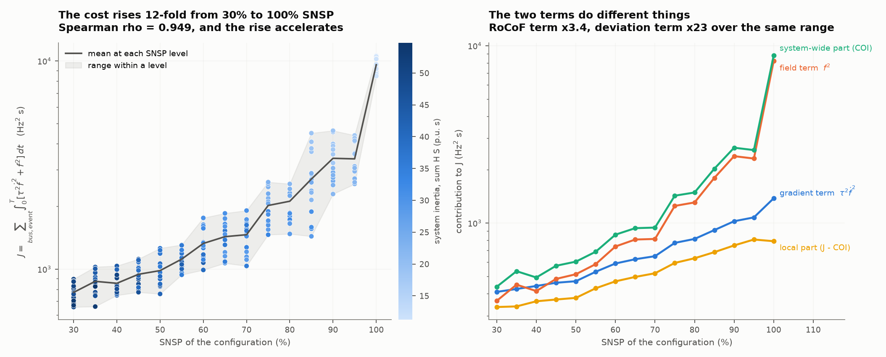

## What was run

**The grid** is the frozen 10×10 caricature of the all-island system defined in
[`grid.py`](grid.py) — 100 buses, 166 lines, wind on the Atlantic seaboard (four
farms radial on a single 110 kV circuit), demand on the east and south coasts,
five synchronous stations spread across the country, a partial cut across the
midlands. It does not change between runs: every experiment loads it from
`grid_buses.csv` / `grid_lines.csv` and checks it against the hash in
`grid.json`. See [the grid section below](#the-toy-grid).

**The ensemble** ([`configs.py`](configs.py)) is 240 balanced operating states,
16 at each of 15 SNSP levels from 30% to 100%. At each level three things are
drawn independently: which stations are committed, how the wind is distributed
(coastal-heavy, inland-heavy or neutral) and the interconnector position. So the
share is stratified and the *geography* varies within each stratum — which is
what makes the scatter at fixed SNSP meaningful.

Crucially, **inertia and reserve follow commitment, not SNSP directly.** A
synchronised machine carries H = 4 s on its own rating and a 5% governor; a
station that is not committed carries neither. Stored energy therefore falls from
55 to 11 p.u.·s across the ensemble, in steps, as stations come off.

**The disturbances** ([`perturbations.py`](perturbations.py)) come in two frozen
sets, and the difference between them turns out to matter more than anything
else here (finding 11).

The **sourced set** — the one findings 1–10 use — is 20 events, each scaling with
whatever causes it:

- *demand-side* (5 city load blocks, a load rejection at Dublin, one diffuse
  imbalance over every bus): fixed, because demand is held fixed across the whole
  ensemble by construction. These are the events that stay put.
- *weather* (8 farm-level gust fronts at 40% of that farm's output, one seaboard
  lull at 10% of every coastal farm): a fraction of what is generating, so the
  same front removes more power when more wind is running.
- *unit trips* (3 stations, the interconnector): **all** of what that unit is
  producing, capped at one unit's worth (1.0 p.u.) — and nothing at all if the
  station is not committed. This half moves the *other* way with SNSP.

At the reference dispatch the events are 0.18–0.97 p.u., the same scale the
fixed-size set used, so the two are directly comparable. Across the sweep the
total imbalance the set applies is almost flat (7.1 → 7.5 p.u.) while its
composition turns over completely: thermal trips 3.0 → 0.6 p.u., wind events
1.1 → 4.0 p.u.

Two further sets are frozen alongside for the controls of findings 11–12: the
**fixed set** (the same 20 events at constant size, which measures vulnerability
at constant hazard) and the **scaled set** (8 wind-only events, all scaling,
which is the hazard-dominated extreme).

**The dynamics** ([`dynamics.py`](dynamics.py)) are the second-order Kuramoto /
swing equations from `../local_effects/swing.py` with governor states, load
damping and plant damping. Each configuration is linearised about **its own**
operating point and propagated with a single matrix exponential that folds the
held disturbance into the state, so all 20 events advance in one matrix multiply
per step. The linearisation agrees with the full nonlinear solver to 0.03% at
these disturbance sizes, and the initial centre-of-inertia RoCoF matches
ΔP·f/(2E) analytically.

## What was found

### 1. The correlation is strong, monotone and convex

| | value |
|---|---|
| Spearman ρ (J against SNSP) | **+0.949** (p ≈ 1 × 10⁻¹²¹) |
| Pearson r | +0.716 — lower only because the relationship is convex |
| Pearson r, excluding the SNSP = 100% stratum | +0.848 |
| J at 30% → 100% SNSP | 772 → 9581 Hz²s (**12.4×**) |
| log-linear fit | R² = 0.811; J ×1.33 per 10 points of SNSP, **doubling every 24 points** |
| total imbalance applied, 30% → 100% | 7.09 → 7.54 p.u. (**×1.06** — the hazard is not what grew) |

The convexity matters operationally: the cost of the last ten points of SNSP is
far larger than the cost of the first ten. Going 30% → 40% costs 11%; going 90% →
100% costs a factor of 2.8. And the last row matters as much as the first: the
set applies essentially the same total imbalance at both ends of the sweep, so
none of this is a bigger-disturbance effect.

### 2. The two terms of the functional say different things

| | 30% SNSP | 100% SNSP | ratio |
|---|---|---|---|
| gradient term, ∫τ²(∂f/∂t)² | 408 | 1377 | **3.4×** |
| field term, ∫f² | 364 | 8204 | **22.6×** |
| system-wide part (evaluated on the COI frequency) | 437 | 8793 | 20.1× |
| local part (J − COI) | 336 | 789 | **2.4×** |

The RoCoF term triples — inertia falling 5-fold, partly offset by the fact that
the frequency it is differentiating is arrested sooner by load damping, and
reinforced by the hazard migrating onto the weakly-connected wind buses. So does
the *local* part, which more than doubles: under a sourced hazard the events that
grow are the ones landing on radial farms, so the geography of the response
matters more, not less, as SNSP rises. The deviation term explodes, because at high SNSP there is no governor
left to bring the frequency back: the system settles at a large offset and the
integral of f² accrues for the rest of the window. Physically, **the risk
changes character as SNSP rises: it starts as a RoCoF problem and ends as a
sustained-deviation problem.**

The same split shows up in the grid-code-shaped counts: the worst 500 ms RoCoF
rises 0.72 → 1.66 Hz/s (crossing the all-island 1 Hz/s limit), and the share of
bus-event pairs exceeding 0.5 Hz/s goes from **3% to 71%**.

### 3. Most of the rise is lost reserve, not lost inertia

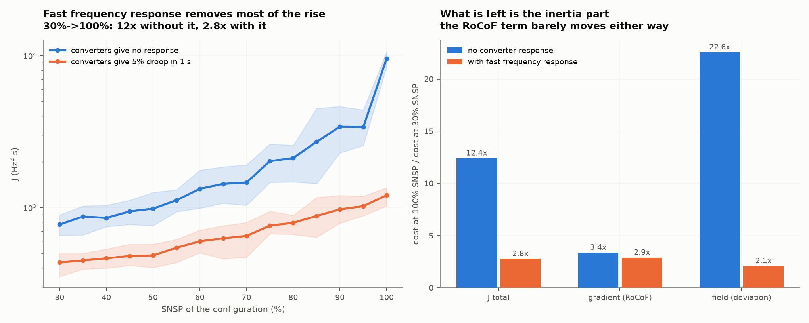

Re-running the identical ensemble with the converters providing the same 5%
droop in 1 s (`--ffr 20`) separates the two mechanisms, because it removes the
reserve loss while leaving the inertia loss untouched:

| | no converter response | with fast frequency response |
|---|---|---|
| J, 30% → 100% SNSP | **12.4×** | **2.8×** |
| gradient term (RoCoF) | 3.4× | **2.9×** |
| field term (deviation) | 22.6× | 2.1× |
| share of bus-events over 0.5 Hz/s | 3% → 71% | 1% → 26% |

So most of the SNSP penalty is a reserve problem that a control choice fixes, and
the residual 2.8× is the part that is genuinely about inertia — note that the
gradient term barely moves (3.4× → 2.9×), so fast frequency response buys almost
nothing on RoCoF — irreducible without adding stored energy (synchronous condensers,
grid-forming converters, or synthetic inertia proper rather than droop). The
practical reading: **an SNSP limit set on a fleet with no converter response is
mostly pricing missing reserve.**

### 4. SNSP is a proxy; inertia is the variable

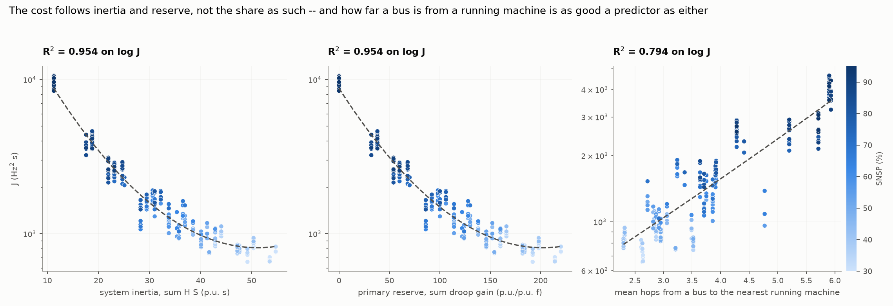

Each point in that figure is **one configuration**, not one bus: the y-axis is
the same J as figure 1, already summed over all 100 buses and all 20 events, and
the x-axis is a property of the configuration as a whole. It is the same 240
points as figure 1 re-plotted against a physical quantity instead of the share.

| predictor | R² alone (quadratic on J) | R² on log J |
|---|---|---|
| SNSP | 0.728 | 0.887 |
| system inertia, Σ H·S | **0.886** | **0.954** |
| primary reserve, Σ droop | 0.886 | 0.954 |
| number of machines synchronised | 0.874 | — |
| mean hops from a bus to the nearest running machine | 0.819 | 0.794 |

Inertia beats the share it is a proxy for, which is the argument for constraining
the physical quantity rather than the ratio. In the baseline, inertia and reserve
are perfectly collinear (the same machines provide both), so they cannot be
separated *within* this run — that is exactly what finding 3's FFR run is for,
and finding 11's condenser run, which does the reverse.

The geography variable is the interesting one: **how far the average bus is from
a running machine predicts the cost better than SNSP itself does** (0.819 against
0.728), and adding it to SNSP raises R² from 0.728 to 0.885. That is the local-effects result
appearing in an SNSP study: what a bus experiences depends on what is near it,
not only on a system ratio.

### 5. At fixed SNSP, the cost still varies by up to 3.1×

| | |
|---|---|
| residual scatter about the SNSP fit | 52% of mean J |
| spread within an SNSP level (mean max/min) | **1.72×** |
| widest level | **3.13×**, at 85% SNSP |

Two configurations with identical SNSP, identical demand and the identical grid
can differ by a factor of three in this cost, purely through which stations are
committed and where the wind is sitting. The spread is wider than the
fixed-hazard control reports (1.72× against 1.50×), because with a sourced hazard
it matters not only how much inertia is left but *where the wind that might drop
is sitting*. The spread widens with SNSP (there are
fewer machines, so which ones they are matters more) and collapses at 100% (there
are none left to choose). **A single SNSP number is not a sufficient statistic
for frequency risk**, and the configurations at the bad end of a level are worse
than the average configuration a full 15 points of SNSP higher.

### 6. Exposure levels up as SNSP rises

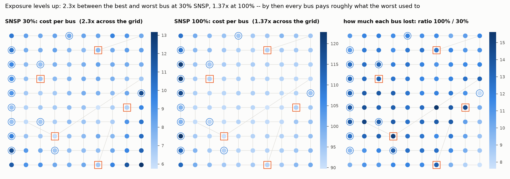

| | worst bus | best bus | spread |
|---|---|---|---|
| SNSP 30% | b99 (south-east corner), 13.2 | b56 (midlands, beside SY-East), 5.7 | **2.3×** |
| SNSP 100% | WF-Bantry (radial farm), 122.8 | b56, 89.8 | **1.37×** |

At low SNSP the map is uneven, and under a sourced hazard the shape is set by
where the *events* are: the big thermal trips are the dominant disturbances then,
so the buses that pay are the ones near them and out on the south-east edge. At
100% the map is nearly flat and the worst bus is a **radial wind farm** — the
hazard has moved onto the seaboard and there is no machine left to anchor it.
The *ratio* map is inverted, exactly as in the fixed-hazard control: the buses
that lose most (up to 15.6×) are the ones that used to have a machine next door
(b56, SY-Shannon, b61, SY-East), and those that lose least (7.6×) are in the
south-east, where the interconnector trip — an event that barely changes size —
dominates at both ends of the sweep.

### 7. Which disturbances become dangerous is not which ones are worst

| event | mean J | 30% | 100% | ratio |
|---|---|---|---|---|
| `wind_lull@seaboard` | 309 | 9.7 | 2112 | **218×** |
| `infeed_loss@HVDC-East` | 145 | 97 | 494 | 5.1× |
| `load_reject@Dublin` | 135 | 48 | 605 | 12.6× |
| `wind_drop@WF-Mizen` | 127 | 8.5 | 704 | 83× |
| `infeed_loss@SY-North` | 116 | 108 | **0.0** | **0.0×** |

This is where the sourced set earns its keep. The seaboard lull is the most
expensive event in the set on average and its cost rises **218-fold** across the
sweep — partly because the system responds worse, mostly because at 30% SNSP
there is very little coastal wind to lose and at 100% there is a great deal. At
the other extreme, `infeed_loss@SY-North` costs 108 at 30% SNSP and **exactly
nothing** at 100%: the station is not running, so the event does not exist. The
contingency that dimensions the system at the bottom of the sweep has evaporated
by the top, and a different one has taken its place.

That turnover is invisible to a fixed-size set, which reports every event as
present and equal at every SNSP, and it is the reason the fixed set understates
the RoCoF trend (2.1× against 3.4×): it keeps charging low-SNSP states for wind
events they are too wind-poor to suffer.

### 8. What the functional is actually integrating

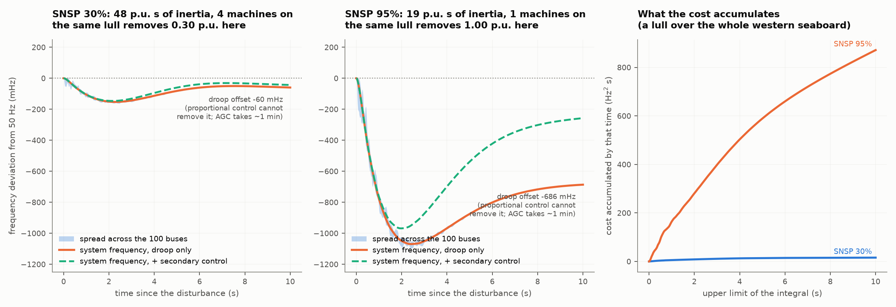

For the seaboard lull — which removes 0.30 p.u. at 30% SNSP and 1.00 p.u. at 95%,
because that is how much coastal wind there is to lose — the frequency reaches
−155 mHz at 30% and settles at −60 mHz, while at 95% it reaches −1080 mHz and
settles at −686 mHz. The right-hand panel shows the cost accruing: at low SNSP it is
essentially complete by 4 s, while at high SNSP it is still climbing at 10 s —
which is the field term of finding 2 seen directly. The per-bus spread (the band)
is narrow for this event: this is a *system* failure mode, and the local
differences of finding 6 are second-order on top of it.

**Those standing offsets are not an unfinished transient.** Droop is
*proportional* control: a machine stops opening up the moment the frequency stops
falling, so the response settles wherever ΔP is balanced by the droop gain plus
load damping, and stays there. The offset is exactly ΔP/(R + D) — `validate.py`
checks it against the analytic value and gets −225.6 mHz measured against −225.6
predicted. Returning to 50 Hz needs *integral* action, and in a real system that
is secondary control (AGC) acting over minutes. The dashed lines show it: with
secondary control enabled the frequency is back within 3 mHz of nominal after
120 s, but it is still at −119 mHz at t = 10 s. Nothing restores frequency inside
a ten-second window, which is why the window is the right length for a study
about inertia and primary response.

### 9. Secondary control changes the cost, but not the RoCoF, and not at 100%

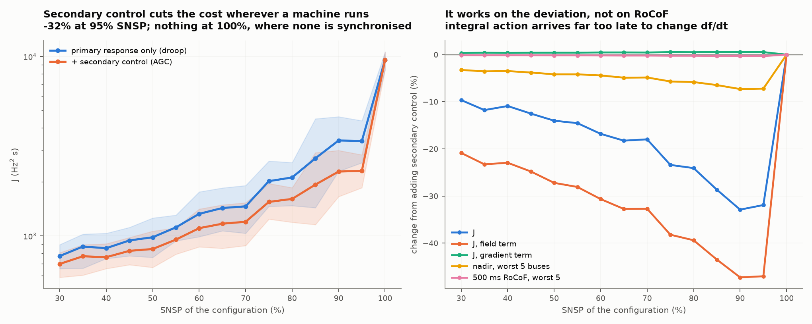

Re-running the whole ensemble with AGC on (`--agc`) quantifies it:

| | 30% SNSP | 70% | 95% | 100% |
|---|---|---|---|---|
| change in J | −9.6% | −18.0% | **−31.9%** | **0.0%** |
| change in the field term | −20.9% | −32.7% | −47.0% | 0.0% |
| change in the gradient term | +0.3% | +0.5% | +0.5% | 0.0% |
| change in nadir at the worst 5 buses | −3.2% | −4.8% | −7.2% | 0.0% |

Two things worth noting. Secondary control acts **entirely on the field term**
and leaves the gradient term untouched to within half a percent — integral action
that takes a minute cannot influence what df/dt does in the first second. And at
100% SNSP it does nothing at all, because there is no synchronised machine to
share the regulation out to. **The instrument that fixes the deviation problem
disappears at exactly the operating point where the deviation problem is worst.**

### 10. Other cost functions agree on the ordering and disagree on the magnitude

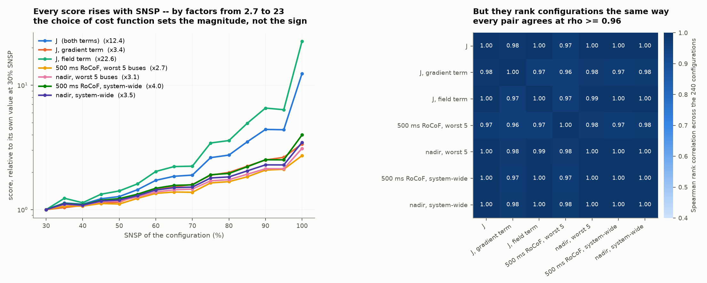

The Ginzburg–Landau functional is one way to score a response; a grid code
usually scores a different way, by taking one number per bus and looking at the
worst few. Both shapes were computed on the identical solves — `rocof_top{n}` is
the 500 ms RoCoF at the n worst buses added up and averaged over events, and
`nadir_top{n}` is the same for the deepest downward excursion:

| score | 30% SNSP | 100% SNSP | ratio | ρ vs SNSP |
|---|---|---|---|---|
| J (both terms) | 772 | 9581 | 12.4× | +0.949 |
| J, gradient term only | 408 | 1377 | 3.4× | +0.941 |
| J, field term only | 364 | 8204 | 22.6× | +0.943 |
| 500 ms RoCoF, worst bus (Hz/s) | 0.31 | 0.76 | 2.5× | +0.898 |
| 500 ms RoCoF, worst 5 (Hz/s) | 1.36 | 3.68 | 2.7× | +0.912 |
| 500 ms RoCoF, worst 10 (Hz/s) | 2.51 | 7.16 | 2.9× | +0.917 |
| nadir, worst bus (Hz) | 0.193 | 0.555 | 2.9× | +0.940 |
| nadir, worst 5 (Hz) | 0.894 | 2.773 | 3.1× | +0.942 |
| nadir, worst 10 (Hz) | 1.758 | 5.545 | 3.2× | +0.943 |

Every one of them rises, and they rise **monotonically with ρ between 0.90 and
0.95** — but by factors between 2.5 and 23. The choice of cost function sets how
alarming the answer looks by an order of magnitude, and picking the integral
functional over a worst-n RoCoF score inflates the apparent penalty about
fivefold, because it is the sustained deviation that grows, not the RoCoF.

They also agree on *which configurations are bad*: every pair of the seven scores
in the figure ranks the 240 configurations with Spearman ρ ≥ 0.96. So the choice matters for
the headline number and hardly at all for the ordering — a useful thing to know
if the point of the score is to choose between operating states rather than to
set a threshold.

**One score goes the other way, and it is the informative one.** The worst bus
divided by the system-wide value falls with SNSP:

| | 30% SNSP | 100% SNSP |
|---|---|---|
| worst-bus 500 ms RoCoF ÷ system RoCoF | **2.04** | **1.27** |
| worst-bus nadir ÷ system nadir | 1.21 | 1.00 |

At 30% SNSP the worst bus sees twice the system-wide RoCoF: the problem is
*local*, and where you stand matters. At 100% the worst bus sees 1.27× the
system value and the nadir is uniform to within a percent — the problem has
become entirely global. This is finding 6 measured in a different way, and it
carries the same operational reading: **at low SNSP, frequency risk is a siting
question; at high SNSP it stops being one, because everywhere is bad.**

### 11. Why an SNSP limit is not redundant with an inertia floor

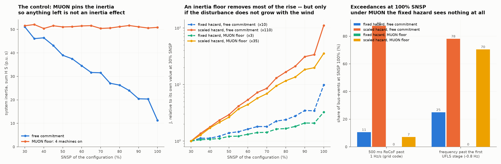

Findings 3 and 4 look like an argument that SNSP is a redundant constraint: the
cost follows inertia and reserve, so constrain those directly. EirGrid does not
treat it that way — it operates a minimum-units constraint (a floor under the
number of synchronised machines, and so under inertia) **and** an SNSP limit on
top of it. If the first pinned everything that mattered, the second would have
nothing left to do.

It has something left to do, and the reason is that our fixed-size disturbance
set had quietly removed it. **A fixed-size event is not a fixed-severity event.**
The seaboard lull removes 0.64 p.u. whatever is running, but the coastal wind
running goes from 2.33 p.u. at 30% SNSP to 9.33 p.u. at 100%, so the same
"event" is a 27.5% wind excursion at the bottom of the sweep and a 6.9% one at
the top. Weather does not work that way: a front of a given meteorological
severity takes a *fraction* of what is generating. Holding the hazard fixed
measures **vulnerability**; risk is hazard × vulnerability, and the hazard is the
channel through which the share can act on the answer for reasons that have
nothing to do with the inertia it displaced.

So the experiment was run four ways — the same grid, the same 240-state
stratification, crossing how the hazard is modelled with whether a
minimum-units floor holds the inertia up:

- **fixed hazard**: the 20-event set of fixed p.u. steps (`perturbations.csv`).
- **scaled hazard**: 8 wind-driven events defined as fractions of what each farm
  is *currently* generating (`perturbations_scaled.csv`) — three correlated
  fronts decaying through the network, a broad seaboard front, a system-wide
  forecast error, a spike, the interconnector, and the largest running farm
  tripping. Total imbalance across the set grows 3.02 → 9.81 p.u. over the sweep.
- **MUON floor**: at least four stations synchronised at all times. Those the
  energy balance does not need run as **synchronous condensers** — spinning, full
  inertia, no output and therefore no governor. That pins stored energy at
  ~51 p.u.·s across the entire sweep (against 51 → 11 without it) while leaving
  SNSP free to reach 100%, and it separates inertia from reserve, which are
  otherwise supplied by the same machines and impossible to tell apart.

**J, from 30% to 100% SNSP:**

| | free commitment | MUON floor (inertia pinned) |
|---|---|---|
| fixed hazard | 9.8× | **3.2×** |
| scaled hazard | 110× | **35×** |

**500 ms RoCoF at the worst five buses (Hz/s):**

| | 30% SNSP | 100% SNSP | ratio |
|---|---|---|---|
| fixed hazard, free commitment | 1.83 | 4.31 | 2.4× |
| scaled hazard, free commitment | 1.51 | 11.46 | 7.6× |
| fixed hazard, MUON floor | 1.80 | 1.84 | **1.03×** |
| scaled hazard, MUON floor | 1.49 | 4.80 | **3.2×** |

**Share of bus-events past a limit, at 100% SNSP:**

| | RoCoF > 1 Hz/s | past first UFLS stage (−0.8 Hz) |
|---|---|---|
| fixed hazard, free commitment | 11% | 25% |
| scaled hazard, free commitment | 88% | 78% |
| fixed hazard, MUON floor | **0%** | **0%** |
| scaled hazard, MUON floor | **7%** | **70%** |

Read the third row and then the fourth. **Under a fixed-size disturbance set, a
minimum-units floor makes the SNSP dependence of RoCoF vanish completely** —
1.03×, and not one bus-event in the ensemble crosses either limit at any SNSP.
On that evidence an SNSP cap on top of MUON would be pure redundancy. Under the
identical floor with the hazard allowed to scale, the worst-five RoCoF still
triples and 70% of bus-events pass the first UFLS stage. **The information an
SNSP limit carries beyond an inertia floor is that the size of the disturbance
you must survive grows with the share.**

The regression says the same thing more sharply. Fitting log J:

| | R² from SNSP | R² from system inertia |
|---|---|---|
| fixed hazard, free commitment | 0.858 | **0.984** |
| scaled hazard, free commitment | 0.949 | 0.946 |
| fixed hazard, MUON floor | 0.876 | **0.035** |
| scaled hazard, MUON floor | 0.952 | **0.012** |

With commitment free, inertia is the better predictor and SNSP is its proxy —
finding 4. Put a floor under inertia and **inertia stops predicting anything at
all** (R² 0.01–0.04, because it no longer varies) while SNSP keeps explaining
88–95% of the variation in log J. That is the quantitative form of the
operational argument: once a minimum-units constraint has done its job, the
residual risk is still ordered by the non-synchronous share, and only a share
limit can see it.

Two honest qualifications. The residual 3.2× in the fixed-hazard MUON cell is
*reserve*, not hazard: condensers carry inertia but no governor, so primary
response still falls to zero as SNSP rises even under the floor — visible in the
deviation term, invisible in the RoCoF one (1.03×). And no configuration
anywhere in the four ensembles lost synchronism: the post-event equilibrium
exists in every one of the 19,200 configuration-event pairs, with the worst line
reaching 0.73 of its static limit. On this grid the nonlinear limit is never the
binding one, so the "big events push it past a limit" mechanism shows up as
threshold *exceedances* (RoCoF relays, UFLS) rather than as loss of synchronism.

### 12. Without the sum over events: no outliers, and no scenario is typical

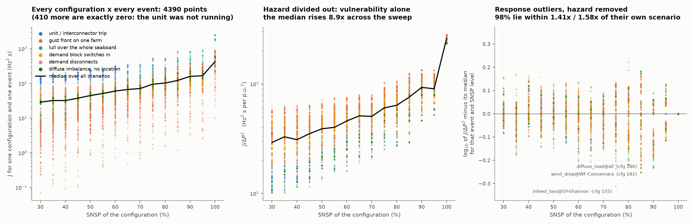

Summing over the disturbance set is what turns a configuration into a single
point, and it hides two things: how much of the trend each *kind* of event
contributes, and whether any individual scenario departs from it. Keeping the
event axis gives 4800 points (4390 of them non-zero — the other 410 are trips of
a station that was not running).

The first thing that shows is how little of the four-decade vertical spread is
about the grid at all:

| scenario | J, 30% → 100% | its ΔP, 30% → 100% | J/ΔP², 30% → 100% |
|---|---|---|---|
| unit / interconnector trip | 127 → 431 (×3.4) | 1.00 → 0.41 | 139 → 2613 (**×18.8**) |
| gust front on one farm | 4.3 → 585 (**×135**) | 0.11 → 0.47 | 367 → 2667 (×7.3) |
| lull over the seaboard | 10.1 → 1910 (**×189**) | 0.24 → 0.89 | 173 → 2411 (×13.9) |
| demand block switches in | 40.7 → 402 (×9.9) | 0.40 → 0.40 | 254 → 2513 (×9.9) |
| demand disconnects | 47 → 605 (×12.9) | 0.50 → 0.50 | 188 → 2419 (×12.9) |
| diffuse imbalance | 28.9 → 585 (×20.3) | 0.50 → 0.50 | 115 → 2340 (×20.3) |

The middle column is the hazard and the right-hand one is what is left after it
is divided out — exactly, because the response is linear and a given
configuration and event shape gives J ∝ ΔP². Read across the rows and the scenarios
disagree wildly on the raw cost (×3.4 for a unit trip, ×189 for a seaboard lull)
while agreeing closely on the part that is about the grid: **the same imbalance
costs 8.9× more at 100% SNSP than at 30%**, whatever kind of imbalance it is.

The right-hand column also converges. At 30% SNSP the six kinds of scenario cost
between 115 and 367 per unit of ΔP² — a factor of 3.2 between the cheapest and
dearest kind of disturbance. At 100% they lie between 2340 and 2667, a factor of
1.14. **By 100% SNSP the grid has stopped distinguishing between kinds of
disturbance**, which is the same levelling-up finding 6 shows across buses,
now across scenarios.

**And there are essentially no outliers.** Measured against its own scenario's
trend (again with ΔP² divided out, so that a gust front on a barely-generating
inland farm does not count as anomalous merely for being small), the scatter has
a standard deviation of 1.17×, 98% of the 4390 points lie within 1.41× above and
1.58× below, and the single worst point in the whole ensemble is 2.05× off. The
relationship is tight scenario by scenario; what looks like enormous spread in
the left-hand panel is the scenarios being different sizes, not the grid
behaving unpredictably.

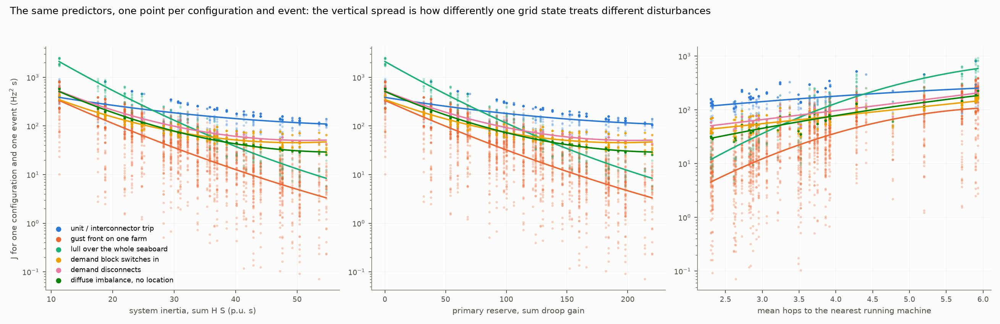

Against the predictors the same decomposition separates the scenario types
sharply, and this is what the summed figure 2 averages away. **A unit trip is
nearly flat in system inertia** — the blue line barely falls across the whole
range — because as inertia disappears so does the unit whose loss the event
represents. The seaboard lull is the steepest line on the plot, crossing from the
cheapest kind of event at high inertia to the dearest at low. Demand events sit
in between, tracking inertia as a textbook single-machine model would predict,
since their size never changes.

So a study that dimensions on thermal contingencies alone would see almost no
SNSP dependence, and one that dimensions on correlated wind alone would see a
very steep one. Both are looking at real events; neither is looking at the
system.

### 13. How much of the answer is the hazard model?

Findings 1–10 and 12 are computed on the sourced set; finding 11 on the fixed and
wind-scaled ones. Since the three differ only in how the *size* of an event is
decided, running all of them puts a bound on how much of the answer is physics
and how much is the modeller's choice of contingency list. Same grid, same 240
states, same solver, same functional:

| | fixed size | **sourced** | wind-only scaled |
|---|---|---|---|
| what scales | nothing | each event with its own source | every event with the wind |
| total imbalance, 30% → 100% | 8.84 → 8.84 (×1.00) | 7.09 → 7.54 (**×1.06**) | 3.09 → 10.13 (×3.28) |
| J, 30% → 100% | 9.8× | **12.4×** | 110× |
| Spearman ρ | +0.957 | **+0.949** | +0.977 |
| gradient term (RoCoF) | 2.1× | **3.4×** | 18.6× |
| local part (J − COI) | 1.3× | **2.4×** | 8.9× |
| worst 500 ms RoCoF (Hz/s) | 0.73 → 1.29 | **0.72 → 1.66** | 0.63 → 3.33 |
| spread within an SNSP level | 1.50× | **1.72×** | — |
| R² on log J: inertia / SNSP | 0.984 / 0.858 | **0.954 / 0.887** | 0.946 / 0.949 |

The direction never changes and the ordering of configurations barely does; the
*magnitude* changes by an order of magnitude. Two things are worth taking from
the middle column specifically.

First, **the sourced set gives a stronger correlation than the fixed one while
applying the same total imbalance** (×1.06 against ×1.00). It is not the size of
the disturbance doing the work — it is where the disturbance now lands. Scaling
the events to their sources moves the hazard off the synchronous stations, which
are heavily loaded at low SNSP and off altogether at high SNSP, and onto the wind
farms on the weak western spurs, which are barely generating at low SNSP and
carrying the system at high SNSP. The RoCoF term feels this most (3.4× against
2.1×) and so does the local part of the cost (2.4× against 1.3×), because those
are the terms that care *where* the event is.

Second, **the wind-only column overstates it** for the mirror-image reason: it
contains no thermal trips at all, so nothing in it shrinks as SNSP rises and the
total hazard triples. The truth is in between, and the sourced set is the honest
version because it lets both directions act.

**One sensitivity is large enough to report on its own.** If a station trip takes
the *whole station* rather than one unit's worth, the correlation nearly
collapses: J rises only 4.3× and ρ falls to **+0.42**. The reason is a defect of
the toy grid rather than a fact about SNSP — its five stations carry 13–28% of
system demand apiece, so "the whole site trips" is a contingency two to three
times larger than any real system dimensions against, and it dominates the
low-SNSP end before vanishing at the top. Capping the trip at one unit (1.0 p.u.,
8% of demand, close to Ireland's largest single infeed) is what the headline uses;
the uncapped ensembles are kept as `ensemble_srcuncapped*.csv`. **If you take one
methodological point from this study, it is that the SNSP–risk correlation is
about as sensitive to the assumed size of the largest thermal contingency as it
is to anything in the physics.**

## Figures

| figure | what it shows | findings |
|---|---|---|
| `fig1_cost_vs_snsp.png` | J against SNSP for all 240 states, and the four components of J | 1, 2, 5 |
| `fig2_predictors.png` | J against inertia, reserve and distance-to-a-machine | 4 |
| `fig3_traces.png` | frequency traces and the cost accumulating, at two ends of the range | 8 |
| `fig4_maps.png` | per-bus cost at 30% and 100%, and the ratio | 6 |
| `fig5_ffr.png` | the same sweep with and without converter fast frequency response | 3 |
| `fig6_metrics.png` | seven different cost functions on the identical solves, and whether they agree | 10 |
| `fig7_secondary.png` | what adding secondary control (AGC) changes, and what it does not | 9 |
| `fig8_muon.png` | the 2×2: hazard model × minimum-units floor, and why SNSP is not redundant with inertia | 11 |
| `grid_layout.png` | the toy grid: roles, line classes, reference dispatch | — |
| `fig1b_events.png` | figure 1 without the sum over events: 4800 points, hazard divided out, outlier check | 12 |
| `fig2b_predictors_events.png` | figure 2 without the sum over events: one trend per scenario type | 12 |
| `fig1c_topbus.png` | figure 1 with the grid-code scores on the vertical axis instead of J: absolute frequency deviation and 500 ms RoCoF, each on the worst 5 buses | 1, 10 |
| `fig1d_topbus_events.png` | the same two scores without the sum over events, and why they are built on |f| rather than on the nadir | 10, 12 |
| `fig9_clusters.png` | the spectral partition of the grid, and how firmly the eigengap chose k = 4 | 14 |
| `fig10_predictor.png` | a risk predictor built on those regions against SNSP, and the controls that say the clustering is not what makes it work | 14 |
| `fig11_topbus_vs_predictor.png` | figure 1c's two panes over SNSP, and the same two over a modal risk predictor | 14 |
| `fixed_hazard/*` | the same figures computed on the fixed-size set, as the control | 13 |

## Files

| file | what it does |
|---|---|
| `grid.py` | the toy grid: specification, `ToyGrid`, `dispatch()`, freeze/load/verify, static feasibility |
| `perturbations.py` | both disturbance sets — fixed-size and hazard-scaled — frozen to `perturbations*.csv` |
| `configs.py` | the ensemble of balanced operating states, with unit commitment |
| `dynamics.py` | swing-equation propagation and the cost functional |
| `run_ensemble.py` | the experiment and its statistics |
| `clusters.py` | spectral clustering of the frozen grid by electrical coupling; eigengap heuristic; freezes `clusters.json` |
| `risk_predictor.py` | per-region features, the model families, the held-out evaluation, the partition/basis controls, and the **cross-disturbance validation** (`cross_event_scores`, `cross_hazard_model`) that holds out *events* rather than configurations; freezes `predictor_*.csv` and `predictor_report.txt` |
| `hazard_draw.py` | samples disturbances from a hazard **prior** and solves two independent representative draws, so a predictor can be tested on disturbances it was never fitted to; freezes `hazard_draw.npz` (~30 min) |
| `report/predictor_report.tex` | the write-up: why a non-SNSP predictor wins, and why it is not locality (`pdflatex` it) |
| `validate.py` | **40 checks — run this first** |
| `figures.py`, `plot_grid.py` | the figures |
| `grid_buses.csv`, `grid_lines.csv`, `grid.json` | **frozen** grid — hash-checked on load |
| `perturbations.csv`, `perturbations.json` | **frozen** disturbance set |
| `configs.csv`, `configs.npz` | the ensemble: summary table and every dispatch vector |
| `ensemble.csv`, `ensemble_nodes.npz` | one row per configuration; per-bus and per-event costs, plus the raw per-bus-per-event readings (`rocof_500ms`, `peak_rocof`, `peak_dev`, `nadir`) that every `*_top{n}` column is a bus-axis reduction of -- keeping them is what makes a new score in that family a reprocess of the npz rather than another pass through the solver, at about 13 MB per ensemble |
| `ensemble_ffr.csv`, … | the same with converter fast frequency response |
| `ensemble_agc.csv`, … | the same with secondary control (AGC) enabled |
| `ensemble_scaled.csv`, `ensemble_muon.csv`, `ensemble_scaled_muon.csv` | the other three cells of the finding-11 2×2 |
| `ensemble_src*.csv` | the sourced-set runs that figures 1–7 are drawn from |
| `ensemble_srcuncapped*.csv` | the same without the one-unit cap on a trip (finding 12's sensitivity) |
| `*_report.txt` | the printed reports for each stage |

## Running it

```bash
cd snsp
sh run_all.sh            # everything, ~25 min
```

or piece by piece:

```bash
PY=../repo/grid_TF_Wind/participant-kit/.venv/Scripts/python.exe
$PY validate.py                          # 40 checks, ~2 min

# the risk predictor: partition the grid, then regress on the regions
$PY clusters.py --freeze                 # clusters.json  (seconds)
$PY risk_predictor.py --freeze                # predictor_*.csv     (~8 min)
$PY risk_predictor.py --target rocof_top1 --suffix _top1 --freeze   # the locality check
$PY hazard_draw.py --events 60 --freeze      # the fresh-draw test  (~30 min)
$PY run_ensemble.py --tag src                       # the headline run, ~6 min
$PY run_ensemble.py --ffr 20 --tag src_ffr          # with converter FFR
$PY run_ensemble.py --agc  --tag src_agc            # with secondary control
$PY figures.py                                      # figures 1-8 + 1b, 2b

# the controls of findings 11-12
$PY run_ensemble.py --events fixed  --tag ""                   # hazard held fixed
$PY run_ensemble.py --events scaled --tag scaled               # all hazard
$PY run_ensemble.py --events fixed  --muon 4 --tag muon
$PY run_ensemble.py --events scaled --muon 4 --tag scaled_muon
$PY figures.py --family fixed                       # figures/fixed_hazard/
```

`run_ensemble.py` takes `--tau`, `--t-end`, `--t-meas`, `--dt`, `--damping`,
`--agc`, `--ffr`, `--events`, `--muon`, `--draws` and `--seed`, so any modelling
choice below can be swept and the variant lands in its own set of files via
`--tag`.
`--analyse-only` re-derives a report from a saved run without re-solving.

## The toy grid

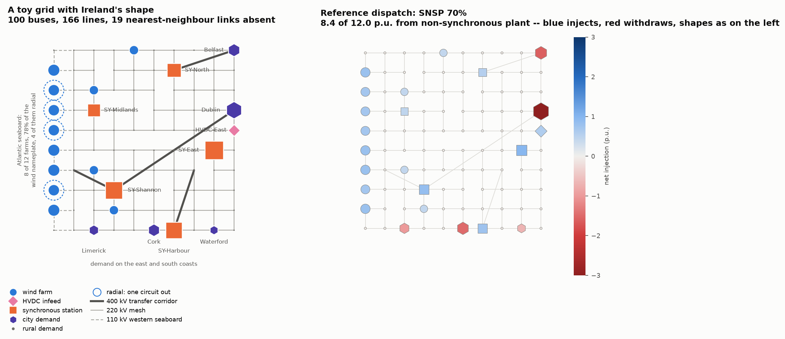

A 10 × 10 arrangement of 100 buses, rows north (0) to south (9), columns west (0)
to east (9); 166 lines. A **caricature** of the all-island system — no real bus,
circuit rating or geography is claimed.

| feature | how it is built |
|---|---|
| generation at a subset of buses, mostly non-inertial, mostly on the left | 18 of 100 buses generate: 12 wind farms, 1 HVDC infeed, 5 synchronous stations. 8 farms are on the west coast carrying **77% of the wind nameplate**; non-synchronous nameplate is 13.8 p.u. against 12.0 p.u. of demand, so SNSP = 100% is reachable |
| non-periodic boundaries | an open lattice: the coasts are real edges |
| not every nearest-neighbour link | 19 of 180 absent. Six strip the coastal circuits from four west-coast farms, leaving each **radial** — one 110 kV circuit east and no second path. Three more partially cut the midlands |
| a few large loads, right and bottom | Dublin 3.0, Belfast 1.6, Cork 1.5, Limerick 1.0, Waterford 0.7 p.u. — 65% of demand; the other 77 buses share 4.2 p.u. of rural demand equally |
| few inertial sources, evenly spread | five stations, no two within five squares on the map (three hops through the graph) |

Three line classes, because a uniform coupling would hide what makes remote wind
fragile: `backbone` K = 8 (five 400 kV corridors), `main` K = 4 (148 links of
220 kV mesh), `spur` K = 2.5 (13 circuits on the western seaboard). Mean degree
3.32, four degree-1 buses, diameter 15 hops.

Inertia is quoted on each bus's own rating (`M = 2HS/ω_s`): H = 4 s for a
synchronised machine, 0.05 s for a station that is off, 0.1 s at a converter,
0.2 s of motor load behind a demand bus. With every machine synchronised the
system stores 61 p.u.·s; with none, 11.3.

`grid.py --steady` confirms a synchronous steady state exists across the whole
SNSP range, with the most-loaded circuit reaching 0.54 of its static limit at
100% SNSP. Above ~40% SNSP that circuit stops being an urban import and becomes a
west-coast spur exporting wind.

## Caveats, stated up front

- **The cost is evaluated on a *measured* frequency, and it has to be.** An
  injection step landing on a converter bus produces ∂f/∂t of order 250 Hz/s in
  the first instant, because M there is ~10⁻⁴ p.u. — an artefact of regularising
  an algebraic bus with a small mass, which no relay or PLL reports. Left raw, it
  dominates ∫(∂f/∂t)² and the functional ends up measuring how massless the
  disturbed bus is. So f is passed through a 100 ms first-order lag (the window a
  RoCoF relay is specified over) and the functional evaluated on that; the
  filtered derivative is exact, (f − f_meas)/T_meas, so nothing is differenced
  numerically. `validate.py` checks that the ranking of configurations is
  identical for lags of 50, 100 and 200 ms — and that the **unfiltered** version
  is the only one that reorders them. The 30%→100% ratio is 2.3× unfiltered and
  16.5× at 200 ms, so the direction never changes but the magnitude does; 9.3× is
  the 100 ms number.
- **τ = 1 s is a weighting choice, not a constant.** (∂f/∂t)² and f² cannot be
  added without a time scale. Both terms are always reported separately, and at
  τ = 1 s the gradient term dominates at low SNSP and the field term at high, so
  the headline ratio is not an artefact of the weighting — but a study weighting
  RoCoF ten times more heavily would report a smaller rise.
- **The horizon matters for the same reason.** T = 10 s covers the swing, the
  nadir and most of the recovery. Because a governor-free state settles at a
  large offset, a longer window inflates the high-SNSP end. `validate.py` checks
  the ordering is unchanged at T = 5, 10 and 20 s.
- **Damping had to be recalibrated from the local-effects model.** That study gave
  every bus a machine on a 1 p.u. base, so its per-bus damping constants were
  per-unit-correct. Here bus ratings vary by two orders of magnitude, and its
  `equal_ratio` rule summed to roughly 50× the physical load damping of the whole
  system — enough to arrest the frequency in 20 ms and hide the entire effect.
  Damping here is built from what is physically present: 1.5 p.u. of load damping
  on the demand at each bus, plus plant damping on the rating of whatever is
  synchronised. The other models remain available under `--damping`.
- **Governor headroom is not modelled.** Droop is linear and unsaturated, so a
  machine near its nameplate delivers reserve it would not really have. That
  flatters the low-SNSP end, where machines are heavily loaded — i.e. it makes
  the reported rise with SNSP *conservative*.
- **No under-frequency load shedding.** At 100% SNSP with no converter response
  the model settles around 1 Hz low, which in reality would shed load first. The
  top-end cost is therefore "what the plant alone would do", not a prediction of
  the outcome.
- **Secondary control is off in the baseline, which is why the frequency settles
  below 50 Hz.** Droop is proportional control and leaves a standing error of
  ΔP/(R + D) by construction; only the integral action of an AGC removes it, over
  minutes. It is available (`--agc`, finding 9) and changes the cost by −7% to
  −32% depending on SNSP, but it is not the baseline because a ten-second window
  is a primary-response window: turning it on mostly changes how much of the tail
  of the field term is counted. It does not change the RoCoF results at all.
- **Two disturbance sets, and they answer different questions.** In the fixed
  set a "wind drop" is 0.35 p.u. at that bus in every configuration, so the
  excitation cannot vary with the dispatch: that isolates vulnerability, and it
  is the right control for findings 1–10. But it is not severity-neutral — the
  same megawatts are a far larger fraction of a small wind fleet — so it
  understates the SNSP dependence and removes the channel finding 11 is about.
  The scaled set fixes the *fraction* instead, and mixes hazard with
  vulnerability by design. Neither is "the" right answer; the pair is.
- **Inertia and reserve are collinear in the baseline** because the same machines
  supply both. Two runs separate them: the FFR variant (finding 3) adds reserve
  without inertia, and the MUON variant (finding 11) adds inertia without reserve
  by running the surplus machines as condensers.
- **No loss of synchronism anywhere.** `post_fault()` solves the nonlinear
  post-event equilibrium for every configuration-event pair; one exists in all
  19,200 of them, the worst line reaching 0.73 of its static limit. The couplings
  on this grid are strong enough that angle stability never binds, so every
  result here is a frequency result. A weaker network — or a bigger event than
  10% of demand — could change that, and the machinery to detect it is in place.
- Distances are lattice squares, not kilometres; K is a coupling, not a rating.
  Nothing is calibrated against the real network — the kit's PyPSA cases are
  where that comparison belongs.

## Where this goes next

- **Put a synchronous condenser where the predictor says.** Finding 4 says
  distance-to-a-running-machine carries most of the geography effect and finding
  6 says the radial farms are the exposed ones. The machinery now exists —
  finding 11 already runs condensers — so the next step is to *site* them by the
  predictor rather than by drawing which stations stay on, and price that
  against siting them at random.
- **Ask what SNSP limit this grid could actually run at.** The cost is smooth, but
  the exceedance counts are not: the share of bus-events over 0.5 Hz/s goes from
  1% to 91%. Inverting that — the SNSP at which a chosen exceedance threshold is
  first crossed, per configuration — turns this into a headroom curve directly
  comparable to an operational SNSP cap, and finding 5 says that cap should
  depend on the commitment, not only on the share.
- **Find the operating limit, not just the trend.** Finding 11 gives exceedance
  counts under a realistic hazard model; inverting them — the SNSP at which a
  chosen exceedance rate is first crossed, for a given MUON floor and a given
  amount of converter FFR — would produce the actual constraint surface an
  operator works to, in the same units as EirGrid's own pair of limits.
- **The part this model structurally cannot reach.** The real justification for
  an SNSP limit is broader than frequency: system strength (short-circuit level),
  converter control interaction and voltage control are all bound up in it, and a
  swing-equation model has none of them. Finding 11 shows *a* mechanism by which
  SNSP carries information an inertia floor does not; it is not the only one, and
  the others need a model with voltage in it.
