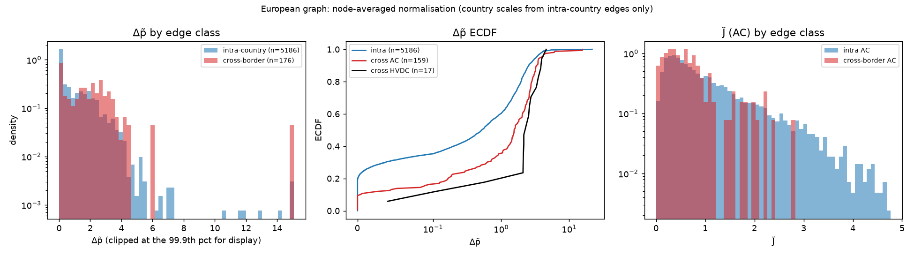
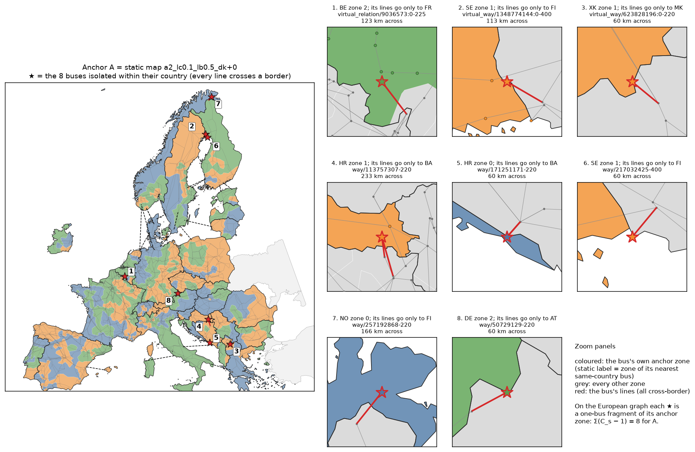

# DBZ stage 1 — the European graph

Generated by `python -m bzgen.dbz.report graph` (`bzgen/dbz/graph.py`, `bzgen/dbz/anchor.py`).
One graph over every bus; lines and links between cluster-countries are kept. Nothing is
re-solved: the per-edge statistics come from `data/solved/prices.parquet` under the static
shedding policy (`clip`, ±500 EUR/MWh).

## Inputs and reproduction of the static edge table

`data/interim` and `data/solved` are gitignored. They were regenerated in this environment
with the unchanged pipeline (topology → weather → assembly → the seeded 8760 h DC-OPF), and
the intra-country rows of the European table were checked against the committed
`results/edges.parquet`:

- intra-country edges: 5186 (static table: 5186, matched on bus pair: 5186)
- max |difference| per column: `dp_duration` 0, `dp_mean` 1.04e-08, `dp_quantile` 7.63e-06, `dp_n` 0, `J_n` 0

**Network build settings.** `bzgen/network/build.py` has no `remove_stubs_across_borders`
switch: stage 5 hard-codes the PyPSA-Eur `remove_stubs_across_borders: false` behaviour
(only degree-1 buses whose single AC line stays in the *same* country are absorbed;
`buses.country` is compared, and cross-border stubs survive). Other settings:
`v_ref_kv=380`, `s_max_pu=0.7`, `min_component=3`,
`drop_under_construction=True`, merged countries
`['LU', 'ME', 'LI', 'AD', 'MC', 'SM', 'VA']` + any with < 5 buses. Countries
are `buses.cluster_country` (after merging, e.g. LU → DE, ME → BA), as in the static pipeline.

## Edges

- European edges: **5362** = 5186 intra-country + **176 cross-border**
  (159 AC corridors, 17 HVDC links) over 63 country pairs.
- Convention: `country` is the cluster-country for intra-country edges and `"XB"` for
  every cross-border edge; `country_a`, `country_b`, `is_cross` carry the endpoints.
- Energy weights at the anchor's α = 2: share of edges with w > 0 (repulsive):
  intra 0.339, cross-border 0.631.

Cross-border edges by country pair:

| pair   |   edges |   ac |   hvdc |   dp_raw_mean |   dp_n_mean |   dp_n_max |   J_n_mean |
|:-------|--------:|-----:|-------:|--------------:|------------:|-----------:|-----------:|
| AL–BA  |       2 |    2 |      0 |         0.024 |       1.289 |      1.532 |      0.589 |
| AL–GR  |       1 |    1 |      0 |         0.016 |       4.585 |      4.585 |      0.338 |
| AL–XK  |       2 |    2 |      0 |         0.023 |       2.54  |      3.035 |      0.313 |
| AT–CH  |       2 |    2 |      0 |         0.339 |       1.049 |      2.092 |      1.676 |
| AT–CZ  |       2 |    2 |      0 |         0.196 |       0.843 |      1.448 |      0.686 |
| AT–DE  |       6 |    6 |      0 |         0.632 |       2.105 |      3.203 |      0.601 |
| AT–HU  |       2 |    2 |      0 |         0.093 |       0.398 |      0.507 |      0.646 |
| AT–IT  |       2 |    2 |      0 |         0.869 |       3.062 |      3.209 |      0.171 |
| AT–SI  |       2 |    2 |      0 |         0.545 |       2.084 |      2.743 |      0.433 |
| BA–HR  |       8 |    8 |      0 |         0.06  |       0.713 |      1.74  |      0.636 |
| BA–IT  |       1 |    0 |      1 |         0.375 |       2.74  |      2.74  |      0     |
| BA–RS  |       4 |    4 |      0 |         0.064 |       2.211 |      3.513 |      0.307 |
| BA–XK  |       1 |    1 |      0 |         0.048 |       2.229 |      2.229 |      0.414 |
| BE–DE  |       2 |    1 |      1 |         0.672 |       2.48  |      2.53  |      0.283 |
| BE–FR  |       5 |    5 |      0 |         0.635 |       1.942 |      2.748 |      0.543 |
| BE–NL  |       2 |    2 |      0 |         0.055 |       0.205 |      0.367 |      1.96  |
| BG–GR  |       2 |    2 |      0 |         0.025 |      15.611 |     15.611 |      0.051 |
| BG–MK  |       1 |    1 |      0 |         0.016 |       1.662 |      1.662 |      0.055 |
| BG–RO  |       3 |    3 |      0 |         0.037 |       0.559 |      1.446 |      0.08  |
| BG–RS  |       1 |    1 |      0 |         0.076 |       6.126 |      6.126 |      0.068 |
| CH–DE  |       6 |    6 |      0 |         0.218 |       0.739 |      2.735 |      1.455 |
| CH–FR  |       9 |    9 |      0 |         0.626 |       1.783 |      2.71  |      0.871 |
| CH–IT  |       8 |    8 |      0 |         0.846 |       3.014 |      3.478 |      0.568 |
| CZ–DE  |       3 |    3 |      0 |         0.55  |       2.7   |      3.58  |      0.373 |
| CZ–PL  |       4 |    4 |      0 |         0.436 |       3.674 |      4.177 |      0.371 |
| CZ–SK  |       4 |    4 |      0 |         0.168 |       1.919 |      2.377 |      0.29  |
| DE–DK  |       3 |    2 |      1 |         0.283 |       1.613 |      4.589 |      0.647 |
| DE–FR  |       5 |    5 |      0 |         0.847 |       2.598 |      2.809 |      0.496 |
| DE–NL  |       4 |    4 |      0 |         0.475 |       1.79  |      2.577 |      0.923 |
| DE–NO  |       1 |    0 |      1 |         0.503 |       2.105 |      2.105 |      0     |
| DE–PL  |       2 |    2 |      0 |         0.181 |       1.029 |      1.26  |      1.372 |
| DE–SE  |       1 |    0 |      1 |         0.142 |       0.559 |      0.559 |      0     |
| DK–NL  |       1 |    0 |      1 |         0.491 |       3.286 |      3.286 |      0     |
| DK–NO  |       1 |    0 |      1 |         0.621 |       3.938 |      3.938 |      0     |
| DK–SE  |       2 |    1 |      1 |         0.375 |       1.798 |      3.5   |      0.531 |
| EE–FI  |       2 |    0 |      2 |         0.823 |       2.151 |      2.151 |      0     |
| EE–LV  |       3 |    3 |      0 |         0     |       0.864 |      2.592 |      0.344 |
| ES–FR  |       5 |    4 |      1 |         0.656 |       2.26  |      2.585 |      0.278 |
| ES–PT  |       7 |    7 |      0 |         0.192 |       1.344 |      4.15  |      1.049 |
| FI–NO  |       1 |    1 |      0 |         0     |       0     |      0     |      0.088 |
| FI–SE  |       6 |    4 |      2 |         0.021 |       0.082 |      0.195 |      0.463 |
| FR–IT  |       3 |    3 |      0 |         0.891 |       2.864 |      3.086 |      0.753 |
| GR–IT  |       1 |    0 |      1 |         0.459 |       3.807 |      3.807 |      0     |
| GR–MK  |       2 |    2 |      0 |         0.008 |       1.584 |      1.617 |      0.505 |
| HR–HU  |       3 |    3 |      0 |         0.126 |       0.915 |      1.593 |      0.741 |
| HR–RS  |       1 |    1 |      0 |         0.057 |       0.715 |      0.715 |      0.767 |
| HR–SI  |       4 |    4 |      0 |         0.158 |       0.953 |      1.753 |      0.748 |
| HU–RO  |       2 |    2 |      0 |         0.102 |       0.748 |      0.914 |      0.71  |
| HU–RS  |       1 |    1 |      0 |         0.068 |       0.83  |      0.83  |      0.829 |
| HU–SI  |       1 |    1 |      0 |         0.074 |       0.437 |      0.437 |      0.844 |
| HU–SK  |       4 |    4 |      0 |         0.107 |       1.205 |      3.491 |      0.811 |
| IT–SI  |       2 |    2 |      0 |         0.405 |       1.854 |      2.272 |      0.646 |
| LT–LV  |       4 |    4 |      0 |         0.003 |       1.632 |      2.946 |      0.387 |
| LT–PL  |       1 |    1 |      0 |         0     |       0     |      0     |      0.607 |
| LT–SE  |       1 |    0 |      1 |         0.915 |       2.119 |      2.119 |      0     |
| MK–RS  |       1 |    1 |      0 |         0.011 |       0.605 |      0.605 |      0.598 |
| MK–XK  |       3 |    3 |      0 |         0.012 |       1.211 |      1.817 |      0.472 |
| NL–NO  |       1 |    0 |      1 |         0.791 |       2.332 |      2.332 |      0     |
| NO–SE  |       5 |    5 |      0 |         0.289 |       1.303 |      2.077 |      0.508 |
| PL–SE  |       1 |    0 |      1 |         0.896 |       2.599 |      2.599 |      0     |
| PL–SK  |       1 |    1 |      0 |         0.185 |       3.111 |      3.111 |      0.505 |
| RO–RS  |       3 |    3 |      0 |         0.172 |       2.206 |      6     |      0.541 |
| RS–XK  |       2 |    2 |      0 |         0.043 |       2.46  |      2.525 |      0.293 |

## Normalisation: intra-country vs cross-border Δp̃

Remedies: Δp `clip` (q = 0.99), J `log1p`; cross-border rule
`edges.cross_border_remedy: average` (mean of the two countries' clip thresholds /
log1p medians, then division by the mean of the two country means). Country scales use
intra-country edges only; restricted to those edges the result equals `edges.normalise`
bit for bit (`tests/test_dbz.py::test_normalisation_reduces_to_static`).

|                       |    n |   mean |   median |   p90 |    p99 |    max |   zero_frac |
|:----------------------|-----:|-------:|---------:|------:|-------:|-------:|------------:|
| intra (all)           | 5186 |  0.996 |    0.517 | 2.543 |  4.192 | 21.784 |       0.196 |
| cross-border (all)    |  176 |  1.885 |    1.701 | 3.478 |  8.497 | 15.611 |       0.085 |
| cross-border AC       |  159 |  1.831 |    1.553 | 3.315 | 10.11  | 15.611 |       0.094 |
| cross-border HVDC     |   17 |  2.391 |    2.332 | 3.86  |  4.485 |  4.589 |       0     |
| intra raw stat        | 5186 |  0.236 |    0.093 | 0.701 |  0.953 |  0.997 |       0.196 |
| cross-border raw stat |  176 |  0.334 |    0.144 | 0.88  |  0.976 |  0.977 |       0.085 |

J̃ (AC only; HVDC has J = 0):

|                 |    n |   mean |   median |   p90 |   p99 |   max |   zero_frac |
|:----------------|-----:|-------:|---------:|------:|------:|------:|------------:|
| intra AC        | 5182 |  1     |    0.726 | 2.204 | 3.831 | 5.275 |           0 |
| cross-border AC |  159 |  0.648 |    0.535 | 1.438 | 2.309 | 2.81  |           0 |

Cross-border Δp̃ averages **1.89×** the intra-country mean (medians 1.70 vs 0.52). The numerator is a border spread; the denominator is the mean of two intra-country means. So, as expected, the borderless map still prefers to cut near national borders, by this factor on average.

## `signal_min`: countries with no intra-country congestion signal

The static gate flags a country when the mean of its raw statistic over intra-country edges
is below `edges.signal_min = 0.01` (`bzgen/cluster/prepare.py::no_signal`). The
flag is **informational only** in the static pipeline: flagged countries are still
normalised by their own (tiny) mean and partitioned with fixed k, and nothing is excluded.

**Decision (`edges.no_signal_policy: keep`).** The flag is recomputed from
intra-country edges only, so it is unchanged, and it still excludes nothing: every bus of a
flagged country is a European node, with its own country scale as its half of the
denominator of each of its cross-border edges. Cross-border edges do not give a flagged
country a new *scale*, but they can give it a *signal*: a border spread divided by a
near-zero intra-country mean. Two things bound it. The clip threshold of a cross-border
edge is the mean of the two countries' q99 thresholds, so a flagged country's small
threshold pulls the clip down as much as its small mean pulls the denominator down. And
when one endpoint has a real signal, its mean dominates the average denominator. The table
shows, for every flagged country, what its cross-border edges carry (`xb_signal`: their
raw mean ≥ `signal_min`, i.e. a signal the static model never saw).

| country   |   intra_edges |   intra_raw_mean | no_congestion_signal   |   xb_edges |   xb_raw_mean |   xb_raw_max | xb_signal   |   xb_dp_n_max |
|:----------|--------------:|-----------------:|:-----------------------|-----------:|--------------:|-------------:|:------------|--------------:|
| AL        |            17 |           0.0048 | True                   |          5 |        0.0225 |       0.0316 | True        |        4.5846 |
| BG        |           142 |           0.0001 | True                   |          7 |        0.0362 |       0.0951 | True        |       15.6114 |
| EE        |            19 |           0      | True                   |          5 |        0.3295 |       0.8486 | True        |        2.5919 |
| GR        |            39 |           0.0005 | True                   |          6 |        0.0904 |       0.4592 | True        |       15.6114 |
| LT        |            31 |           0.0028 | True                   |          6 |        0.1547 |       0.9153 | True        |        2.9461 |
| LV        |            23 |           0.0012 | True                   |          7 |        0.0021 |       0.0058 | False       |        2.9461 |
| MK        |             5 |           0.0099 | True                   |          7 |        0.0114 |       0.0183 | True        |        1.8169 |

## Node set

- European nodes: **N = 3771** = every bus (static: 3763 annealed nodes + 8 buses
  attached post hoc). No European node lacks an edge.
- The 8 buses that were *isolated within their country* (every line crosses a border) are
  ordinary nodes now. The anchor gives them their static label, i.e. the zone of the nearest
  same-country bus, which they are **not adjacent to**. Each is therefore a singleton fragment
  of its anchor zone on the European graph. Every other anchor zone is connected (asserted in
  `anchor.check_contiguity`; adding edges can only merge components). So A has
  Σ(C_s − 1) = 8 on the European graph, all from these buses, in zones
  [11, 23, 42, 43, 65, 81, 89]. A contiguous B must move them to a neighbouring (foreign) zone,
  which costs a small, fixed amount of rigidity at every λ_rigid.

| bus                            | country   | neighbours   |   anchor_zone |
|:-------------------------------|:----------|:-------------|--------------:|
| virtual_relation/9036573:0-225 | BE        | FR           |            11 |
| virtual_way/1348774144:0-400   | SE        | FI           |            81 |
| virtual_way/623828196:0-220    | XK        | MK           |            89 |
| way/113757307-220              | HR        | BA, BA       |            43 |
| way/171251171-220              | HR        | BA           |            42 |
| way/217032425-400              | SE        | FI           |            81 |
| way/257192868-220              | NO        | FI           |            65 |
| way/50729129-220               | DE        | AT           |            23 |

## Scales

- anchor configuration: `a2_lc0.1_lb0.5_dk+0` (α = 2, λ_b = 0.5);
  **K = 90** = Σ_c k_c over 31 cluster-countries
- total European load L_tot = 321,346 MW (time-weighted mean)
- balance floor: `balance_floor_frac_of_mean` 0.15 / K = **0.00167**
  (static: absolute 0.05 against *national* load at k ≈ 3)
- rigidity weights g_i: installed capacity, mean ḡ = 308.6 MW;
  buses with g_i = 0: 31 of 3771
- rigidity normalisation **Z = 2N/K · ḡ = 25,856.8** MW
- `contiguity_guarantee(g, λ_b)` = Σ|w|/2 + 2λ_b + 1 = **10,515.9**
- max degree 15; BFS workspace `Q` = 0.43 MiB (asserted < 64 MiB)
