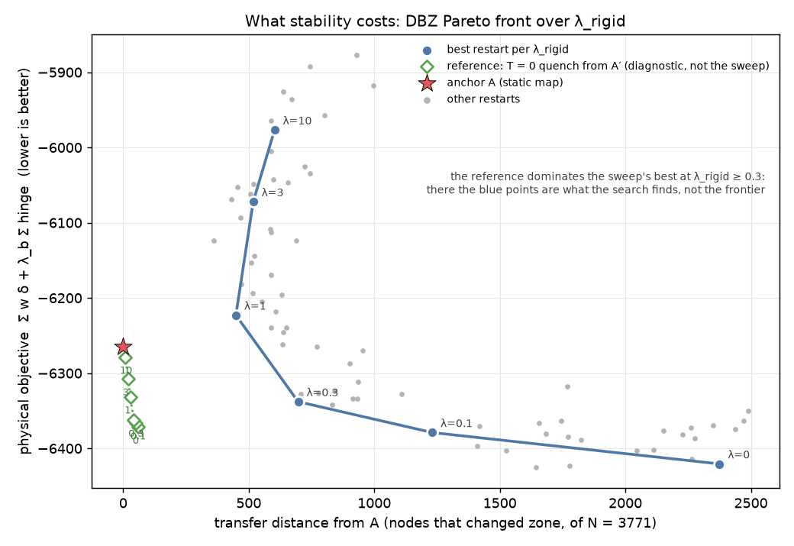
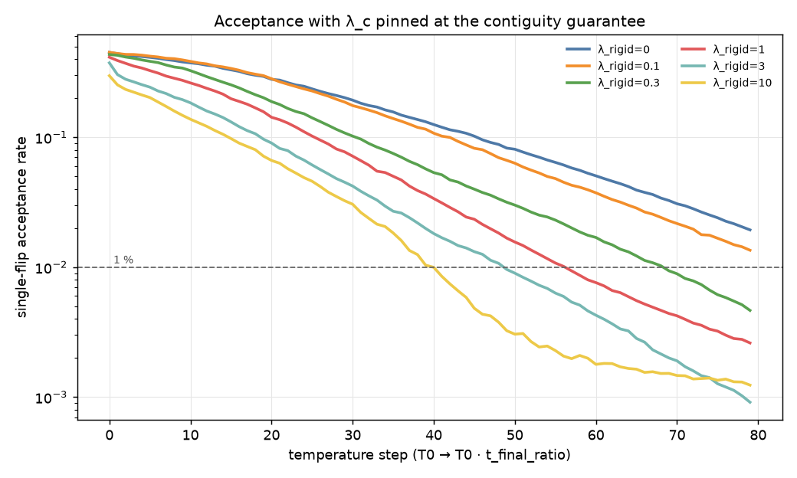
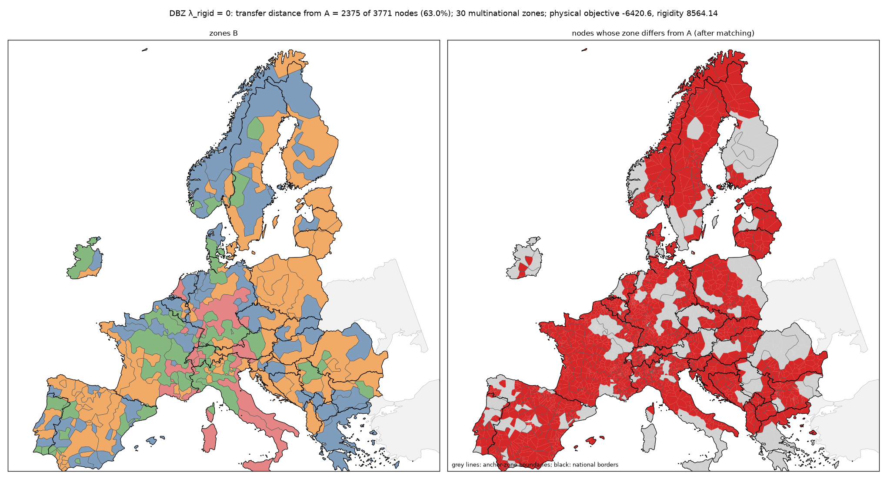
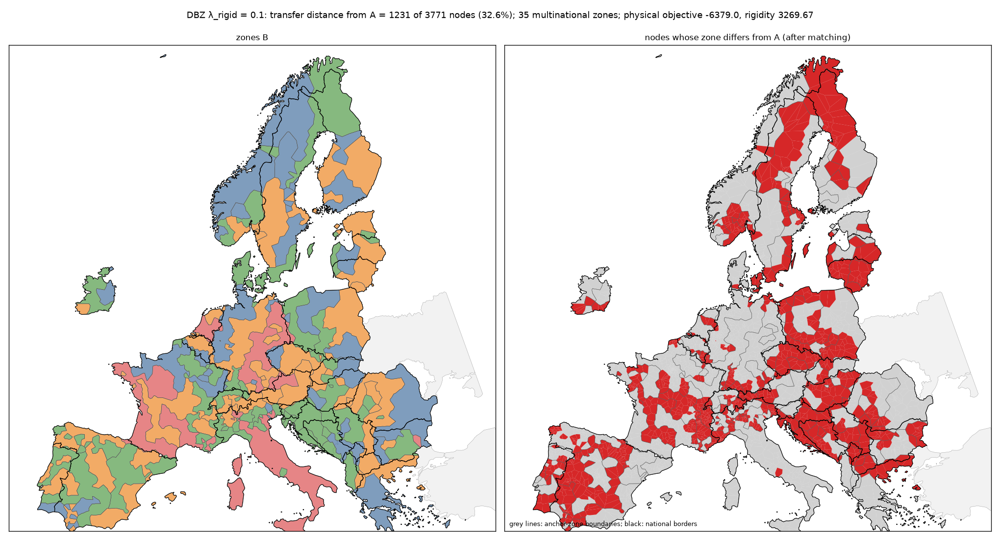
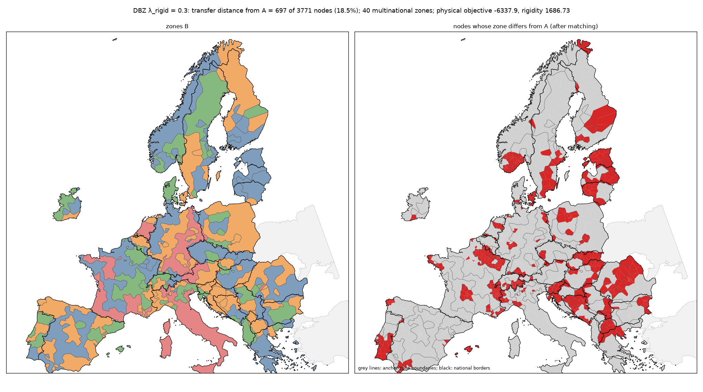
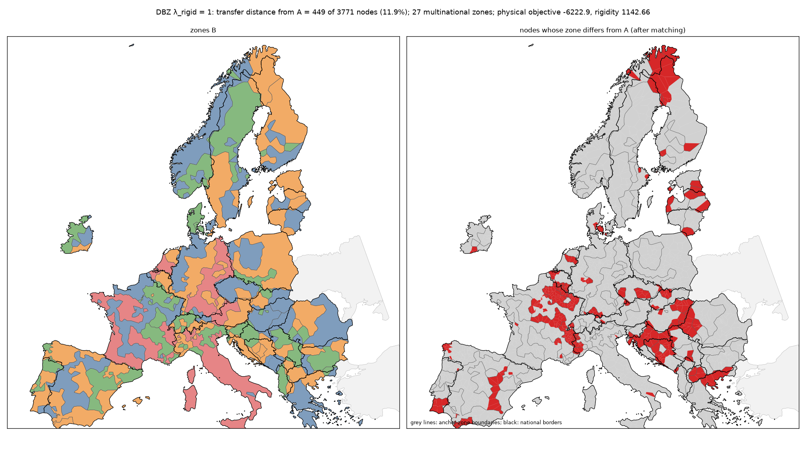
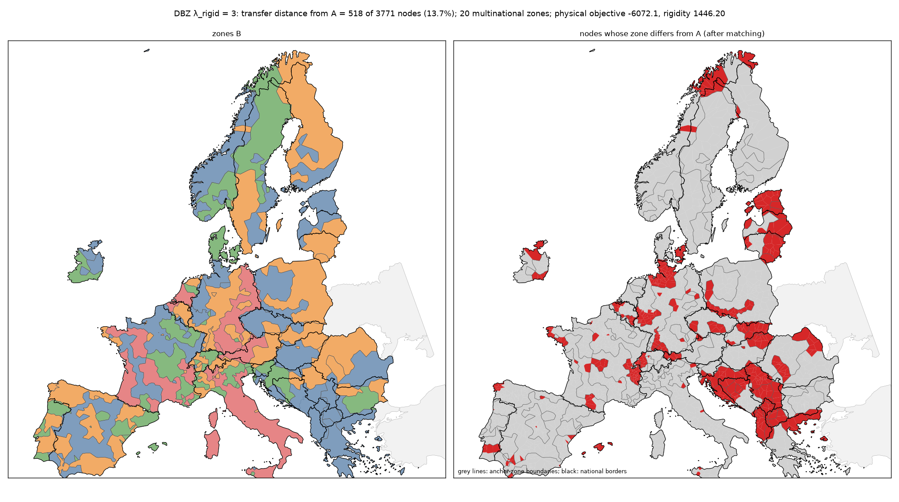
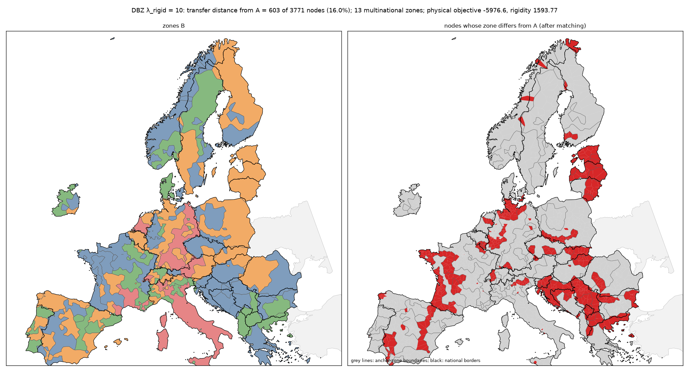

# DBZ stage 2 — Dynamical Bidding Zones: results

Generated by `python -m bzgen.dbz.sweep` (`bzgen/dbz/report.py`), regenerated after every
completed λ_rigid.

## The anchor (the most consequential input)

**A = `a2_lc0.1_lb0.5_dk+0`**, the static headline map (`sweep.headline`): α = 2,
λ_c,initial = 0.1, λ_b = 0.5, Δk = +0. It is the largest α on the
static grid with ≥ 95 % of zones above the balance floor (`reports/results.md`), which makes
it the static map the project stands behind; the sweep baseline (α = 1) was not used. B is
optimised with the same α and λ_b, so A is a static optimum of the physical terms B faces.
K = 90 zones, N = 3771 nodes, Z = 25,856.8 MW, balance floor = 0.15/K =
0.00167. On the European graph A has physical objective **-6265.3**
(Potts -6270.0, balance 9.352) and Σ(C_s − 1) = 8: the 8
formerly-isolated buses (`reports/dbz_graph.md`).

## Method as run

- H = Potts + λ_c Σ(C_s−1) + λ_b Σ hinge + λ_rigid · H_rigid, with λ_c pinned at
  `contiguity_guarantee` (10,515.9) for the whole schedule.
- H_rigid = (1/Z) Σ_i g_i |BZ_B(i) Δ BZ_A(i)|, g_i = installed capacity. It is kept
  incrementally from K × K contingency tables (O(1) per single-node move, O(#A-zones) per fragment
  move) and re-synchronised from the tables after every temperature; the best restart's totals
  are re-checked against a full recomputation.
- schedule: 80 temperatures, **500 sweeps per temperature**
  (static: 50), t_final_ratio 0.01, quench 20 sweeps,
  12 restarts per λ. T0 is calibrated on Potts + balance + rigidity (contiguity
  excluded), so it grows with λ_rigid, and must lie in (1e-3, 1e3).
- initial labels: never A. Half the restarts use `graph_voronoi` per connected component (random
  seeds). The other half use graph-Voronoi growth from one random seed inside each anchor zone
  (it starts ~50 % of nodes away from A). The lowest-energy restart under each λ's own
  objective is reported, together with its init.

## Pareto front: what stability costs

Physical objective (Potts + λ_b · balance, lower is better) against the transfer distance
from A (N minus the maximum one-to-one matching of B-zones to A-zones on the contingency
table: the number of nodes that changed zone). One point per λ_rigid (best restart); grey:
the other restarts; red star: A itself (not contiguous on the European graph, see above).

|   λ_rigid |   physical |    Potts |   Σ(C−1) |   balance |   rigidity |        E |   transfer |   transfer % |   transfer MW |   ARI vs A |   zones |   multinat. |   size min |   size med |   size max |   ≥ floor |
|----------:|-----------:|---------:|---------:|----------:|-----------:|---------:|-----------:|-------------:|--------------:|-----------:|--------:|------------:|-----------:|-----------:|-----------:|----------:|
|       0   |   -6420.65 | -6424.98 |        0 |     8.654 |    8564.14 | -6420.65 |       2375 |        0.63  |      731329   |      0.251 |      90 |          30 |          1 |       20.5 |        298 |        66 |
|       0.1 |   -6378.95 | -6385.09 |        0 |    12.271 |    3269.67 | -6051.98 |       1231 |        0.326 |      330928   |      0.669 |      90 |          35 |          1 |       20   |        292 |        62 |
|       0.3 |   -6337.94 | -6342.09 |        0 |     8.298 |    1686.73 | -5831.92 |        697 |        0.185 |      165358   |      0.829 |      90 |          40 |          1 |       19   |        356 |        66 |
|       1   |   -6222.92 | -6228.05 |        0 |    10.254 |    1142.66 | -5080.27 |        449 |        0.119 |       98438.1 |      0.865 |      90 |          27 |          1 |       19   |        343 |        67 |
|       3   |   -6072.12 | -6082.47 |        0 |    20.689 |    1446.2  | -1733.52 |        518 |        0.137 |      158561   |      0.876 |      90 |          20 |          1 |       25.5 |        358 |        56 |
|      10   |   -5976.64 | -5987.61 |        0 |    21.93  |    1593.77 |  9961.06 |        603 |        0.16  |      190458   |      0.877 |      90 |          13 |          1 |       22.5 |        383 |        60 |

## Where the cuts are

Shares of cut edges (and of the repulsive weight w⁺ on cut edges) that are cross-border (XB) or
HVDC; `XB edges cut`: the share of cross-border edges that are still zone boundaries;
`A cuts kept`: the share of A's cut edges that are also cut in B.

|   λ_rigid |   cut edges |   cut: XB share |   cut w+: XB |   XB edges cut |   cut: DC share |   cut w+: DC |   A cuts kept |
|----------:|------------:|----------------:|-------------:|---------------:|----------------:|-------------:|--------------:|
|       0   |         949 |           0.059 |        0.093 |          0.318 |           0.012 |        0.026 |         0.608 |
|       0.1 |         898 |           0.088 |        0.126 |          0.449 |           0.017 |        0.028 |         0.699 |
|       0.3 |         866 |           0.105 |        0.133 |          0.517 |           0.018 |        0.037 |         0.8   |
|       1   |         861 |           0.135 |        0.149 |          0.659 |           0.022 |        0.04  |         0.86  |
|       3   |         832 |           0.144 |        0.15  |          0.682 |           0.022 |        0.035 |         0.845 |
|      10   |         818 |           0.154 |        0.157 |          0.716 |           0.022 |        0.042 |         0.851 |

## Restart spread, reproducibility, schedule

|   λ_rigid |   restarts |   E spread |   gap 2nd |   ARI best/2nd |   ARI mean |   ARI min | best init     |   E best voronoi |   E best anchor-seeded |     T0 |   accept (first 10 %) | collapse < 1 %   |   s / restart |   wall s |
|----------:|-----------:|-----------:|----------:|---------------:|-----------:|----------:|:--------------|-----------------:|-----------------------:|-------:|----------------------:|:-----------------|--------------:|---------:|
|       0   |         12 |     70.054 |     6.998 |          0.242 |      0.25  |     0.207 | voronoi       |         -6420.65 |               -6413.65 |  5.214 |                 0.423 | False            |       150.153 |  462.119 |
|       0.1 |         12 |    214.656 |    53.358 |          0.525 |      0.465 |     0.385 | anchor_seeded |         -5998.63 |               -6051.98 |  5.671 |                 0.429 | False            |       125.742 |  402.377 |
|       0.3 |         12 |    373.256 |    35.999 |          0.804 |      0.747 |     0.638 | anchor_seeded |         -5795.92 |               -5831.92 |  4.965 |                 0.4   | False            |       124.772 |  400.129 |
|       1   |         12 |   1006.7   |   184.294 |          0.855 |      0.795 |     0.74  | anchor_seeded |         -4895.97 |               -5080.27 |  6.599 |                 0.351 | False            |       119.972 |  372.241 |
|       3   |         12 |   2961.69  |   228.712 |          0.808 |      0.785 |     0.71  | voronoi       |         -1733.52 |               -1504.81 |  9.382 |                 0.271 | False            |       110.596 |  353.012 |
|      10   |         12 |  14662     |  1860.77  |          0.793 |      0.747 |     0.64  | voronoi       |          9961.06 |               11821.8  | 18.462 |                 0.223 | False            |       110.366 |  368.43  |

No λ_rigid shows an acceptance collapse (< 1 %) in the first 10 % of the schedule.

## Optimisation quality: a reference quench from A′

Diagnostic, not part of the sweep. A′ is A with each formerly-isolated bus moved to its
neighbouring (foreign) zone, the nearest contiguous map to A. A T = 0 quench (50 sweeps) from
A′ under each λ's objective gives a point near the anchored optimum. If it beats the sweep's
best restart, the annealer has not found the optimum at that λ, and the Pareto point there
is an upper bound on the true cost of stability, not the cost itself.

|   λ_rigid |   found: physical |   found: transfer |   found: E |   ref: physical |   ref: transfer |   ref: E |   E gap (found − ref) | ref dominates   |
|----------:|------------------:|------------------:|-----------:|----------------:|----------------:|---------:|----------------------:|:----------------|
|       0   |          -6420.65 |              2375 |   -6420.65 |        -6371.7  |              60 | -6371.7  |                -48.94 | False           |
|       0.1 |          -6378.95 |              1231 |   -6051.98 |        -6365.98 |              51 | -6352.53 |                300.54 | False           |
|       0.3 |          -6337.94 |               697 |   -5831.92 |        -6362.42 |              43 | -6327.66 |                495.74 | True            |
|       1   |          -6222.92 |               449 |   -5080.27 |        -6331.45 |              28 | -6275.26 |               1194.99 | True            |
|       3   |          -6072.12 |               518 |   -1733.52 |        -6307.47 |              20 | -6187.26 |               4453.74 | True            |
|      10   |          -5976.64 |               603 |    9961.06 |        -6278.59 |               9 | -5929.35 |              15890.4  | True            |

**The reference dominates the sweep's result (better physical objective *and* smaller transfer distance) at 4 of 6 λ values.** The annealer, started away from A with λ_c pinned, does not find the anchored basin under single-node and fragment moves. Where this holds, read the front as what this search finds, not as the Pareto frontier.

## Zone maps

### λ_rigid = 0

### λ_rigid = 0.1

### λ_rigid = 0.3

### λ_rigid = 1

### λ_rigid = 3

### λ_rigid = 10

