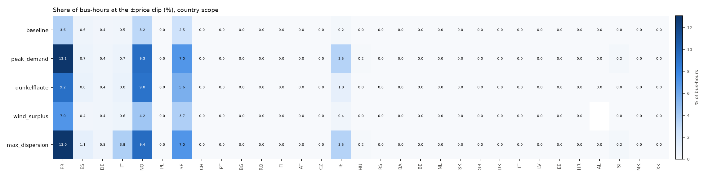
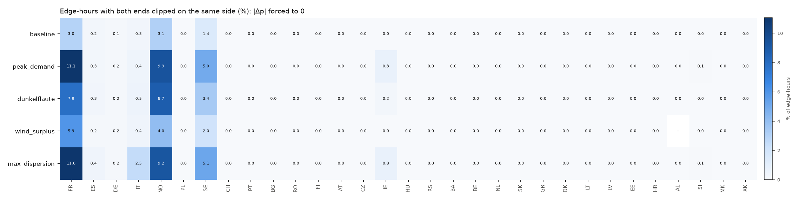
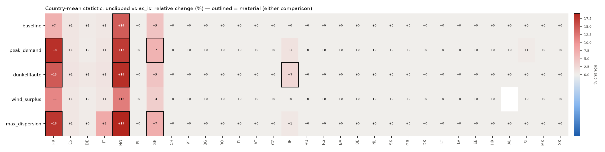
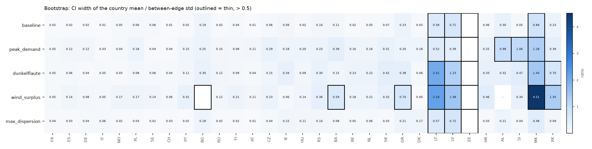
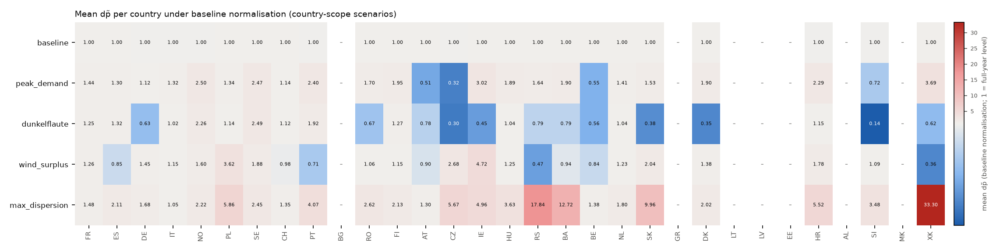
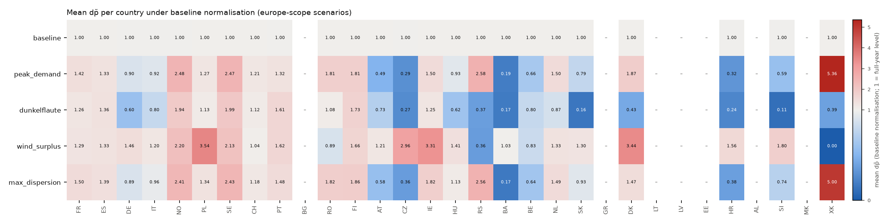
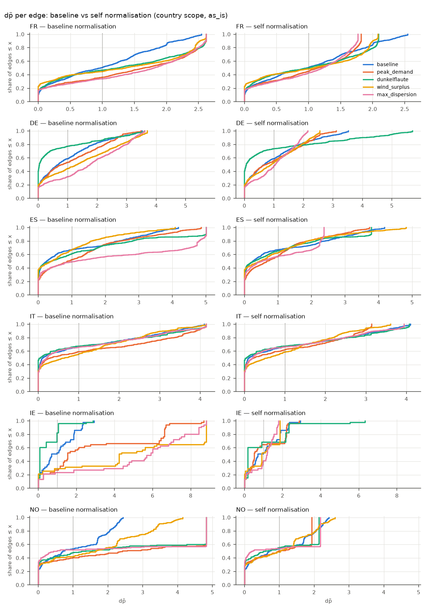
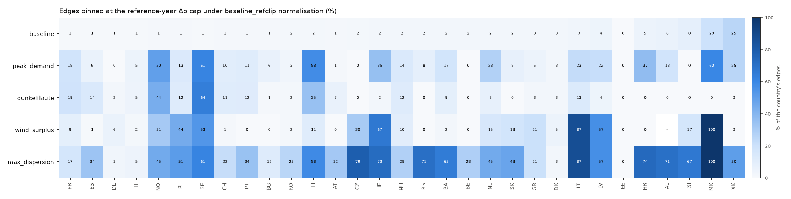
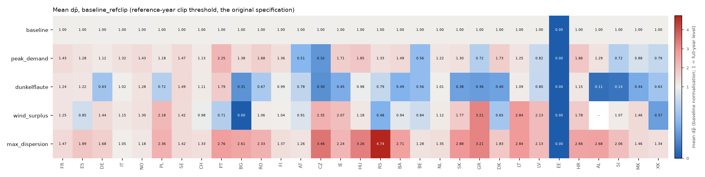

# nDBZ scenarios: outlier hours, the price clip, normalisation

Generated by `python -m bzgen.ndbz.report scenarios` (`bzgen/ndbz/scenarios.py`). Configuration: `config/ndbz.yaml` over `config/default.yaml`. No OPF re-solve: every scenario is a subset of the 8760 solved hours in `data/solved/prices.parquet`.

- statistic: **duration** (threshold 1.0 EUR/MWh), remedies: Δp `clip` (q = 0.99), J `log1p`; per country, cross-border edges dropped (as in the static pipeline)
- defaults: `scope: country`, `q: 0.01`, `min_snapshots: 200`, `clip_handling: as_is`, `normalisation: baseline`
- shedding policy `clip`, price clip ±500 EUR/MWh
- **reproduction check**: the `baseline` scenario (all hours, `as_is`, baseline normalisation) against the static `results/edges.parquet`: max |Δ dp̃| = 0.0e+00, max |Δ J̃| = 0.0e+00 over 5186 edges. The re-solved prices therefore reproduce the static inputs, and the anchor map A was built from these exact numbers.

## 1. The price clip (read first)

Prices are clipped at ±500 EUR/MWh before any statistic (`solve.shedding_policy: clip`). With the duration statistic, the clip destroys signal only where **both** ends of an edge are beyond the clip on the same side in the same hour: |Δp| is then forced to 0, although the unclipped prices may differ by hundreds of EUR/MWh. An edge with one end clipped still shows |Δp| > 1 EUR/MWh. The second table below counts exactly those forced-to-zero edge-hours.

Three treatments are compared: `as_is` (the static pipeline's clipped prices), `exclude_clipped` (drop every edge-hour with an endpoint at the clip, renormalise that edge's weight), and `unclipped`. The solved duals in `prices.parquet` are stored *before* the clip: `prepare` applies it later. So `unclipped` is the statistic an unclipped solve would give, and **no re-solve is needed to check it**.

Material disagreement means Spearman ρ of the per-edge statistic < 0.9, or a relative change of the country mean > 20%, for either comparison with `as_is`.

**10 (scenario, country) pairs disagree materially.** Conclusions for them are provisional under `as_is`. Use the `unclipped` statistic, or report the two side by side:

|                          | vs as_is        |   mean_rel_change |   spearman |
|:-------------------------|:----------------|------------------:|-----------:|
| ('dunkelflaute', 'IE')   | exclude_clipped |            -0.212 |      0.87  |
| ('baseline', 'NO')       | unclipped       |             0.145 |      0.891 |
| ('peak_demand', 'FR')    | unclipped       |             0.182 |      0.69  |
| ('peak_demand', 'NO')    | unclipped       |             0.173 |      0.768 |
| ('peak_demand', 'SE')    | unclipped       |             0.066 |      0.868 |
| ('dunkelflaute', 'FR')   | unclipped       |             0.147 |      0.765 |
| ('dunkelflaute', 'NO')   | unclipped       |             0.182 |      0.788 |
| ('max_dispersion', 'FR') | unclipped       |             0.176 |      0.689 |
| ('max_dispersion', 'NO') | unclipped       |             0.191 |      0.789 |
| ('max_dispersion', 'SE') | unclipped       |             0.072 |      0.866 |

Per-country clip tables (country scope)

**bus-hours at the clip**

| country   |   baseline |   peak_demand |   dunkelflaute |   wind_surplus |   max_dispersion |
|:----------|-----------:|--------------:|---------------:|---------------:|-----------------:|
| FR        |      0.036 |         0.131 |          0.092 |          0.07  |            0.13  |
| ES        |      0.006 |         0.007 |          0.008 |          0.004 |            0.011 |
| DE        |      0.004 |         0.004 |          0.004 |          0.004 |            0.005 |
| IT        |      0.005 |         0.007 |          0.008 |          0.006 |            0.038 |
| NO        |      0.032 |         0.093 |          0.09  |          0.042 |            0.094 |
| PL        |      0     |         0     |          0     |          0     |            0     |
| SE        |      0.025 |         0.07  |          0.056 |          0.037 |            0.07  |
| CH        |      0     |         0     |          0     |          0     |            0     |
| PT        |      0     |         0     |          0     |          0     |            0     |
| BG        |      0     |         0     |          0     |          0     |            0     |
| RO        |      0     |         0     |          0     |          0     |            0     |
| FI        |      0     |         0     |          0     |          0     |            0     |
| AT        |      0     |         0     |          0     |          0     |            0     |
| CZ        |      0     |         0     |          0     |          0     |            0     |
| IE        |      0.002 |         0.035 |          0.01  |          0.004 |            0.035 |
| HU        |      0     |         0.002 |          0     |          0     |            0.002 |
| RS        |      0     |         0     |          0     |          0     |            0     |
| BA        |      0     |         0     |          0     |          0     |            0     |
| BE        |      0     |         0     |          0     |          0     |            0     |
| NL        |      0     |         0     |          0     |          0     |            0     |
| SK        |      0     |         0     |          0     |          0     |            0     |
| GR        |      0     |         0     |          0     |          0     |            0     |
| DK        |      0     |         0     |          0     |          0     |            0     |
| LT        |      0     |         0     |          0     |          0     |            0     |
| LV        |      0     |         0     |          0     |          0     |            0     |
| EE        |      0     |         0     |          0     |          0     |            0     |
| HR        |      0     |         0     |          0     |          0     |            0     |
| AL        |      0     |         0     |          0     |        nan     |            0     |
| SI        |      0     |         0.002 |          0     |          0     |            0.002 |
| MK        |      0     |         0     |          0     |          0     |            0     |
| XK        |      0     |         0     |          0     |          0     |            0     |

**edge-hours with ≥ 1 end clipped**

| country   |   baseline |   peak_demand |   dunkelflaute |   wind_surplus |   max_dispersion |
|:----------|-----------:|--------------:|---------------:|---------------:|-----------------:|
| FR        |      0.04  |         0.152 |          0.104 |          0.078 |            0.15  |
| ES        |      0.007 |         0.009 |          0.01  |          0.005 |            0.014 |
| DE        |      0.004 |         0.005 |          0.005 |          0.005 |            0.006 |
| IT        |      0.003 |         0.006 |          0.006 |          0.004 |            0.029 |
| NO        |      0.047 |         0.141 |          0.131 |          0.062 |            0.14  |
| PL        |      0     |         0     |          0     |          0     |            0     |
| SE        |      0.028 |         0.085 |          0.065 |          0.041 |            0.086 |
| CH        |      0     |         0     |          0     |          0     |            0     |
| PT        |      0     |         0     |          0     |          0     |            0     |
| BG        |      0     |         0     |          0     |          0     |            0     |
| RO        |      0     |         0     |          0     |          0     |            0     |
| FI        |      0     |         0     |          0     |          0     |            0     |
| AT        |      0     |         0     |          0     |          0     |            0     |
| CZ        |      0     |         0     |          0     |          0     |            0     |
| IE        |      0.003 |         0.048 |          0.014 |          0.006 |            0.048 |
| HU        |      0     |         0.003 |          0     |          0     |            0.003 |
| RS        |      0     |         0     |          0     |          0     |            0     |
| BA        |      0     |         0     |          0     |          0     |            0     |
| BE        |      0     |         0     |          0     |          0     |            0     |
| NL        |      0     |         0     |          0     |          0     |            0     |
| SK        |      0     |         0     |          0     |          0     |            0     |
| GR        |      0     |         0     |          0     |          0     |            0     |
| DK        |      0     |         0     |          0     |          0     |            0     |
| LT        |      0     |         0     |          0     |          0     |            0     |
| LV        |      0     |         0     |          0     |          0     |            0     |
| EE        |      0     |         0     |          0     |          0     |            0     |
| HR        |      0     |         0     |          0     |          0     |            0     |
| AL        |      0     |         0     |          0     |        nan     |            0     |
| SI        |      0     |         0.003 |          0     |          0     |            0.003 |
| MK        |      0     |         0     |          0     |          0     |            0     |
| XK        |      0     |         0     |          0     |          0     |            0     |

**edge-hours with both ends clipped, same side**

| country   |   baseline |   peak_demand |   dunkelflaute |   wind_surplus |   max_dispersion |
|:----------|-----------:|--------------:|---------------:|---------------:|-----------------:|
| FR        |      0.03  |         0.111 |          0.079 |          0.059 |            0.11  |
| ES        |      0.002 |         0.003 |          0.003 |          0.002 |            0.004 |
| DE        |      0.001 |         0.002 |          0.002 |          0.002 |            0.002 |
| IT        |      0.003 |         0.004 |          0.005 |          0.004 |            0.025 |
| NO        |      0.031 |         0.093 |          0.087 |          0.04  |            0.092 |
| PL        |      0     |         0     |          0     |          0     |            0     |
| SE        |      0.014 |         0.05  |          0.034 |          0.02  |            0.052 |
| CH        |      0     |         0     |          0     |          0     |            0     |
| PT        |      0     |         0     |          0     |          0     |            0     |
| BG        |      0     |         0     |          0     |          0     |            0     |
| RO        |      0     |         0     |          0     |          0     |            0     |
| FI        |      0     |         0     |          0     |          0     |            0     |
| AT        |      0     |         0     |          0     |          0     |            0     |
| CZ        |      0     |         0     |          0     |          0     |            0     |
| IE        |      0     |         0.008 |          0.002 |          0     |            0.008 |
| HU        |      0     |         0     |          0     |          0     |            0     |
| RS        |      0     |         0     |          0     |          0     |            0     |
| BA        |      0     |         0     |          0     |          0     |            0     |
| BE        |      0     |         0     |          0     |          0     |            0     |
| NL        |      0     |         0     |          0     |          0     |            0     |
| SK        |      0     |         0     |          0     |          0     |            0     |
| GR        |      0     |         0     |          0     |          0     |            0     |
| DK        |      0     |         0     |          0     |          0     |            0     |
| LT        |      0     |         0     |          0     |          0     |            0     |
| LV        |      0     |         0     |          0     |          0     |            0     |
| EE        |      0     |         0     |          0     |          0     |            0     |
| HR        |      0     |         0     |          0     |          0     |            0     |
| AL        |      0     |         0     |          0     |        nan     |            0     |
| SI        |      0     |         0.001 |          0     |          0     |            0.001 |
| MK        |      0     |         0     |          0     |          0     |            0     |
| XK        |      0     |         0     |          0     |          0     |            0     |

**edges with any clipped hour**

| country   |   baseline |   peak_demand |   dunkelflaute |   wind_surplus |   max_dispersion |
|:----------|-----------:|--------------:|---------------:|---------------:|-----------------:|
| FR        |      0.365 |         0.365 |          0.328 |          0.101 |            0.365 |
| ES        |      0.031 |         0.03  |          0.021 |          0.015 |            0.031 |
| DE        |      0.009 |         0.009 |          0.005 |          0.009 |            0.009 |
| IT        |      0.051 |         0.051 |          0.047 |          0.037 |            0.051 |
| NO        |      0.148 |         0.148 |          0.148 |          0.148 |            0.14  |
| PL        |      0     |         0     |          0     |          0     |            0     |
| SE        |      0.144 |         0.144 |          0.144 |          0.072 |            0.144 |
| CH        |      0     |         0     |          0     |          0     |            0     |
| PT        |      0     |         0     |          0     |          0     |            0     |
| BG        |      0     |         0     |          0     |          0     |            0     |
| RO        |      0     |         0     |          0     |          0     |            0     |
| FI        |      0.019 |         0.019 |          0     |          0     |            0.019 |
| AT        |      0     |         0     |          0     |          0     |            0     |
| CZ        |      0     |         0     |          0     |          0     |            0     |
| IE        |      0.333 |         0.333 |          0.333 |          0.039 |            0.333 |
| HU        |      0.1   |         0.1   |          0.06  |          0     |            0.1   |
| RS        |      0     |         0     |          0     |          0     |            0     |
| BA        |      0     |         0     |          0     |          0     |            0     |
| BE        |      0     |         0     |          0     |          0     |            0     |
| NL        |      0     |         0     |          0     |          0     |            0     |
| SK        |      0     |         0     |          0     |          0     |            0     |
| GR        |      0     |         0     |          0     |          0     |            0     |
| DK        |      0     |         0     |          0     |          0     |            0     |
| LT        |      0     |         0     |          0     |          0     |            0     |
| LV        |      0     |         0     |          0     |          0     |            0     |
| EE        |      0     |         0     |          0     |          0     |            0     |
| HR        |      0     |         0     |          0     |          0     |            0     |
| AL        |      0     |         0     |          0     |        nan     |            0     |
| SI        |      0.333 |         0.333 |          0     |          0     |            0.333 |
| MK        |      0     |         0     |          0     |          0     |            0     |
| XK        |      0     |         0     |          0     |          0     |            0     |

**edges with ≥ 10 % of hours clipped**

| country   |   baseline |   peak_demand |   dunkelflaute |   wind_surplus |   max_dispersion |
|:----------|-----------:|--------------:|---------------:|---------------:|-----------------:|
| FR        |      0.101 |         0.23  |          0.118 |          0.101 |            0.23  |
| ES        |      0.011 |         0.014 |          0.014 |          0.011 |            0.015 |
| DE        |      0.005 |         0.005 |          0.005 |          0.009 |            0.009 |
| IT        |      0.025 |         0.032 |          0.025 |          0.025 |            0.046 |
| NO        |      0.14  |         0.144 |          0.148 |          0.14  |            0.14  |
| PL        |      0     |         0     |          0     |          0     |            0     |
| SE        |      0.072 |         0.117 |          0.089 |          0.072 |            0.117 |
| CH        |      0     |         0     |          0     |          0     |            0     |
| PT        |      0     |         0     |          0     |          0     |            0     |
| BG        |      0     |         0     |          0     |          0     |            0     |
| RO        |      0     |         0     |          0     |          0     |            0     |
| FI        |      0     |         0     |          0     |          0     |            0     |
| AT        |      0     |         0     |          0     |          0     |            0     |
| CZ        |      0     |         0     |          0     |          0     |            0     |
| IE        |      0     |         0.039 |          0.039 |          0.039 |            0.039 |
| HU        |      0     |         0     |          0     |          0     |            0     |
| RS        |      0     |         0     |          0     |          0     |            0     |
| BA        |      0     |         0     |          0     |          0     |            0     |
| BE        |      0     |         0     |          0     |          0     |            0     |
| NL        |      0     |         0     |          0     |          0     |            0     |
| SK        |      0     |         0     |          0     |          0     |            0     |
| GR        |      0     |         0     |          0     |          0     |            0     |
| DK        |      0     |         0     |          0     |          0     |            0     |
| LT        |      0     |         0     |          0     |          0     |            0     |
| LV        |      0     |         0     |          0     |          0     |            0     |
| EE        |      0     |         0     |          0     |          0     |            0     |
| HR        |      0     |         0     |          0     |          0     |            0     |
| AL        |      0     |         0     |          0     |        nan     |            0     |
| SI        |      0     |         0     |          0     |          0     |            0     |
| MK        |      0     |         0     |          0     |          0     |            0     |
| XK        |      0     |         0     |          0     |          0     |            0     |

**Country-mean statistic, relative change vs as_is**

| country   |   ('exclude_clipped', 'baseline') |   ('exclude_clipped', 'peak_demand') |   ('exclude_clipped', 'dunkelflaute') |   ('exclude_clipped', 'wind_surplus') |   ('exclude_clipped', 'max_dispersion') |   ('unclipped', 'baseline') |   ('unclipped', 'peak_demand') |   ('unclipped', 'dunkelflaute') |   ('unclipped', 'wind_surplus') |   ('unclipped', 'max_dispersion') |
|:----------|----------------------------------:|-------------------------------------:|--------------------------------------:|--------------------------------------:|----------------------------------------:|----------------------------:|-------------------------------:|--------------------------------:|--------------------------------:|----------------------------------:|
| FR        |                            -0     |                                0.02  |                                 0.02  |                                 0.054 |                                   0.025 |                       0.069 |                          0.182 |                           0.147 |                           0.111 |                             0.176 |
| ES        |                            -0.004 |                                0.001 |                                 0.002 |                                -0.009 |                                  -0.001 |                       0.012 |                          0.011 |                           0.012 |                           0.01  |                             0.01  |
| DE        |                             0.003 |                               -0     |                                 0     |                                -0     |                                  -0.001 |                       0.005 |                          0.004 |                           0.009 |                           0.003 |                             0.003 |
| IT        |                             0.011 |                                0.01  |                                 0.02  |                                 0.012 |                                   0.093 |                       0.008 |                          0.012 |                           0.013 |                           0.011 |                             0.076 |
| NO        |                            -0.027 |                                0     |                                 0.004 |                                 0.053 |                                   0     |                       0.145 |                          0.173 |                           0.182 |                           0.119 |                             0.191 |
| PL        |                             0     |                                0     |                                 0     |                                 0     |                                   0     |                       0     |                          0     |                           0     |                           0     |                             0     |
| SE        |                            -0.053 |                                0.009 |                                -0.017 |                                -0.04  |                                   0.009 |                       0.049 |                          0.066 |                           0.046 |                           0.036 |                             0.072 |
| CH        |                             0     |                                0     |                                 0     |                                 0     |                                   0     |                       0     |                          0     |                           0     |                           0     |                             0     |
| PT        |                             0     |                                0     |                                 0     |                                 0     |                                   0     |                       0     |                          0     |                           0     |                           0     |                             0     |
| BG        |                             0     |                                0     |                                 0     |                                 0     |                                   0     |                       0     |                          0     |                           0     |                           0     |                             0     |
| RO        |                             0     |                                0     |                                 0     |                                 0     |                                   0     |                       0     |                          0     |                           0     |                           0     |                             0     |
| FI        |                            -0     |                                0     |                                 0     |                                 0     |                                   0     |                       0     |                          0     |                           0     |                           0     |                             0     |
| AT        |                             0     |                                0     |                                 0     |                                 0     |                                   0     |                       0     |                          0     |                           0     |                           0     |                             0     |
| CZ        |                             0     |                                0     |                                 0     |                                 0     |                                   0     |                       0     |                          0     |                           0     |                           0     |                             0     |
| IE        |                            -0.023 |                                0.007 |                                -0.212 |                                -0.006 |                                   0.006 |                       0.001 |                          0.014 |                           0.026 |                           0     |                             0.008 |
| HU        |                            -0     |                               -0.001 |                                -0     |                                 0     |                                   0     |                       0     |                          0.001 |                           0     |                           0     |                             0     |
| RS        |                             0     |                                0     |                                 0     |                                 0     |                                   0     |                       0     |                          0     |                           0     |                           0     |                             0     |
| BA        |                             0     |                                0     |                                 0     |                                 0     |                                   0     |                       0     |                          0     |                           0     |                           0     |                             0     |
| BE        |                             0     |                                0     |                                 0     |                                 0     |                                   0     |                       0     |                          0     |                           0     |                           0     |                             0     |
| NL        |                             0     |                                0     |                                 0     |                                 0     |                                   0     |                       0     |                          0     |                           0     |                           0     |                             0     |
| SK        |                             0     |                                0     |                                 0     |                                 0     |                                   0     |                       0     |                          0     |                           0     |                           0     |                             0     |
| GR        |                             0     |                                0     |                                 0     |                                 0     |                                   0     |                       0     |                          0     |                           0     |                           0     |                             0     |
| DK        |                             0     |                                0     |                                 0     |                                 0     |                                   0     |                       0     |                          0     |                           0     |                           0     |                             0     |
| LT        |                             0     |                                0     |                                 0     |                                 0     |                                   0     |                       0     |                          0     |                           0     |                           0     |                             0     |
| LV        |                             0     |                                0     |                                 0     |                                 0     |                                   0     |                       0     |                          0     |                           0     |                           0     |                             0     |
| EE        |                             0     |                                0     |                                 0     |                                 0     |                                   0     |                       0     |                          0     |                           0     |                           0     |                             0     |
| HR        |                             0     |                                0     |                                 0     |                                 0     |                                   0     |                       0     |                          0     |                           0     |                           0     |                             0     |
| AL        |                             0     |                                0     |                                 0     |                               nan     |                                   0     |                       0     |                          0     |                           0     |                         nan     |                             0     |
| SI        |                            -0     |                               -0.014 |                                 0     |                                 0     |                                  -0.001 |                       0     |                          0.006 |                           0     |                           0     |                             0.001 |
| MK        |                             0     |                                0     |                                 0     |                                 0     |                                   0     |                       0     |                          0     |                           0     |                           0     |                             0     |
| XK        |                             0     |                                0     |                                 0     |                                 0     |                                   0     |                       0     |                          0     |                           0     |                           0     |                             0     |

**Spearman ρ of the per-edge statistic vs as_is**

| country   |   ('exclude_clipped', 'baseline') |   ('exclude_clipped', 'peak_demand') |   ('exclude_clipped', 'dunkelflaute') |   ('exclude_clipped', 'wind_surplus') |   ('exclude_clipped', 'max_dispersion') |   ('unclipped', 'baseline') |   ('unclipped', 'peak_demand') |   ('unclipped', 'dunkelflaute') |   ('unclipped', 'wind_surplus') |   ('unclipped', 'max_dispersion') |
|:----------|----------------------------------:|-------------------------------------:|--------------------------------------:|--------------------------------------:|----------------------------------------:|----------------------------:|-------------------------------:|--------------------------------:|--------------------------------:|----------------------------------:|
| FR        |                             0.988 |                                0.983 |                                 0.979 |                                 0.976 |                                   0.979 |                       0.959 |                          0.69  |                           0.765 |                           0.919 |                             0.689 |
| ES        |                             0.999 |                                0.999 |                                 1     |                                 0.999 |                                   1     |                       0.997 |                          0.996 |                           0.99  |                           0.998 |                             0.986 |
| DE        |                             0.996 |                                1     |                                 1     |                                 1     |                                   1     |                       0.995 |                          0.993 |                           0.994 |                           0.994 |                             0.993 |
| IT        |                             0.999 |                                0.997 |                                 0.998 |                                 0.999 |                                   0.937 |                       1     |                          0.999 |                           0.999 |                           1     |                             0.957 |
| NO        |                             0.961 |                                1     |                                 0.999 |                                 0.957 |                                   1     |                       0.891 |                          0.768 |                           0.788 |                           0.909 |                             0.789 |
| PL        |                             1     |                                1     |                                 1     |                                 1     |                                   1     |                       1     |                          1     |                           1     |                           1     |                             1     |
| SE        |                             0.928 |                                0.98  |                                 0.98  |                                 0.957 |                                   0.983 |                       0.955 |                          0.868 |                           0.936 |                           0.968 |                             0.866 |
| CH        |                             1     |                                1     |                                 1     |                                 1     |                                   1     |                       1     |                          1     |                           1     |                           1     |                             1     |
| PT        |                             1     |                                1     |                                 1     |                                 1     |                                   1     |                       1     |                          1     |                           1     |                           1     |                             1     |
| BG        |                             1     |                                1     |                                 1     |                               nan     |                                   1     |                       1     |                          1     |                           1     |                         nan     |                             1     |
| RO        |                             1     |                                1     |                                 1     |                                 1     |                                   1     |                       1     |                          1     |                           1     |                           1     |                             1     |
| FI        |                             1     |                                1     |                                 1     |                                 1     |                                   1     |                       1     |                          1     |                           1     |                           1     |                             1     |
| AT        |                             1     |                                1     |                                 1     |                                 1     |                                   1     |                       1     |                          1     |                           1     |                           1     |                             1     |
| CZ        |                             1     |                                1     |                                 1     |                                 1     |                                   1     |                       1     |                          1     |                           1     |                           1     |                             1     |
| IE        |                             0.98  |                                0.991 |                                 0.87  |                                 0.995 |                                   0.998 |                       1     |                          0.989 |                           0.991 |                           1     |                             0.999 |
| HU        |                             1     |                                1     |                                 1     |                                 1     |                                   0.999 |                       1     |                          1     |                           1     |                           1     |                             0.999 |
| RS        |                             1     |                                1     |                                 1     |                                 1     |                                   1     |                       1     |                          1     |                           1     |                           1     |                             1     |
| BA        |                             1     |                                1     |                                 1     |                                 1     |                                   1     |                       1     |                          1     |                           1     |                           1     |                             1     |
| BE        |                             1     |                                1     |                                 1     |                                 1     |                                   1     |                       1     |                          1     |                           1     |                           1     |                             1     |
| NL        |                             1     |                                1     |                                 1     |                                 1     |                                   1     |                       1     |                          1     |                           1     |                           1     |                             1     |
| SK        |                             1     |                                1     |                                 1     |                                 1     |                                   1     |                       1     |                          1     |                           1     |                           1     |                             1     |
| GR        |                             1     |                                1     |                                 1     |                                 1     |                                   1     |                       1     |                          1     |                           1     |                           1     |                             1     |
| DK        |                             1     |                                1     |                                 1     |                                 1     |                                   1     |                       1     |                          1     |                           1     |                           1     |                             1     |
| LT        |                             1     |                                1     |                                 1     |                                 1     |                                   1     |                       1     |                          1     |                           1     |                           1     |                             1     |
| LV        |                             1     |                                1     |                                 1     |                                 1     |                                   1     |                       1     |                          1     |                           1     |                           1     |                             1     |
| EE        |                           nan     |                              nan     |                               nan     |                               nan     |                                 nan     |                     nan     |                        nan     |                         nan     |                         nan     |                           nan     |
| HR        |                             1     |                                1     |                                 1     |                                 1     |                                   1     |                       1     |                          1     |                           1     |                           1     |                             1     |
| AL        |                             1     |                                1     |                                 1     |                               nan     |                                   1     |                       1     |                          1     |                           1     |                         nan     |                             1     |
| SI        |                             1     |                                0.996 |                                 1     |                                 1     |                                   1     |                       1     |                          1     |                           1     |                           1     |                             1     |
| MK        |                             1     |                                1     |                                 1     |                                 1     |                                   1     |                       1     |                          1     |                           1     |                           1     |                             1     |
| XK        |                             1     |                                1     |                                 1     |                                 1     |                                   1     |                       1     |                          1     |                           1     |                           1     |                             1     |

## 2. Scenario definitions and snapshot counts

| scenario | definition |
|---|---|
| `baseline` | all snapshots: the set the static map A was built on |
| `peak_demand` | top q of hours by total load (national load of the cluster-country) |
| `dunkelflaute` | bottom 10% of VRE (on/offshore wind + solar, capacity-weighted) CF **and** top 33% of load |
| `wind_surplus` | top q of hours by wind (on + offshore) capacity factor |
| `max_dispersion` | top q of hours by the cross-sectional std of the country's nodal prices (after the clip) |

Load and CF come from the solve inputs (`data/interim/national_load.parquet`, `res_profiles.parquet`, `generators.csv`), not recomputed. "Top q" is by weight. `q = 0.01` is 88 h, below `min_snapshots = 200`, so q is widened to **q_eff = 0.0228** (200 h) in every country. The dunkelflaute quantiles widen together in steps of 0.05 until the intersection reaches 200 h. Effective VRE quantile per country: 0.10–0.20; load quantile 0.33–0.43.

`scope: country` (default) selects each country's own outlier hours. `scope: europe` selects one common set from system-wide load / CF / price dispersion. Europe-scope snapshot counts:

| scenario       |   n_snapshots |   weight_share |   q_eff |   vre_q_eff |   load_q_eff |
|:---------------|--------------:|---------------:|--------:|------------:|-------------:|
| peak_demand    |           200 |          0.023 |   0.023 |       nan   |      nan     |
| dunkelflaute   |           245 |          0.028 | nan     |         0.2 |        0.433 |
| wind_surplus   |           200 |          0.023 |   0.023 |       nan   |      nan     |
| max_dispersion |           200 |          0.023 |   0.023 |       nan   |      nan     |

Scenarios undefined for a country (skipped there):

|                        | status                       |
|:-----------------------|:-----------------------------|
| ('wind_surplus', 'AL') | undefined: no wind_cf signal |

Snapshot counts per country (country scope)

| country   |   baseline |   peak_demand |   dunkelflaute |   wind_surplus |   max_dispersion |
|:----------|-----------:|--------------:|---------------:|---------------:|-----------------:|
| FR        |       8760 |           200 |            270 |            200 |              200 |
| ES        |       8760 |           200 |            340 |            200 |              200 |
| DE        |       8760 |           200 |            356 |            200 |              200 |
| IT        |       8760 |           200 |            224 |            200 |              200 |
| NO        |       8760 |           200 |            237 |            200 |              200 |
| PL        |       8760 |           200 |            231 |            200 |              200 |
| SE        |       8760 |           200 |            242 |            200 |              200 |
| CH        |       8760 |           200 |            228 |            200 |              200 |
| PT        |       8760 |           200 |            289 |            200 |              200 |
| BG        |       8760 |           200 |            305 |            200 |              200 |
| RO        |       8760 |           200 |            329 |            200 |              200 |
| FI        |       8760 |           200 |            263 |            200 |              200 |
| AT        |       8760 |           200 |            239 |            200 |              200 |
| CZ        |       8760 |           200 |            233 |            200 |              200 |
| IE        |       8760 |           200 |            341 |            200 |              200 |
| HU        |       8760 |           200 |            315 |            200 |              200 |
| RS        |       8760 |           200 |            242 |            200 |              200 |
| BA        |       8760 |           200 |            290 |            200 |              200 |
| BE        |       8760 |           200 |            226 |            200 |              200 |
| NL        |       8760 |           200 |            329 |            200 |              200 |
| SK        |       8760 |           200 |            242 |            200 |              200 |
| GR        |       8760 |           200 |            275 |            200 |              200 |
| DK        |       8760 |           200 |            304 |            200 |              200 |
| LT        |       8760 |           200 |            242 |            200 |              200 |
| LV        |       8760 |           200 |            238 |            200 |              200 |
| EE        |       8760 |           200 |            214 |            200 |              200 |
| HR        |       8760 |           200 |            348 |            200 |              200 |
| AL        |       8760 |           200 |           1125 |            nan |              200 |
| SI        |       8760 |           200 |            309 |            200 |              200 |
| MK        |       8760 |           200 |            409 |            200 |              200 |
| XK        |       8760 |           200 |            466 |            200 |              200 |

Overlap (Jaccard) of each country's own outlier hours with the europe-wide set. Low values mean the two scopes ask different questions:

|    |   peak_demand |   dunkelflaute |   wind_surplus |   max_dispersion |
|:---|--------------:|---------------:|---------------:|-----------------:|
| FR |          0.53 |           0.1  |           0.15 |             0.6  |
| ES |          0.35 |           0.12 |           0.04 |             0.07 |
| DE |          0.41 |           0.38 |           0.44 |             0.02 |
| IT |          0.08 |           0.14 |           0.01 |             0.32 |
| NO |          0.42 |           0.04 |           0.01 |             0.03 |
| PL |          0.47 |           0.18 |           0.1  |             0.01 |
| SE |          0.49 |           0.08 |           0.03 |             0.25 |
| CH |          0.47 |           0.08 |           0.19 |             0.2  |
| PT |          0.14 |           0.04 |           0.02 |             0.07 |
| BG |          0.26 |           0.1  |           0    |             0.14 |
| RO |          0.41 |           0.06 |           0.04 |             0.22 |
| FI |          0.31 |           0.03 |           0    |             0.22 |
| AT |          0.4  |           0.11 |           0.05 |             0    |
| CZ |          0.4  |           0.24 |           0.14 |             0    |
| IE |          0.13 |           0.04 |           0.12 |             0.06 |
| HU |          0.32 |           0.13 |           0.04 |             0.07 |
| RS |          0.32 |           0.03 |           0    |             0    |
| BA |          0.19 |           0.11 |           0    |             0    |
| BE |          0.55 |           0.22 |           0.22 |             0    |
| NL |          0.39 |           0.24 |           0.25 |             0.06 |
| SK |          0.38 |           0.12 |           0.06 |             0.01 |
| GR |          0.1  |           0.04 |           0.02 |             0.11 |
| DK |          0.33 |           0.23 |           0.1  |             0.16 |
| LT |          0.31 |           0.09 |           0.04 |             0.06 |
| LV |          0.37 |           0.13 |           0.02 |             0.06 |
| EE |          0.44 |           0.07 |           0.04 |             0.06 |
| HR |          0.17 |           0.08 |           0.04 |             0    |
| AL |          0.12 |           0.08 |         nan    |             0    |
| SI |          0.47 |           0.08 |           0.05 |             0.09 |
| MK |          0.26 |           0.11 |           0    |             0.04 |
| XK |          0.32 |           0.1  |           0    |             0.1  |

### Bootstrap stability

Snapshot bootstrap (500 replicates, `as_is`) of the country mean of `dp_duration`. A scenario is **thin** for a country when the 95% CI width exceeds 0.5 × the between-edge std of the statistic. The hours then cannot pin down the country's congestion level to better than the spread that separates its edges. Also recorded: the median per-edge bootstrap SE over the between-edge std (`results/ndbz/scenarios/bootstrap.csv`).

**Thin (scenario, country) pairs: 25.** Scenario conclusions for them are not supported by the data:

|                          |   n_snapshots |   ci_width_over_edge_std |
|:-------------------------|--------------:|-------------------------:|
| ('baseline', 'EE')       |          8760 |                   inf    |
| ('baseline', 'LT')       |          8760 |                     0.58 |
| ('baseline', 'LV')       |          8760 |                     0.71 |
| ('baseline', 'MK')       |          8760 |                     0.84 |
| ('peak_demand', 'AL')    |           200 |                     0.98 |
| ('peak_demand', 'EE')    |           200 |                   inf    |
| ('peak_demand', 'LT')    |           200 |                     0.52 |
| ('peak_demand', 'MK')    |           200 |                     1.28 |
| ('peak_demand', 'SI')    |           200 |                     1.06 |
| ('dunkelflaute', 'EE')   |           214 |                   inf    |
| ('dunkelflaute', 'LT')   |           242 |                     2.01 |
| ('dunkelflaute', 'LV')   |           238 |                     1.23 |
| ('dunkelflaute', 'MK')   |           409 |                     1.44 |
| ('dunkelflaute', 'XK')   |           466 |                     0.7  |
| ('wind_surplus', 'BA')   |           200 |                     0.59 |
| ('wind_surplus', 'BG')   |           200 |                   inf    |
| ('wind_surplus', 'EE')   |           200 |                   inf    |
| ('wind_surplus', 'GR')   |           200 |                     0.7  |
| ('wind_surplus', 'LT')   |           200 |                     2.19 |
| ('wind_surplus', 'LV')   |           200 |                     1.48 |
| ('wind_surplus', 'MK')   |           200 |                     4.51 |
| ('wind_surplus', 'XK')   |           200 |                     1.35 |
| ('max_dispersion', 'EE') |           200 |                   inf    |
| ('max_dispersion', 'LT') |           200 |                     0.57 |
| ('max_dispersion', 'LV') |           200 |                     0.72 |

Median per-edge bootstrap SE / between-edge std:

| country   |   baseline |   peak_demand |   dunkelflaute |   wind_surplus |   max_dispersion |
|:----------|-----------:|--------------:|---------------:|---------------:|-----------------:|
| FR        |       0.01 |          0.05 |           0.04 |           0.05 |             0.05 |
| ES        |       0.01 |          0.08 |           0.01 |           0.09 |             0.03 |
| DE        |       0.01 |          0.09 |           0.02 |           0.07 |             0.09 |
| IT        |       0    |          0.03 |           0    |           0.07 |             0.03 |
| NO        |       0.02 |          0    |           0    |           0.1  |             0    |
| PL        |       0.03 |          0.11 |           0.02 |           0.09 |             0.02 |
| SE        |       0.03 |          0.04 |           0.04 |           0.09 |             0.03 |
| CH        |       0.01 |          0.03 |           0.03 |           0.05 |             0.01 |
| PT        |       0    |          0.02 |           0    |           0    |             0    |
| BG        |       0    |          0    |           0    |         inf    |             0    |
| RO        |       0    |          0    |           0    |           0    |             0    |
| FI        |       0.02 |          0.04 |           0.04 |           0.1  |             0    |
| AT        |       0.01 |          0.03 |           0.02 |           0.06 |             0    |
| CZ        |       0.02 |          0.1  |           0.04 |           0.1  |             0.02 |
| IE        |       0.03 |          0.08 |           0.07 |           0    |             0.08 |
| HU        |       0.01 |          0.08 |           0.03 |           0.07 |             0.08 |
| RS        |       0.03 |          0    |           0    |           0    |             0.07 |
| BA        |       0.04 |          0.17 |           0    |           0.21 |             0.03 |
| BE        |       0.01 |          0.1  |           0.08 |           0.08 |             0.03 |
| NL        |       0.02 |          0.1  |           0.1  |           0.1  |             0.04 |
| SK        |       0.01 |          0.09 |           0.15 |           0.08 |             0.03 |
| GR        |       0    |          0    |           0    |           0    |             0    |
| DK        |       0    |          0    |           0    |           0    |             0    |
| LT        |       0.2  |          0.2  |           1.02 |           0.75 |             0.19 |
| LV        |       0.31 |          0    |           0    |           0.67 |             0.32 |
| EE        |     inf    |        inf    |         inf    |         inf    |           inf    |
| HR        |       0.02 |          0.11 |           0.13 |           0.19 |             0    |
| AL        |       0.12 |          0    |           0    |         nan    |             0.13 |
| SI        |       0.02 |          0.34 |           0.1  |           0.13 |             0.01 |
| MK        |       0.32 |          0.63 |           0    |           1.35 |             0.21 |
| XK        |       0.06 |          0.04 |           0.11 |           0    |             0.03 |

### Comparability of the statistic across scenarios

`congestion_stats` divides by the subset's total weight, so `dp_duration` is a share of hours in [0, 1], whatever the scenario length. This is asserted on every scenario table (`scenarios._check_comparable`). `tests/test_ndbz.py` checks the weight-normalisation of all three statistics: invariance to scaling all weights, to duplicating every snapshot, and the full year as the weight-average of a scenario and its complement for `duration` and `mean`. `mean` shares the property. `quantile` is a quantile of the per-hour distribution and does not grow with length either, but it does not decompose over subsets.

## 3. Normalisation: baseline vs self

`self` renormalises each scenario to mean dp̃ = 1 per country, so only the spatial pattern survives. `baseline` (default) divides by the **full-year** country mean, so a scenario that is more congested than the year has mean dp̃ > 1. That strengthens the Potts term against a fixed rigidity term, which is intended and tested.

**Decision (after the step-1 checkpoint).** The `clip` remedy (q = 0.99) clips each scenario at its **own** 99th percentile; only the divisor comes from the reference year. With the reference-year threshold (`baseline_refclip`, the original specification), extreme scenarios pinned up to ~70 % of a country's edges at one value (table below), tying them in the Potts term. With the own-quantile clip, a uniformly c-times more congested scenario gives exactly c × dp̃. Countries with no full-year congestion signal (AL, BG, EE, GR, LT, LV, MK) are **skipped** by the re-zoning. Their reference mean is ≈ 0, so any scenario would be amplified without bound (mean dp̃ up to ~40 under the own-quantile clip). They are blank in the severity maps.

For comparison, `baseline_refclip` pins every scenario edge above the reference year's 99th-percentile edge to the same dp̃. Share of edges pinned:

Pinned share per country and scenario (baseline_refclip)

| country   |   baseline |   peak_demand |   dunkelflaute |   wind_surplus |   max_dispersion |
|:----------|-----------:|--------------:|---------------:|---------------:|-----------------:|
| FR        |      0.01  |         0.176 |          0.187 |          0.089 |            0.165 |
| ES        |      0.01  |         0.061 |          0.14  |          0.009 |            0.335 |
| DE        |      0.011 |         0.003 |          0.02  |          0.059 |            0.035 |
| IT        |      0.011 |         0.053 |          0.047 |          0.018 |            0.049 |
| NO        |      0.012 |         0.496 |          0.436 |          0.312 |            0.452 |
| PL        |      0.013 |         0.133 |          0.12  |          0.444 |            0.511 |
| SE        |      0.011 |         0.611 |          0.639 |          0.533 |            0.611 |
| CH        |      0.012 |         0.104 |          0.11  |          0.012 |            0.22  |
| PT        |      0.013 |         0.11  |          0.117 |          0     |            0.344 |
| BG        |      0.014 |         0.063 |          0.014 |          0     |            0.12  |
| RO        |      0.017 |         0.034 |          0.017 |          0.017 |            0.252 |
| FI        |      0.019 |         0.575 |          0.349 |          0.113 |            0.585 |
| AT        |      0.014 |         0.014 |          0.068 |          0     |            0.315 |
| CZ        |      0.018 |         0     |          0     |          0.304 |            0.786 |
| IE        |      0.02  |         0.353 |          0.02  |          0.667 |            0.725 |
| HU        |      0.02  |         0.14  |          0.12  |          0.1   |            0.28  |
| RS        |      0.021 |         0.083 |          0     |          0     |            0.708 |
| BA        |      0.022 |         0.174 |          0.087 |          0.022 |            0.652 |
| BE        |      0.022 |         0     |          0     |          0     |            0.283 |
| NL        |      0.025 |         0.275 |          0.075 |          0.15  |            0.45  |
| SK        |      0.025 |         0.075 |          0     |          0.175 |            0.475 |
| GR        |      0.026 |         0.051 |          0.026 |          0.205 |            0.205 |
| DK        |      0.027 |         0.027 |          0.027 |          0.054 |            0.027 |
| LT        |      0.032 |         0.226 |          0.129 |          0.871 |            0.871 |
| LV        |      0.043 |         0.217 |          0.043 |          0.565 |            0.565 |
| EE        |      0     |         0     |          0     |          0     |            0     |
| HR        |      0.053 |         0.368 |          0     |          0     |            0.737 |
| AL        |      0.059 |         0.176 |          0     |        nan     |            0.706 |
| SI        |      0.083 |         0     |          0     |          0.167 |            0.667 |
| MK        |      0.2   |         0.6   |          0     |          1     |            1     |
| XK        |      0.25  |         0.25  |          0     |          0     |            0.5   |

Mean dp̃ per country (baseline normalisation)

| country   |   ('country scope', 'baseline') |   ('country scope', 'peak_demand') |   ('country scope', 'dunkelflaute') |   ('country scope', 'wind_surplus') |   ('country scope', 'max_dispersion') |   ('europe scope', 'baseline') |   ('europe scope', 'peak_demand') |   ('europe scope', 'dunkelflaute') |   ('europe scope', 'wind_surplus') |   ('europe scope', 'max_dispersion') |
|:----------|--------------------------------:|-----------------------------------:|------------------------------------:|------------------------------------:|--------------------------------------:|-------------------------------:|----------------------------------:|-----------------------------------:|-----------------------------------:|-------------------------------------:|
| FR        |                               1 |                               1.44 |                                1.25 |                                1.26 |                                  1.48 |                              1 |                              1.42 |                               1.26 |                               1.29 |                                 1.5  |
| ES        |                               1 |                               1.3  |                                1.32 |                                0.85 |                                  2.11 |                              1 |                              1.33 |                               1.36 |                               1.33 |                                 1.39 |
| DE        |                               1 |                               1.12 |                                0.63 |                                1.45 |                                  1.68 |                              1 |                              0.9  |                               0.6  |                               1.46 |                                 0.89 |
| IT        |                               1 |                               1.32 |                                1.02 |                                1.15 |                                  1.05 |                              1 |                              0.92 |                               0.8  |                               1.2  |                                 0.96 |
| NO        |                               1 |                               2.5  |                                2.26 |                                1.6  |                                  2.22 |                              1 |                              2.48 |                               1.94 |                               2.2  |                                 2.41 |
| PL        |                               1 |                               1.34 |                                1.14 |                                3.62 |                                  5.86 |                              1 |                              1.27 |                               1.13 |                               3.54 |                                 1.34 |
| SE        |                               1 |                               2.47 |                                2.49 |                                1.88 |                                  2.45 |                              1 |                              2.47 |                               1.99 |                               2.13 |                                 2.43 |
| CH        |                               1 |                               1.14 |                                1.12 |                                0.98 |                                  1.35 |                              1 |                              1.21 |                               1.12 |                               1.04 |                                 1.18 |
| PT        |                               1 |                               2.4  |                                1.92 |                                0.71 |                                  4.07 |                              1 |                              1.32 |                               1.61 |                               1.62 |                                 1.48 |
| BG        |                             nan |                             nan    |                              nan    |                              nan    |                                nan    |                            nan |                            nan    |                             nan    |                             nan    |                               nan    |
| RO        |                               1 |                               1.7  |                                0.67 |                                1.06 |                                  2.62 |                              1 |                              1.81 |                               1.08 |                               0.89 |                                 1.82 |
| FI        |                               1 |                               1.95 |                                1.27 |                                1.15 |                                  2.13 |                              1 |                              1.81 |                               1.73 |                               1.66 |                                 1.86 |
| AT        |                               1 |                               0.51 |                                0.78 |                                0.9  |                                  1.3  |                              1 |                              0.49 |                               0.73 |                               1.21 |                                 0.58 |
| CZ        |                               1 |                               0.32 |                                0.3  |                                2.68 |                                  5.67 |                              1 |                              0.29 |                               0.27 |                               2.96 |                                 0.36 |
| IE        |                               1 |                               3.02 |                                0.45 |                                4.72 |                                  4.96 |                              1 |                              1.5  |                               1.25 |                               3.31 |                                 1.82 |
| HU        |                               1 |                               1.89 |                                1.04 |                                1.25 |                                  3.63 |                              1 |                              0.93 |                               0.62 |                               1.41 |                                 1.13 |
| RS        |                               1 |                               1.64 |                                0.79 |                                0.47 |                                 17.84 |                              1 |                              2.58 |                               0.37 |                               0.36 |                                 2.56 |
| BA        |                               1 |                               1.9  |                                0.79 |                                0.94 |                                 12.72 |                              1 |                              0.19 |                               0.17 |                               1.03 |                                 0.17 |
| BE        |                               1 |                               0.55 |                                0.56 |                                0.84 |                                  1.38 |                              1 |                              0.66 |                               0.8  |                               0.83 |                                 0.64 |
| NL        |                               1 |                               1.41 |                                1.04 |                                1.23 |                                  1.8  |                              1 |                              1.5  |                               0.87 |                               1.33 |                                 1.49 |
| SK        |                               1 |                               1.53 |                                0.38 |                                2.04 |                                  9.96 |                              1 |                              0.79 |                               0.16 |                               1.3  |                                 0.93 |
| GR        |                             nan |                             nan    |                              nan    |                              nan    |                                nan    |                            nan |                            nan    |                             nan    |                             nan    |                               nan    |
| DK        |                               1 |                               1.9  |                                0.35 |                                1.38 |                                  2.02 |                              1 |                              1.87 |                               0.43 |                               3.44 |                                 1.47 |
| LT        |                             nan |                             nan    |                              nan    |                              nan    |                                nan    |                            nan |                            nan    |                             nan    |                             nan    |                               nan    |
| LV        |                             nan |                             nan    |                              nan    |                              nan    |                                nan    |                            nan |                            nan    |                             nan    |                             nan    |                               nan    |
| EE        |                             nan |                             nan    |                              nan    |                              nan    |                                nan    |                            nan |                            nan    |                             nan    |                             nan    |                               nan    |
| HR        |                               1 |                               2.29 |                                1.15 |                                1.78 |                                  5.52 |                              1 |                              0.32 |                               0.24 |                               1.56 |                                 0.38 |
| AL        |                             nan |                             nan    |                              nan    |                              nan    |                                nan    |                            nan |                            nan    |                             nan    |                             nan    |                               nan    |
| SI        |                               1 |                               0.72 |                                0.14 |                                1.09 |                                  3.48 |                              1 |                              0.59 |                               0.11 |                               1.8  |                                 0.74 |
| MK        |                             nan |                             nan    |                              nan    |                              nan    |                                nan    |                            nan |                            nan    |                             nan    |                             nan    |                               nan    |
| XK        |                               1 |                               3.69 |                                0.62 |                                0.36 |                                 33.3  |                              1 |                              5.36 |                               0.39 |                               0    |                                 5    |

Per scenario, countries whose *scenario* statistic has no congestion signal (country mean below `edges.signal_min` = 0.01). Under `self` their dp̃ is noise amplified by a small divisor:

- `baseline`: AL, BG, EE, GR, LT, LV, MK
- `peak_demand`: AL, BG, EE, GR, LV
- `dunkelflaute`: AL, BG, EE, GR, LT, LV, MK, XK
- `wind_surplus`: BG, EE, GR, XK
- `max_dispersion`: BG, EE

J̃ is topology only. It is identical across all scenarios (asserted in `scenarios.normalise` and tested).

## 4. Reading

Written after inspecting the numbers above. This is the step-1 checkpoint: nothing has
been annealed yet.

**1. The clip has not eaten the signal, except in three countries.** In every scenario,
under 1 % of bus-hours sit at the clip in 24 of the 31 cluster-countries. The clip is
concentrated where the solve sheds chronically: FR (13 % of bus-hours in `peak_demand`),
NO (9 %), SE (7 %), IE (3.5 %). There it bites the way the brief warned, in the
direction that makes the extreme scenarios look *calmer*.

- With the unclipped prices, the FR / NO / SE country-mean duration rises by 15–19 %
  (SE: 7 %) in `peak_demand`, `dunkelflaute` and `max_dispersion`.
- The per-edge ranking changes: Spearman ρ falls to 0.69–0.87.
- `exclude_clipped` barely moves them. Dropping the tied hours does not recover the
  gaps that the clip hid; only the unclipped prices do.
- IE `dunkelflaute` is the one case where `exclude_clipped` is material (−21 %). There
  the unclipped statistic agrees with `as_is` to within 3 %.
- NO is material even on the full year (`baseline`, +14 %). The clip already shaped the
  static map A there.

**Conclusions for FR, NO and SE are provisional under `as_is`.** No re-solve is needed
to settle them: `prices.parquet` holds the unclipped duals. Recommendation: run the
re-zoning for those three countries under both `as_is` and `unclipped` and report both.
Alternatively, make `unclipped` the scenario default and keep `as_is` as the check. With
the duration statistic, the clip only hides gaps (it never creates them). The static
pipeline adopted the clip to protect the *mean* statistic from 3000+ EUR/MWh shedding
prices. So `unclipped` is safe for `duration` but not for `mean`.

**2. Severity survives under baseline normalisation, and it is not uniform.**

- `peak_demand` and `max_dispersion` are more congested than the year almost everywhere:
  mean dp̃ is 1.1–1.7 in the large countries and 1.7 / 2.2 in IE.
- `dunkelflaute` is *less* congested in DE (0.63), PL (0.72) and IE (0.45). With no
  wind, the wind-export corridors are not loaded, so a still-and-cold hour is a
  low-congestion hour for those grids.
- `wind_surplus` is where IE (2.1), PL (2.2) and DE (1.4) are stressed, and ES is calmer
  (0.85).
- Under `self`, all of this is divided out by construction (mean 1).

**3. Normalisation: decided after the checkpoint.** The original specification took the
`clip` remedy's threshold from the reference year (now `baseline_refclip`). In
scenarios more congested than the year, that pinned 45–50 % of NO's edges, 61–64 %
of SE's, up to 73 % of IE's and up to 51 % of PL's at a single value, which flattens
the re-zoning signal. The default `baseline` therefore:

- clips at the scenario's **own** 99th percentile and divides by the reference-year
  country mean, so severity is kept and a uniformly c-times more congested scenario
  gives exactly c × dp̃;
- **skips** the countries with no full-year congestion signal (BG, EE, GR, LT, LV, MK,
  AL): their near-zero reference mean would otherwise inflate dp̃ to ~40.

Weakly (but not negligibly) congested countries still get large dp̃ in `max_dispersion`:
XK 33, RS 18, BA 13, SK 10. This is genuine rather than an artefact. dp̃ is bounded by
1 / (the country's full-year share of congested hours), and a country congested in 3 %
of the year can be congested in half of its most-dispersed hours. Expect those
countries to re-zone freely at every λ_rigid in the sweep, and read their results as
"the scenario overwhelms the anchor", not as a calibrated trade-off.

**Clip: decided.** `as_is` stays the default (it is what A was built on). FR, NO and SE
are additionally re-zoned with `unclipped` (`scenario.clip_robustness`), and both are
reported.

**4. Sample size is adequate wherever there is a signal.**

- `q = 1 %` is 88 h, so it is widened to 200 h (2.3 %) everywhere.
- The dunkelflaute quantiles widen to at most a VRE 20 % / load 43 % intersection.
- Every (scenario, country) pair flagged thin is a country with no or negligible
  congestion signal (EE, LT, LV, MK, AL, BG, GR, XK), plus SI `peak_demand` and BA
  `wind_surplus`. For those, the between-edge spread is itself ≈ 0.
- For the large countries and IE, the bootstrap CI of the country mean is narrow. The
  median per-edge SE is ≤ 0.11 of the between-edge spread: the edges are well ranked on
  200 h.

**5. Country and europe scope ask different questions.**

- For `peak_demand`, the hour sets overlap moderately (Jaccard 0.3–0.5 in most large
  countries; IT 0.08, PT 0.14).
- For `wind_surplus`, `dunkelflaute` and `max_dispersion`, the overlap is mostly
  0.0–0.2. Europe's windiest hours are not Italy's or Norway's.
- The default stays `country`. Both scopes are persisted in `results/ndbz/scenarios/`.

