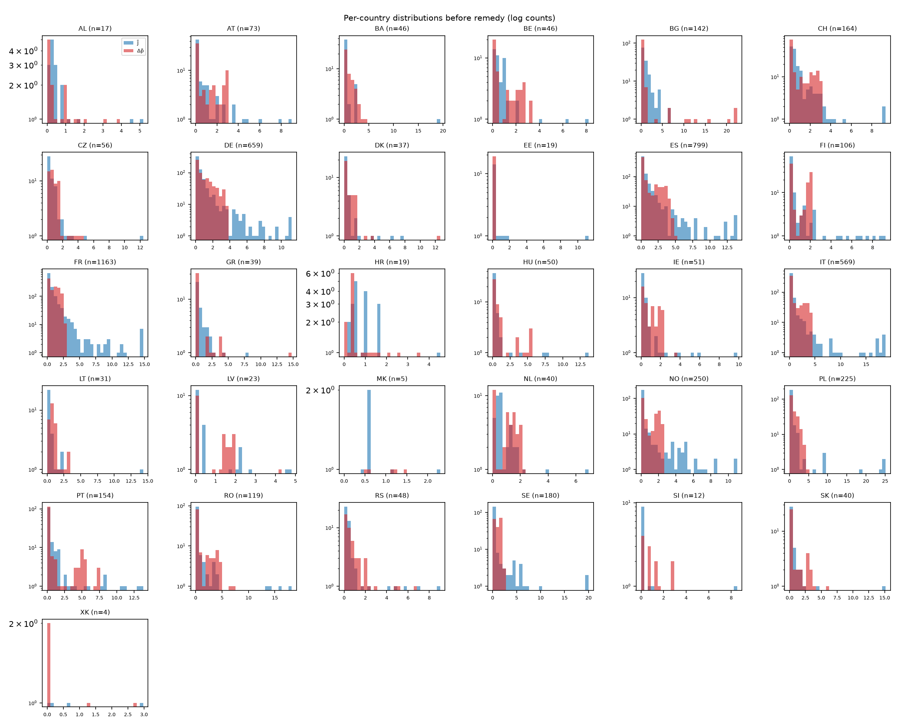
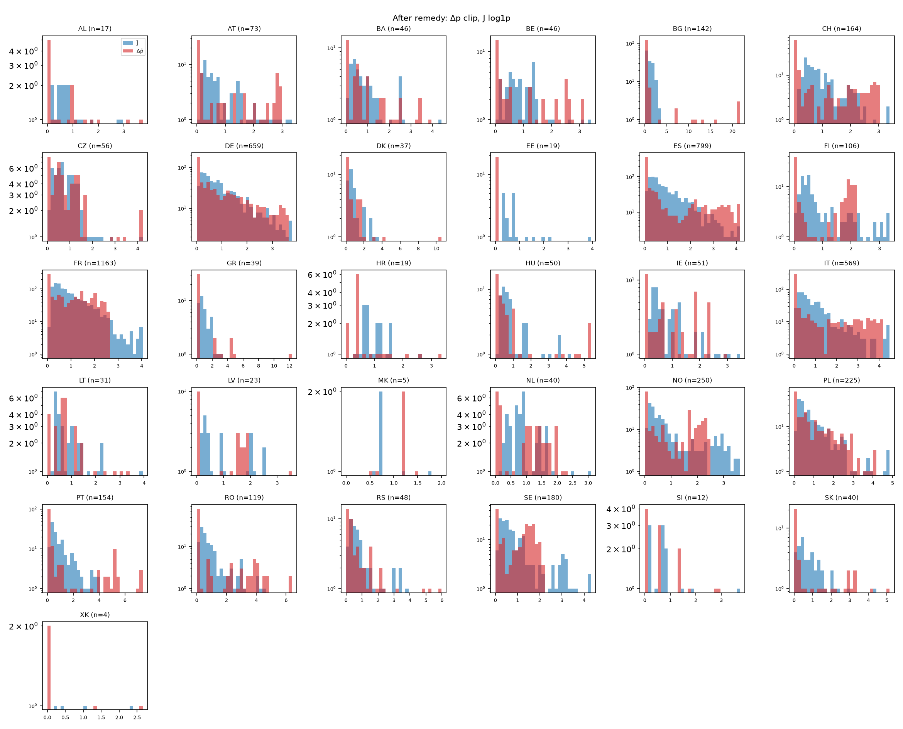

# Normalisation checkpoint (gate)

Generated by `python -m bzgen.cluster.prepare`; narrative written after inspecting the
numbers. Inputs: all 8760 solved hours (weight 1), cross-border edges dropped.

- congestion statistic: **duration** (threshold 1.0 EUR/MWh for duration; quantile q = 0.9)
- shedding policy: **clip** — 8523 of 8760 hours have shedding > 1.0 MW (97.3% of weight), 15.61 TWh
- raw price range -1765 .. 11234 EUR/MWh; bus-hours above +500: 0.0113
- dual degeneracy (second cost-noise seed, 500 hours): bus-hours whose price moves by > 0.5 EUR/MWh: **0.0732%**; hours with at least one such bus: 25.4%; 99th percentile of |Δprice|: 0.086 EUR/MWh
- remedy applied: Δp `clip`, J `log1p`

## Finding and decision

**Statistic.** The default Δp statistic is **duration**: the weighted share of hours with
|Δp| > €1/MWh. Art. 14 asks for *structural*, persistent congestion, and a mean conflates
that with rare spikes. The data support the choice. Across countries the duration statistic
has median skew 1.1 and a median top-1 % share of 0.10, whereas the weighted mean and the q90
have skew up to 17.5 and 16.1: the pocket-driven price spikes dominate them. Duration does
not saturate: at most 15 % of a country's edges exceed 0.9 (AT), and most countries have
none.

**Δp̃ outliers.** Three countries have Δp̃ concentrated on a handful of lines: **BG** (88 %
of edges at zero, one line at 24× the mean, top-1 % share 0.32), **GR** (77 % zero,
top-1 % 0.44) and **DK** (51 % zero, top-1 % 0.39). Here the price signal really is carried
by a few congested lines. That is a property of these countries' nodal prices, not a
numerical artefact, so no transformation can "fix" it without inventing signal. Their
partitions will be driven by those few lines, and that is what the result will say. As a
guard against single-edge dominance, Δp̃ is clipped at each country's 99th percentile before
normalising (`dp_remedy: clip`). This changes at most the top 1 % of edges and does not
change the concentration. **EE has no intra-country price divergence at all** (every edge
zero): it has no congestion signal and its partition is driven by J̃ and the balance term only.

**J̃ outliers — remedy applied.** Raw susceptance is dominated by outliers, as expected,
because reactance spans three orders of magnitude (short lines have tiny x). Raw skew is up
to 10.7 (FR, max 46× the mean), and in small countries the top 1 % of lines (often a single
line) carries 50–75 % of the total (BA, LT, SI, XK). Left like that, the energy would be
driven by a few short lines. **Remedy: `J_remedy: log1p`**, J → log(1 + J / median J), then
normalised by the country mean. Across countries this brings the maximum skew to 2.2 and the
top-1 % share of large countries (≥ 100 edges) to ≤ 0.075, while keeping both the ordering
and relative magnitudes. Clipping at q99 (max skew 5.9) was not enough. A rank transform
(uniform, skew 0) discards all magnitude information and was rejected.

**What remains true after the remedy, and matters for interpretation.** With both terms
normalised to mean 1, the median edge still has w = Δp̃ − αJ̃ > 0 in **45 % of edges at α = 1**
(country median), and 26 % at α = 3. So at α ≈ 1 the Potts energy is *repulsive* on almost
half the edges. Its minimisers at fixed k are contiguous but tend to maximise cut weight.
The reason is that nodal price differences in a meshed DC network are spatial gradients
around congested corridors, not steps at them. The α sweep is where this shows up (share of
repulsive edges and cut ratio are recorded per configuration).

**Degeneracy of the duals.** Re-solving 500 random hours with a second cost-noise seed moves
0.07 % of bus-hours by more than €0.5/MWh (99th percentile of |Δprice| €0.09/MWh). That is
far below the €1/MWh duration threshold, so dual degeneracy does not affect the statistic
used. 25 % of those hours have at least one bus that moves.

**Load shedding.** Shedding occurs in 97 % of hours at five chronic load pockets
(`reports/solve.md`), so excluding shedding hours is impossible. Prices are clipped to
±€500/MWh. Under the duration statistic, a pocket bus's incident lines show |Δp| > €1 in
most hours, so partitions may carve out pockets. Wherever that happens it is flagged as an
artefact of the 220 kV truncation.

**Gate status: passed with the remedies above.** Proceeding to the spectrum and the annealer.

## Before remedy (raw statistic / per-country mean)

| country   |   n_edges |   dp_mean |   dp_skew |   dp_top1pct_share |   dp_max |   dp_zero_frac |   J_mean |   J_skew |   J_top1pct_share |   J_max |
|:----------|----------:|----------:|----------:|-------------------:|---------:|---------------:|---------:|---------:|------------------:|--------:|
| AL        |        17 |         1 |     1.238 |              0.229 |    3.899 |          0.294 |        1 |    2.105 |             0.308 |   5.244 |
| AT        |        73 |         1 |     0.64  |              0.04  |    2.955 |          0.247 |        1 |    2.956 |             0.132 |   9.671 |
| BA        |        46 |         1 |     1.235 |              0.092 |    4.242 |          0.217 |        1 |    6.224 |             0.53  |  24.361 |
| BE        |        46 |         1 |     0.636 |              0.069 |    3.171 |          0.109 |        1 |    3.556 |             0.189 |   8.704 |
| BG        |       142 |         1 |     4.439 |              0.323 |   24.048 |          0.88  |        1 |    1.995 |             0.089 |   6.313 |
| CH        |       164 |         1 |     0.585 |              0.037 |    3.038 |          0.116 |        1 |    3.606 |             0.114 |   9.448 |
| CZ        |        56 |         1 |     1.833 |              0.079 |    4.4   |          0.036 |        1 |    5.687 |             0.272 |  15.245 |
| DE        |       659 |         1 |     0.914 |              0.038 |    3.68  |          0.124 |        1 |    4.04  |             0.128 |  16.415 |
| DK        |        37 |         1 |     4.801 |              0.393 |   14.539 |          0.514 |        1 |    2.571 |             0.215 |   7.739 |
| EE        |        19 |         0 |   nan     |            nan     |    0     |          1     |        1 |    3.828 |             0.643 |  12.225 |
| ES        |       799 |         1 |     1.082 |              0.044 |    4.903 |          0.184 |        1 |    5.698 |             0.163 |  26.768 |
| FI        |       106 |         1 |     0.018 |              0.041 |    2.215 |          0.274 |        1 |    2.814 |             0.175 |   9.882 |
| FR        |      1163 |         1 |     0.259 |              0.027 |    2.614 |          0.082 |        1 |   10.683 |             0.201 |  45.812 |
| GR        |        39 |         1 |     4.529 |              0.442 |   17.221 |          0.769 |        1 |    3.192 |             0.205 |   7.992 |
| HR        |        19 |         1 |     1.306 |              0.187 |    3.56  |          0     |        1 |    2.822 |             0.253 |   4.806 |
| HU        |        50 |         1 |     1.952 |              0.108 |    5.414 |          0.06  |        1 |    4.168 |             0.312 |  15.597 |
| IE        |        51 |         1 |     0.575 |              0.068 |    3.48  |          0.137 |        1 |    3.517 |             0.219 |  11.169 |
| IT        |       569 |         1 |     1.053 |              0.043 |    4.129 |          0.223 |        1 |    5.398 |             0.208 |  22.286 |
| LT        |        31 |         1 |     1.297 |              0.108 |    3.363 |          0.129 |        1 |    5.006 |             0.532 |  16.48  |
| LV        |        23 |         1 |     0.998 |              0.182 |    4.191 |          0.435 |        1 |    1.541 |             0.21  |   4.836 |
| MK        |         5 |         1 |    -0.201 |              0.294 |    1.471 |          0     |        1 |    1.099 |             0.464 |   2.322 |
| NL        |        40 |         1 |    -0.091 |              0.058 |    2.325 |          0.1   |        1 |    3.765 |             0.191 |   7.646 |
| NO        |       250 |         1 |     0.214 |              0.03  |    2.537 |          0.204 |        1 |    3.411 |             0.145 |  16.049 |
| PL        |       225 |         1 |     1.115 |              0.058 |    4.957 |          0.138 |        1 |    6.12  |             0.333 |  25.631 |
| PT        |       154 |         1 |     1.903 |              0.098 |    7.594 |          0.448 |        1 |    4.097 |             0.191 |  16.419 |
| RO        |       119 |         1 |     1.557 |              0.116 |    7.048 |          0.471 |        1 |    4.868 |             0.314 |  21.319 |
| RS        |        48 |         1 |     2.433 |              0.141 |    6.785 |          0.167 |        1 |    2.897 |             0.201 |   9.654 |
| SE        |       180 |         1 |    -0.235 |              0.024 |    2.185 |          0.144 |        1 |    5.156 |             0.225 |  20.28  |
| SI        |        12 |         1 |     0.745 |              0.24  |    2.884 |          0.083 |        1 |    2.942 |             0.746 |   8.958 |
| SK        |        40 |         1 |     1.528 |              0.151 |    6.026 |          0.3   |        1 |    5.35  |             0.444 |  17.746 |
| XK        |         4 |         1 |     0.531 |              0.673 |    2.693 |          0.25  |        1 |    1.023 |             0.753 |   3.011 |

## After remedy

| country   |   n_edges |   dp_mean |   dp_skew |   dp_top1pct_share |   dp_max |   dp_zero_frac |   J_mean |   J_skew |   J_top1pct_share |   J_max |
|:----------|----------:|----------:|----------:|-------------------:|---------:|---------------:|---------:|---------:|------------------:|--------:|
| AL        |        17 |         1 |     1.186 |              0.223 |    3.799 |          0.294 |        1 |    1.296 |             0.169 |   2.878 |
| AT        |        73 |         1 |     0.639 |              0.04  |    2.937 |          0.247 |        1 |    1.144 |             0.047 |   3.418 |
| BA        |        46 |         1 |     1.151 |              0.085 |    3.908 |          0.217 |        1 |    2.061 |             0.107 |   4.939 |
| BE        |        46 |         1 |     0.634 |              0.069 |    3.155 |          0.109 |        1 |    1.526 |             0.076 |   3.473 |
| BG        |       142 |         1 |     4.323 |              0.307 |   21.784 |          0.88  |        1 |    0.58  |             0.046 |   3.294 |
| CH        |       164 |         1 |     0.585 |              0.037 |    3.028 |          0.116 |        1 |    1.165 |             0.041 |   3.397 |
| CZ        |        56 |         1 |     1.792 |              0.076 |    4.259 |          0.036 |        1 |    1.747 |             0.075 |   4.189 |
| DE        |       659 |         1 |     0.908 |              0.037 |    3.525 |          0.124 |        1 |    1.26  |             0.041 |   4.198 |
| DK        |        37 |         1 |     4.159 |              0.323 |   11.947 |          0.514 |        1 |    1.308 |             0.091 |   3.291 |
| EE        |        19 |         0 |   nan     |            nan     |    0     |          1     |        1 |    2.152 |             0.216 |   4.105 |
| ES        |       799 |         1 |     1.063 |              0.042 |    4.179 |          0.184 |        1 |    1.393 |             0.041 |   4.653 |
| FI        |       106 |         1 |     0.017 |              0.041 |    2.151 |          0.274 |        1 |    1.221 |             0.063 |   3.408 |
| FR        |      1163 |         1 |     0.256 |              0.026 |    2.548 |          0.082 |        1 |    1.554 |             0.043 |   5.275 |
| GR        |        39 |         1 |     3.682 |              0.361 |   14.085 |          0.769 |        1 |    1.183 |             0.082 |   3.207 |
| HR        |        19 |         1 |     1.218 |              0.18  |    3.423 |          0     |        1 |    1.294 |             0.135 |   2.562 |
| HU        |        50 |         1 |     1.95  |              0.108 |    5.389 |          0.06  |        1 |    1.932 |             0.085 |   4.243 |
| IE        |        51 |         1 |     0.394 |              0.057 |    2.931 |          0.137 |        1 |    1.377 |             0.071 |   3.62  |
| IT        |       569 |         1 |     1.052 |              0.043 |    4.102 |          0.223 |        1 |    1.82  |             0.048 |   4.663 |
| LT        |        31 |         1 |     1.262 |              0.105 |    3.266 |          0.129 |        1 |    2.097 |             0.137 |   4.242 |
| LV        |        23 |         1 |     0.659 |              0.163 |    3.76  |          0.435 |        1 |    0.716 |             0.111 |   2.562 |
| MK        |         5 |         1 |    -0.216 |              0.293 |    1.464 |          0     |        1 |    0.836 |             0.35  |   1.749 |
| NL        |        40 |         1 |    -0.11  |              0.056 |    2.256 |          0.1   |        1 |    1.491 |             0.081 |   3.236 |
| NO        |       250 |         1 |     0.211 |              0.029 |    2.427 |          0.204 |        1 |    1.207 |             0.044 |   3.949 |
| PL        |       225 |         1 |     1.019 |              0.054 |    4.037 |          0.138 |        1 |    1.98  |             0.065 |   4.866 |
| PT        |       154 |         1 |     1.89  |              0.096 |    7.378 |          0.448 |        1 |    1.622 |             0.051 |   4.055 |
| RO        |       119 |         1 |     1.468 |              0.108 |    6.407 |          0.471 |        1 |    1.812 |             0.075 |   4.564 |
| RS        |        48 |         1 |     2.258 |              0.128 |    6.164 |          0.167 |        1 |    1.59  |             0.08  |   3.823 |
| SE        |       180 |         1 |    -0.242 |              0.023 |    2.106 |          0.144 |        1 |    1.588 |             0.048 |   4.317 |
| SI        |        12 |         1 |     0.742 |              0.24  |    2.876 |          0.083 |        1 |    1.921 |             0.321 |   3.85  |
| SK        |        40 |         1 |     1.326 |              0.134 |    5.377 |          0.3   |        1 |    1.751 |             0.11  |   4.411 |
| XK        |         4 |         1 |     0.516 |              0.67  |    2.679 |          0.25  |        1 |    0.695 |             0.579 |   2.318 |

## Congestion signal per country

Countries flagged `no_congestion_signal` have (almost) no intra-country price divergence:
normalising by a near-zero mean amplifies noise, so their partitions are driven by J̃ and
the balance term, not by congestion. They are still partitioned (k is fixed), and flagged.

| country   |   edges |   share_edges_dp_zero |   max_raw_stat |   country_mean_raw_stat | no_congestion_signal   |
|:----------|--------:|----------------------:|---------------:|------------------------:|:-----------------------|
| AL        |      17 |                0.2941 |         0.0187 |                  0.0048 | True                   |
| AT        |      73 |                0.2466 |         0.9654 |                  0.3268 | False                  |
| BA        |      46 |                0.2174 |         0.1421 |                  0.0335 | False                  |
| BE        |      46 |                0.1087 |         0.8627 |                  0.2721 | False                  |
| BG        |     142 |                0.8803 |         0.0024 |                  0.0001 | True                   |
| CH        |     164 |                0.1159 |         0.9741 |                  0.3206 | False                  |
| CZ        |      56 |                0.0357 |         0.6063 |                  0.1378 | False                  |
| DE        |     659 |                0.1244 |         0.9953 |                  0.2704 | False                  |
| DK        |      37 |                0.5135 |         0.6341 |                  0.0436 | False                  |
| EE        |      19 |                1      |         0      |                  0      | True                   |
| ES        |     799 |                0.184  |         0.9811 |                  0.2001 | False                  |
| FI        |     106 |                0.2736 |         0.6122 |                  0.2763 | False                  |
| FR        |    1163 |                0.0817 |         0.9975 |                  0.3815 | False                  |
| GR        |      39 |                0.7692 |         0.0078 |                  0.0005 | True                   |
| HR        |      19 |                0      |         0.4874 |                  0.1369 | False                  |
| HU        |      50 |                0.06   |         0.7595 |                  0.1403 | False                  |
| IE        |      51 |                0.1373 |         0.3992 |                  0.1147 | False                  |
| IT        |     569 |                0.2232 |         0.9947 |                  0.2409 | False                  |
| LT        |      31 |                0.129  |         0.0095 |                  0.0028 | True                   |
| LV        |      23 |                0.4348 |         0.0049 |                  0.0012 | True                   |
| MK        |       5 |                0      |         0.0146 |                  0.0099 | True                   |
| NL        |      40 |                0.1    |         0.6056 |                  0.2605 | False                  |
| NO        |     250 |                0.204  |         0.5261 |                  0.2074 | False                  |
| PL        |     225 |                0.1378 |         0.4049 |                  0.0817 | False                  |
| PT        |     154 |                0.4481 |         0.6597 |                  0.0869 | False                  |
| RO        |     119 |                0.4706 |         0.9344 |                  0.1326 | False                  |
| RS        |      48 |                0.1667 |         0.1708 |                  0.0252 | False                  |
| SE        |     180 |                0.1444 |         0.5179 |                  0.237  | False                  |
| SI        |      12 |                0.0833 |         0.5671 |                  0.1966 | False                  |
| SK        |      40 |                0.3    |         0.2326 |                  0.0386 | False                  |
| XK        |       4 |                0.25   |         0.0277 |                  0.0103 | False                  |

## Degeneracy by country (share of bus-hours moving > tol between noise seeds)

|    |   share |
|:---|--------:|
| AL | 0       |
| AT | 3e-05   |
| BA | 0       |
| BE | 0.00065 |
| BG | 0       |
| CH | 0.00111 |
| CZ | 0       |
| DE | 0.0004  |
| DK | 0       |
| EE | 0       |
| ES | 0.00012 |
| FI | 0.0009  |
| FR | 0.00234 |
| GR | 0       |
| HR | 0       |
| HU | 6e-05   |
| IE | 0       |
| IT | 0.00069 |
| LT | 0       |
| LU | 0.00825 |
| LV | 0       |
| ME | 0       |
| MK | 0       |
| NL | 0       |
| NO | 0.00047 |
| PL | 0       |
| PT | 0       |
| RO | 0       |
| RS | 0       |
| SE | 6e-05   |
| SI | 0       |
| SK | 0       |
| XK | 0       |
