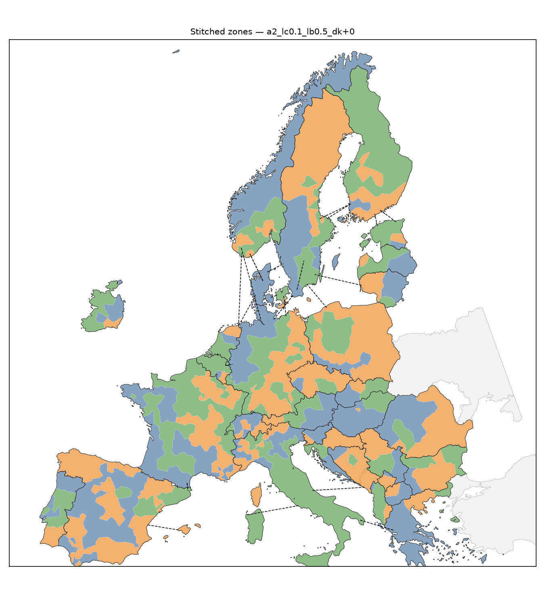
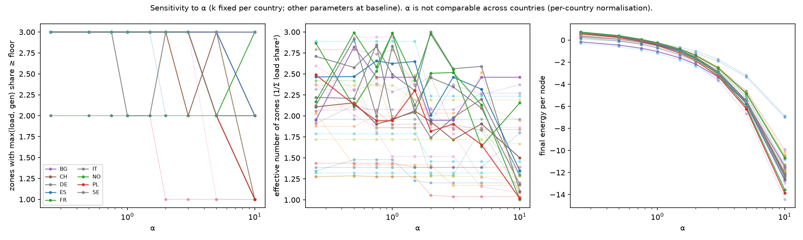
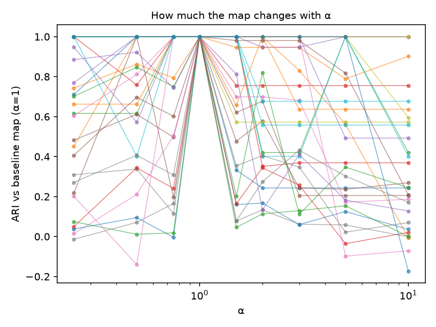

# Results: candidate bidding zones

> Nodal prices are a proxy: these zones are drawn from prices that would change if the
> zones were imposed (see README). Nothing here closes that loop.

Headline configuration: **`a2_lc0.1_lb0.5_dk+0`** (α, λ_c,initial, λ_b, Δk). 17 configurations × 31 countries in `results/sweep.csv`.

## Findings, in order of importance

1. **For most large countries the minimum-energy map is not identifiable.** In the
   headline configuration, the best and second-best of 12 restarts differ structurally
   (ARI 0.12–0.33 for FR, ES, DE, IT, PL, PT) at energy gaps of 0.2–8.6 on energies of
   several hundred. The convergence check makes this sharper. Annealing 4× longer with 24
   restarts lowers the minimum by only 0.1–1 %, yet it finds a **different** map for FR, ES,
   DE, IT, PL and SE (ARI 0.10–0.29 against the sweep's map). Only NO, BG and CH return
   essentially the same map (ARI ≥ 0.85). This is degeneracy of the energy landscape: many
   structurally different partitions lie within ~1 % of the best energy found. The maps for
   these countries should be read as *one* low-energy member of a large near-degenerate set,
   not as *the* partition. Small countries (≤ ~40 buses) are reproducible (ARI 1.0 across
   restarts).
2. **α brackets two failure modes, and no value of α avoids both.** With both terms
   normalised to mean 1, the Potts weight w = Δp̃ − αJ̃ is repulsive on 49 % of edges at α = 1
   (median over large countries), and on 65 % at α = 0.25. The minimisers are then contiguous
   but interdigitated (cut ratio 0.14–0.16). As α grows the zones compact: repulsive share
   0.17 and cut ratio 0.07 at α = 5. But at α = 10 almost everything is attractive, and with
   k fixed the cheapest solution carves off **microzones** (FR 99.7 % / 0.2 % / 0.1 % of load;
   only 71 of 90 zones above the 5 % floor). The small balance term (λ_b = 0.5, deliberately
   kept small) does not prevent this. The headline α = 2 is the largest value on the grid at
   which ≥ 95 % of zones clear the floor (86 of 90). That criterion was chosen after seeing
   the sweep and is stated as such. The α = 1 baseline map is in `figures/europe/`.
3. **Maps are sensitive to every parameter.** Median ARI against the α = 1 map is 0.07–0.34
   across the α grid for large countries (`sensitivity_alpha_ari.png`). Given (1), part of
   this is restart noise rather than a response to the parameter.
4. **k carries no information from the spectrum.** No country's Laplacian eigengap passes a
   Poisson-spacing null test (min p = 0.10, SI), so every k is the fallback (3, or 2 for
   the smallest countries). The Δk sweep (k = 2..5) is in `results/sweep.csv`.
5. **Why the landscape is glassy.** In a meshed DC network, a congested corridor creates
   price *gradients* over a wide area rather than a step at the corridor. Every edge in that
   area shows persistent |Δp| > €1/MWh (duration statistic), so the congestion signal does
   not pick out a boundary. It rewards cutting anywhere in the region, and the fixed-k Potts
   energy then has many equivalent cuts. This is a property of using edge-wise nodal price
   differences as the splitting signal, which the proxy limitation compounds. It is the
   main methodological lesson of this PoC.
6. **Load pockets.** The 220 kV truncation leaves chronic shedding pockets (Munich, Cádiz,
   Rennes, Uppsala, Oslo; `reports/solve.md`). Zone boundaries next to them should be treated
   as artefacts until the network includes sub-transmission.

All 17 configurations × 31 countries end with contiguous zones (HVDC counted as adjacency;
λ_c ramped to a value that guarantees it).

## Headline configuration, per country

`E_gap_2nd` and `ari_best_vs_2nd` compare the best restart with the second best: a small
energy gap with a low ARI means structurally different maps of almost equal energy
(degeneracy). `frac_edges_w_positive` is the share of edges on which the Potts term is
repulsive (w = Δp̃ − αJ̃ > 0); `cut_ratio` is the share of intra-country edges cut.
k was the fallback default in 31 of 31 countries.

| country   |   n_nodes |   k | elbow_convincing   |    energy |   E_spread |   E_gap_2nd |   ari_best_vs_2nd |   restarts_contiguous |   frac_edges_w_positive |   cut_ratio | zone_buses   | zone_load_share   |   n_zones_above_floor |
|:----------|----------:|----:|:-------------------|----------:|-----------:|------------:|------------------:|----------------------:|------------------------:|------------:|:-------------|:------------------|----------------------:|
| FR        |       770 |   3 | False              | -1287.5   |     38.546 |       4.422 |             0.332 |                    12 |                   0.356 |       0.122 | 403/193/174  | 0.539/0.261/0.200 |                     3 |
| ES        |       567 |   3 | False              |  -965.187 |     40.124 |       2.682 |             0.123 |                    12 |                   0.322 |       0.129 | 359/142/66   | 0.665/0.164/0.172 |                     3 |
| DE        |       479 |   3 | False              |  -759.226 |     25.253 |       0.999 |             0.327 |                    12 |                   0.376 |       0.108 | 202/148/129  | 0.331/0.339/0.330 |                     3 |
| IT        |       418 |   3 | False              |  -668.506 |     39.701 |       8.551 |             0.28  |                    12 |                   0.313 |       0.102 | 250/93/75    | 0.734/0.137/0.129 |                     3 |
| NO        |       211 |   3 | False              |  -292.347 |     16.8   |       0.469 |             0.986 |                    12 |                   0.436 |       0.124 | 130/34/47    | 0.372/0.330/0.298 |                     3 |
| PL        |       146 |   3 | False              |  -269.974 |     13.452 |       0.187 |             0.183 |                    12 |                   0.369 |       0.173 | 93/30/23     | 0.711/0.187/0.102 |                     3 |
| SE        |       131 |   3 | False              |  -204.214 |      2.815 |       0.418 |             0.573 |                    12 |                   0.433 |       0.144 | 45/45/41     | 0.113/0.467/0.420 |                     3 |
| BG        |       122 |   3 | False              |  -266.867 |      7.175 |       0.17  |             0.53  |                    12 |                   0.12  |       0.085 | 51/33/38     | 0.666/0.252/0.082 |                     3 |
| CH        |       122 |   3 | False              |  -197.262 |      7.023 |       0.2   |             0.636 |                    12 |                   0.317 |       0.128 | 43/71/8      | 0.177/0.683/0.139 |                     3 |
| PT        |        97 |   3 | False              |  -207.495 |      7.585 |       0.477 |             0.224 |                    12 |                   0.214 |       0.136 | 65/26/6      | 0.680/0.226/0.094 |                     3 |
| RO        |        93 |   3 | False              |  -161.674 |     10.627 |       0     |             1     |                    12 |                   0.261 |       0.126 | 52/27/14     | 0.652/0.315/0.033 |                     3 |
| FI        |        84 |   3 | False              |  -124.419 |      4.018 |       1.094 |             0.744 |                    12 |                   0.396 |       0.151 | 37/38/9      | 0.665/0.286/0.048 |                     3 |
| AT        |        65 |   3 | False              |   -87.051 |      8.395 |       0.234 |             0.946 |                    12 |                   0.438 |       0.096 | 36/19/10     | 0.645/0.257/0.098 |                     3 |
| BE        |        39 |   3 | False              |   -55.376 |      7.732 |       0.537 |             0.351 |                    12 |                   0.304 |       0.087 | 32/6/1       | 0.973/0.019/0.007 |                     1 |
| CZ        |        39 |   3 | False              |   -74.071 |      6.678 |       0     |             1     |                    12 |                   0.357 |       0.214 | 30/7/2       | 0.795/0.153/0.052 |                     3 |
| IE        |        38 |   3 | False              |   -60.786 |      3.735 |       0.617 |             0.634 |                    12 |                   0.353 |       0.157 | 18/16/4      | 0.587/0.361/0.052 |                     3 |
| HU        |        36 |   3 | False              |   -71.241 |      5.816 |       0     |             1     |                    12 |                   0.22  |       0.14  | 26/1/9       | 0.535/0.304/0.161 |                     3 |
| BA        |        35 |   3 | False              |   -60.775 |      9.815 |       0     |             1     |                    12 |                   0.348 |       0.13  | 31/2/2       | 0.875/0.063/0.063 |                     3 |
| NL        |        34 |   3 | False              |   -45.117 |      2.132 |       0     |             1     |                    12 |                   0.325 |       0.125 | 22/8/4       | 0.832/0.079/0.090 |                     3 |
| RS        |        34 |   3 | False              |   -64.822 |      0.272 |       0     |             1     |                    12 |                   0.333 |       0.146 | 23/4/7       | 0.701/0.135/0.164 |                     3 |
| DK        |        32 |   3 | False              |   -50.69  |      1.144 |       0     |             1     |                    12 |                   0.324 |       0.054 | 23/6/3       | 0.485/0.468/0.047 |                     3 |
| SK        |        32 |   3 | False              |   -58.744 |      7.381 |       0.64  |             0.484 |                    12 |                   0.35  |       0.15  | 16/10/6      | 0.590/0.291/0.118 |                     3 |
| GR        |        31 |   3 | False              |   -60.206 |     17.105 |       0     |             1     |                    12 |                   0.205 |       0.077 | 25/4/2       | 0.836/0.146/0.018 |                     3 |
| LT        |        26 |   3 | False              |   -37.783 |      3.988 |       0     |             1     |                    12 |                   0.323 |       0.161 | 10/15/1      | 0.721/0.245/0.034 |                     2 |
| LV        |        19 |   3 | False              |   -30.171 |      8.425 |       0     |             1     |                    12 |                   0.522 |       0.174 | 15/3/1       | 0.813/0.157/0.030 |                     3 |
| HR        |        16 |   3 | False              |   -23.639 |      0.993 |       0     |             1     |                    12 |                   0.316 |       0.211 | 7/5/4        | 0.647/0.188/0.165 |                     3 |
| EE        |        15 |   3 | False              |   -35.654 |      2.261 |       0     |             1     |                    12 |                   0     |       0.158 | 13/1/1       | 0.864/0.068/0.068 |                     3 |
| AL        |        13 |   3 | False              |   -21.047 |      0     |       0     |             1     |                    12 |                   0.353 |       0.118 | 11/1/1       | 0.908/0.080/0.011 |                     2 |
| SI        |         9 |   2 | False              |   -16.302 |      2.975 |       0     |             1     |                    12 |                   0.5   |       0.167 | 8/1          | 0.875/0.125       |                     2 |
| MK        |         5 |   2 | False              |    -5.022 |      0     |       0     |             1     |                    12 |                   0.2   |       0.4   | 2/3          | 0.571/0.429       |                     2 |
| XK        |         5 |   2 | False              |    -5.93  |      0     |       0     |             1     |                    12 |                   0.5   |       0.25  | 4/1          | 0.833/0.167       |                     2 |

Per-country maps: `figures/zones/a2_lc0.1_lb0.5_dk+0/<CC>.png`; all countries on one sheet: `figures/zones/a2_lc0.1_lb0.5_dk+0.png`.

## All configurations (medians over countries)

| config_id              | role                  |   alpha |   lambda_c_initial |   lambda_b |   dk |   countries |   non_contiguous |   degenerate |   median_frac_w_pos |   median_cut_ratio |   median_ari_best_vs_2nd |   median_ari_vs_baseline |   zones_below_floor_total |
|:-----------------------|:----------------------|--------:|-------------------:|-----------:|-----:|------------:|-----------------:|-------------:|--------------------:|-------------------:|-------------------------:|-------------------------:|--------------------------:|
| a1_lc0.1_lb0.5_dk+0    | baseline              |    1    |               0.1  |        0.5 |    0 |          31 |                0 |            1 |               0.459 |              0.16  |                    1     |                  nan     |                         3 |
| a0.25_lc0.1_lb0.5_dk+0 | vary alpha            |    0.25 |               0.1  |        0.5 |    0 |          31 |                0 |            1 |               0.64  |              0.175 |                    0.636 |                    0.701 |                         2 |
| a0.5_lc0.1_lb0.5_dk+0  | vary alpha            |    0.5  |               0.1  |        0.5 |    0 |          31 |                0 |            1 |               0.543 |              0.167 |                    0.799 |                    0.812 |                         2 |
| a0.75_lc0.1_lb0.5_dk+0 | vary alpha            |    0.75 |               0.1  |        0.5 |    0 |          31 |                0 |            1 |               0.5   |              0.161 |                    1     |                    1     |                         2 |
| a1.5_lc0.1_lb0.5_dk+0  | vary alpha            |    1.5  |               0.1  |        0.5 |    0 |          31 |                0 |            1 |               0.4   |              0.146 |                    1     |                    0.946 |                         3 |
| a2_lc0.1_lb0.5_dk+0    | vary alpha            |    2    |               0.1  |        0.5 |    0 |          31 |                0 |            2 |               0.333 |              0.136 |                    1     |                    0.677 |                         4 |
| a3_lc0.1_lb0.5_dk+0    | vary alpha            |    3    |               0.1  |        0.5 |    0 |          31 |                0 |            4 |               0.262 |              0.126 |                    1     |                    0.572 |                         7 |
| a5_lc0.1_lb0.5_dk+0    | vary alpha            |    5    |               0.1  |        0.5 |    0 |          31 |                0 |            8 |               0.176 |              0.1   |                    1     |                    0.558 |                        12 |
| a10_lc0.1_lb0.5_dk+0   | vary alpha            |   10    |               0.1  |        0.5 |    0 |          31 |                0 |            7 |               0.056 |              0.085 |                    0.97  |                    0.269 |                        19 |
| a1_lc0.1_lb0.5_dk-1    | vary dk               |    1    |               0.1  |        0.5 |   -1 |          28 |                0 |            0 |               0.447 |              0.115 |                    1     |                    0.447 |                         0 |
| a1_lc0.1_lb0.5_dk+1    | vary dk               |    1    |               0.1  |        0.5 |    1 |          31 |                0 |            0 |               0.459 |              0.193 |                    0.865 |                    0.766 |                        10 |
| a1_lc0.1_lb0.5_dk+2    | vary dk               |    1    |               0.1  |        0.5 |    2 |          31 |                0 |            1 |               0.459 |              0.206 |                    0.766 |                    0.552 |                        19 |
| a1_lc0.1_lb0_dk+0      | vary lambda_b         |    1    |               0.1  |        0   |    0 |          31 |                0 |            1 |               0.459 |              0.16  |                    1     |                    1     |                         3 |
| a1_lc0.1_lb0.1_dk+0    | vary lambda_b         |    1    |               0.1  |        0.1 |    0 |          31 |                0 |            3 |               0.459 |              0.16  |                    1     |                    1     |                         3 |
| a1_lc0.1_lb2_dk+0      | vary lambda_b         |    1    |               0.1  |        2   |    0 |          31 |                0 |            1 |               0.459 |              0.16  |                    0.947 |                    0.946 |                         2 |
| a1_lc0.02_lb0.5_dk+0   | vary lambda_c_initial |    1    |               0.02 |        0.5 |    0 |          31 |                0 |            2 |               0.459 |              0.16  |                    0.677 |                    1     |                         3 |
| a1_lc0.5_lb0.5_dk+0    | vary lambda_c_initial |    1    |               0.5  |        0.5 |    0 |          31 |                0 |            0 |               0.459 |              0.16  |                    0.84  |                    1     |                         2 |

## Sensitivity to α

## Convergence check (headline configuration)

| country   |   n_nodes |   sweep_E_min |   long_E_min |   long_E_median |   long_E_spread |   improvement |   rel_improvement |   ari_long_vs_sweep_map |
|:----------|----------:|--------------:|-------------:|----------------:|----------------:|--------------:|------------------:|------------------------:|
| FR        |       770 |     -1287.5   |    -1289.22  |       -1272.02  |          28.665 |         1.721 |             0.001 |                   0.102 |
| ES        |       567 |      -965.187 |     -970.156 |        -952.696 |          80.475 |         4.969 |             0.005 |                   0.209 |
| DE        |       479 |      -759.226 |     -760.797 |        -747.427 |          45.906 |         1.571 |             0.002 |                   0.231 |
| IT        |       418 |      -668.506 |     -671.99  |        -659.144 |          31.25  |         3.484 |             0.005 |                   0.294 |
| NO        |       211 |      -292.347 |     -292.805 |        -287.532 |          43.022 |         0.458 |             0.002 |                   0.952 |
| PL        |       146 |      -269.974 |     -271.859 |        -264.631 |          13.309 |         1.885 |             0.007 |                   0.287 |
| SE        |       131 |      -204.214 |     -204.384 |        -203.115 |           6.345 |         0.17  |             0.001 |                   0.232 |
| BG        |       122 |      -266.867 |     -266.892 |        -260.633 |          57.008 |         0.025 |             0     |                   0.947 |
| CH        |       122 |      -197.262 |     -199.275 |        -194.679 |          15.611 |         2.013 |             0.01  |                   0.847 |
