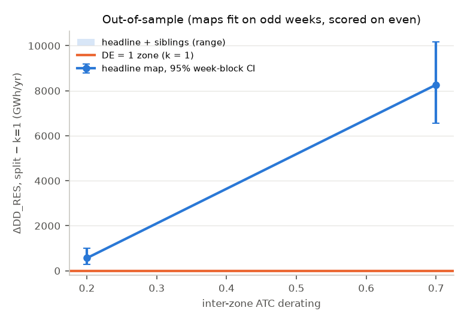
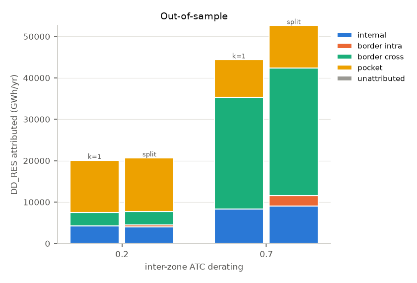
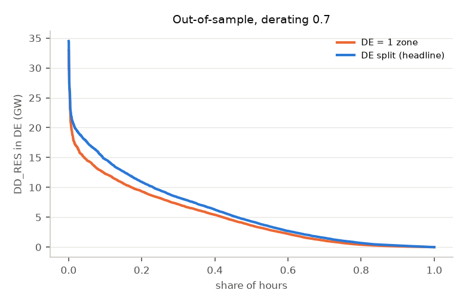
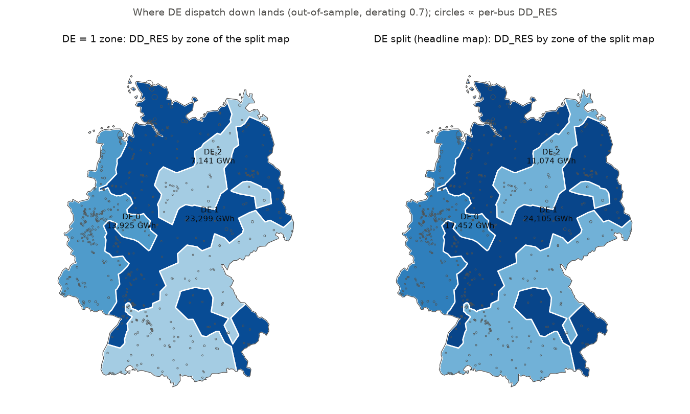

# Validation: does splitting DE into zones reduce dispatch down?

Generated by `python -m bzgen.validate.run`.

> ## Fallbacks and flags
>
> - **Net positions are soft, not fixed (quick-result fix; the brief asked for hard equalities and no relaxation).** With hard equalities most hours were LP-infeasible: the zonal market schedules exchanges the meshed grid cannot deliver even with load shedding. Deviation from a zone's market net position costs €1000/MWh (above every generator cost, below load shedding), so net positions hold wherever redispatch can deliver them. The undeliverable volume is reported (`np_slack_*`, `np_undeliverable_hours*`) and is itself a result: it measures how far the zonal market's exchanges exceed what the grid can carry.
> - **Zone polygons are not an ENTSO-E publication.** No authoritative bidding-zone polygon set was reachable (transparency.entsoe.eu and entsoe.eu blocked by the session's egress policy). SE1–4, NO1–5, DK1–2 and six Italian zones come from Electricity Maps' curated open geometry (`geo/world.geojson`, commit `809539d5c76d`), hash in `data/PROVENANCE.md`.
> - **Italy has 6 zones, not the 7 in force since 2021**: CALA (Calabria) is not in the geometry and sits inside IT-SUD, as in the brief.
> - **Sibling tolerance widened** to 0.01 (from `sweep.degeneracy_rel_tol` = 0.001, at which DE has no near-degenerate restart). Siblings are re-run restarts (fixed crc32 seeds; the sweep's `hash()` seeds are not reproducible). Fewer than 3 siblings are reported as found, not padded.
> - **BNetzA redispatch volume is not sourced**: the 20–30 TWh/yr range is the order of magnitude given in the brief (bundesnetzagentur.de, smard.de, netztransparenz.de blocked).
> - **Chronic load pockets stay in the model** (decision: exclude from statistics only). Their stage-B shedding forces equal down-regulation elsewhere in the same zone, which counts as dispatch down and lands differently under k = 1 (anywhere in DE) and the split map (only in the pocket's zone). This is a confounder of ΔDD, not a finding.
> - **Inferred values** (config, not sourced): reference derating 0.7, markup €1/MWh, pocket threshold 50% of hours, dual tolerance 0.001 €/MWh, RES = onwind, offwind, solar; the derating grid is the brief's.
> - **α = 2 was chosen on the full year** (reports/results.md); the out-of-sample refit reuses it, a small leak of test weeks into the map definition.
> - **Solver path**: stage A and B run on the benchmark's highspy LP (`bzgen/solve/lp.py`), not on `n.optimize()` (≈40 s/h outside the solver on this network); the PyPSA/linopy build of stage B with net positions added via `n.model.add_constraints` is the cross-check (`tests/test_validate.py`, and `--check` on real hours).

Dispatch down in this model is **entirely constraint-driven**. A DC-OPF has no SNSP or inertia limit, so there is no system-wide pro-rata curtailment component. Every MWh counted here comes from a binding zonal ATC, a binding network branch, or zone-wide oversupply that no link can export.

## Headline

**Out-of-sample (primary).** Splitting DE does **not** demonstrably reduce dispatch down under this model: dispatch down is higher with DE split, and the interval excludes zero.

ΔDD_RES (split − k=1) at derating 0.7: **+8,266 GWh/yr**; week-block 95% CI [+6,545, +10,170]; derating band [+564, +8,266]; sibling band [+8,266, +8,266] over 1 map(s).

Negative ΔDD means less dispatch down with DE split.

## Method

1. **Zones.** DE-LU from the map under test (k = 1: one zone). SE, NO, DK, IT by real bidding zone (point-in-polygon; buses outside every polygon of their own country take the nearest one). Every other country is one zone.
2. **Stage A — market.** Buses collapsed to zones. Generators and loads keep their identity. Inter-zone AC cuts become one Link per zone pair (`p_nom = derating · Σ s_nom · s_max_pu`, s_max_pu = 0.7). HVDC is kept as it is, and intra-zone lines are deleted. No KVL.
3. **Stage B — redispatch.** The full nodal network with KVL. Each unit gets an up part (`mc + markup`) and a down part (`−mc + markup` per MWh backed down). The market schedule is a fixed injection. One equality per zone and hour holds the net position (Σ up = Σ down). Net positions are soft in this run (flag above). Load shedding is available at €3000/MWh. No relaxation and no counter-trading.
4. **Metrics** (DE-LU incl. offshore): DD_RES = market spill[RES] + redispatch down[RES]; DD_RES_TH adds thermal down-regulation. Attribution: market spill over binding zonal links (stage-A duals), redispatch down over binding nodal branches touching DE (stage-B duals), weighted by |μ| · capacity. Cost gap `(C_market + C_redispatch − C_nodal) / C_nodal` (physical costs, markup excluded).
5. **Scoring.** Primary: maps refit on odd ISO weeks (edge statistics from `prices.parquet`, same anneal), with stages A and B scored on even weeks only. k = 1 needs no refit. Appendix: full-year maps scored on the full year. Paired by hour. The bootstrap resamples by ISO week (1000 resamples, 95%).
6. **Same inputs as the benchmark**: the same snapshots, the same seeded cost noise (`anneal.seed`, U[0.001, 0.01) €/MWh) and the same worker/block parallelism. The nodal reference was re-solved; its prices differ from `data/solved/prices.parquet` by at most 2.44e-04 €/MWh.

## Maps under test

| map          | role     | fit   |   energy | restart   |
|:-------------|:---------|:------|---------:|:----------|
| k1           | k1       | none  |  nan     |           |
| oos_headline | headline | oos   | -757.904 | 4         |

ARI between the out-of-sample headline and the in-sample headline: 0.27.

In-sample restarts (`results/validate/maps/is_restarts.csv`):

|   restart |   energy |   rel_gap_to_best |   ari_vs_headline | contiguous   | within_tol   | distinct   | sibling   |
|----------:|---------:|------------------:|------------------:|:-------------|:-------------|:-----------|:----------|
|         1 | -757.577 |            0.0022 |            0.1136 | True         | True         | True       | True      |
|         2 | -754.664 |            0.006  |            0.4514 | True         | True         | True       | True      |
|         4 | -752.879 |            0.0084 |            0.623  | True         | True         | True       | True      |
|         7 | -751.564 |            0.0101 |            0.1561 | True         | False        | True       | False     |
|         3 | -748.906 |            0.0136 |            0.2999 | True         | False        | True       | False     |
|         8 | -746.813 |            0.0163 |            0.3402 | True         | False        | True       | False     |
|        10 | -746.794 |            0.0164 |            0.238  | True         | False        | True       | False     |
|         9 | -744.144 |            0.0199 |            0.3063 | True         | False        | True       | False     |
|        11 | -742.043 |            0.0226 |            0.1662 | True         | False        | True       | False     |
|         6 | -741.802 |            0.023  |            0.2096 | True         | False        | True       | False     |
|         5 | -733.581 |            0.0338 |            0.5195 | True         | False        | True       | False     |
|         0 | -729.048 |            0.0397 |            0.0854 | True         | False        | True       | False     |

Out-of-sample restarts (`results/validate/maps/oos_restarts.csv`):

|   restart |   energy |   rel_gap_to_best |   ari_vs_headline | contiguous   | within_tol   | distinct   | sibling   |
|----------:|---------:|------------------:|------------------:|:-------------|:-------------|:-----------|:----------|
|         2 | -757.544 |            0.0005 |            0.4347 | True         | True         | True       | True      |
|         5 | -755.918 |            0.0026 |            0.4973 | True         | True         | True       | True      |
|         6 | -755.203 |            0.0036 |            0.2502 | True         | True         | True       | True      |
|         8 | -750.086 |            0.0103 |            0.211  | True         | False        | True       | False     |
|         7 | -743.58  |            0.0189 |            0.2643 | True         | False        | True       | False     |
|         3 | -737.889 |            0.0264 |            0.0771 | True         | False        | True       | False     |
|         9 | -736.702 |            0.028  |            0.1382 | True         | False        | True       | False     |
|        11 | -735.047 |            0.0302 |            0.3674 | True         | False        | True       | False     |
|        10 | -734.804 |            0.0305 |            0.2901 | True         | False        | True       | False     |
|         0 | -734.225 |            0.0312 |            0.1234 | True         | False        | True       | False     |
|         1 | -720.296 |            0.0496 |            0.1676 | True         | False        | True       | False     |

Real foreign zones (bus counts):

| country   |   buses |   in_polygon |   nearest_polygon |   max_nearest_km | zones                                                             |
|:----------|--------:|-------------:|------------------:|-----------------:|:------------------------------------------------------------------|
| SE        |     133 |          129 |                 4 |              6.2 | SE1:17 SE2:36 SE3:66 SE4:14                                       |
| NO        |     212 |          190 |                22 |             13.9 | NO1:30 NO2:62 NO3:37 NO4:39 NO5:44                                |
| DK        |      32 |           27 |                 5 |             26.6 | DK1:23 DK2:9                                                      |
| IT        |     418 |          414 |                 4 |              1.8 | IT-CNOR:17 IT-CSUD:75 IT-NORD:251 IT-SARD:13 IT-SICI:21 IT-SUD:41 |

## Results

All of `results/validate.csv`, abridged (GWh/yr, M€/yr; shed energy is reported separately and never counted as dispatch down):

|                                   |   DD_RES_GWh |   DD_RES_TH_GWh |   DD_share_of_avail_res |   internal_share |   border_share |   C_redispatch_MEUR |   C_total_MEUR |   efficiency_gap |   lp_infeasible_hours |   np_undeliverable_hours |   np_slack_focus_GWh |   shed_hours_excl_pockets |   shed_focus_GWh |   shed_pocket_GWh |   dDD_RES_GWh |   dDD_RES_lo |   dDD_RES_hi |
|:----------------------------------|-------------:|----------------:|------------------------:|-----------------:|---------------:|--------------------:|---------------:|-----------------:|----------------------:|-------------------------:|---------------------:|--------------------------:|-----------------:|------------------:|--------------:|-------------:|-------------:|
| ('oos_even', 'k1', 0.2)           |      20089.5 |         45932.9 |                   0.081 |            0.565 |          0.435 |             36879.8 |         131140 |            0.095 |                     0 |                     1959 |                0.605 |                      2427 |          7067.55 |           9823.67 |       nan     |      nan     |      nan     |
| ('oos_even', 'oos_headline', 0.2) |      20653.6 |         52752.2 |                   0.083 |            0.518 |          0.482 |             37174.4 |         131444 |            0.098 |                     0 |                     1958 |               14.911 |                      2427 |          7067.55 |           9823.75 |       564.073 |      289.194 |      990.777 |
| ('oos_even', 'k1', 0.7)           |      44365.4 |        115551   |                   0.179 |            0.235 |          0.765 |             72274.6 |         138966 |            0.161 |                     0 |                     4331 |             1292.61  |                      3930 |          7389.61 |          10083.8  |       nan     |      nan     |      nan     |
| ('oos_even', 'oos_headline', 0.7) |      52631.5 |        136685   |                   0.212 |            0.213 |          0.787 |             75154.7 |         141846 |            0.185 |                     0 |                     4332 |             3678.09  |                      4005 |          7678.98 |          10054.7  |      8266.16  |     6545.15  |    10169.8   |

### k = 1 redispatch volume versus BNetzA

| derating   | redispatch_up_focus_GWh   | redispatch_down_focus_GWh   | DD_RES_GWh   | up_plus_down_TWh   |
|------------|---------------------------|-----------------------------|--------------|--------------------|

Reference: 20–30 TWh/yr (unsourced, from the brief). Nothing is tuned to match it. A large gap is expected from the 220 kV truncation (no 110 kV grid, load pockets) and from the idealised market (one perfect ATC auction, perfect redispatch).

## Validity checks

Asserted: `C_market ≤ C_nodal` every hour at derating 1 (the zonal model is a relaxation only there; at lower deratings the ATC is below what the physical cut carries, so violations are reported, not asserted); `C_market(k=1) ≤ C_market(split)` every hour; `C_market + C_redispatch ≥ C_nodal` every feasible hour. Tolerance 1e-06·|C| + €10.

|                                                   |   runs |   hours |   violations |    max_excess_EUR |
|:--------------------------------------------------|-------:|--------:|-------------:|------------------:|
| ('C_market + C_redispatch >= C_nodal', 0.2, True) |      2 |    8736 |            0 | -188597           |
| ('C_market + C_redispatch >= C_nodal', 0.7, True) |      2 |    8736 |            0 |  -55029.2         |
| ('C_market <= C_nodal', 0.2, False)               |      2 |    8736 |          976 |       2.09433e+06 |
| ('C_market <= C_nodal', 0.7, False)               |      2 |    8736 |            0 |   -8861.96        |
| ('C_market(k=1) <= C_market(split)', 0.2, True)   |      1 |    4368 |            0 |       0           |
| ('C_market(k=1) <= C_market(split)', 0.7, True)   |      1 |    4368 |            0 |       0           |

**All asserted checks pass.**

## Load pockets (excluded from the congestion statistics)

Buses shedding in ≥ 50% of nodal hours. Branches incident to them form the `pocket` attribution bucket, which is excluded from the internal/border shares. Shedding is reported separately (`shed_*` columns) and never counted as dispatch down.

|                                  |   shed_hour_share | country   |   lon |   lat |
|:---------------------------------|------------------:|:----------|------:|------:|
| way/24237879-220                 |             0.957 | DE        | 11.29 | 48.05 |
| virtual_way/30859575:1-220       |             0.869 | DE        | 11.3  | 47.65 |
| way/44633677-220                 |             0.763 | ES        | -6.16 | 36.52 |
| virtual_relation/8384686:f:1-225 |             0.742 | FR        | -1.59 | 48.12 |
| way/294798805-220                |             0.637 | SE        | 18.1  | 59.97 |

## Limitations

1. **Nodal network truncated at 220 kV** (reports/solve.md): the load pockets force redispatch that a real 110 kV grid would not need, and the k = 1 redispatch volume is not comparable to BNetzA's.
2. **Idealised market**: one ATC auction with ATC = derating × thermal cut capacity, no flow-based coupling, no minimum-RAM rule, no intraday. Derating is a free parameter; the result is shown across it.
3. **Idealised redispatch**: every unit can be redispatched at mc ± markup, with no gradients, must-run or cross-border redispatch limits. Net positions are fixed exactly.
4. **No storage, hydro without energy limits, and 2019 weather** with the 2025 fleet (README).
5. **Zone polygons are curated open data** (flag above), and Italy has 6 zones.
6. **Degeneracy**: the DE map is one member of a near-degenerate family (reports/results.md). The sibling band measures how much that matters for dispatch down.
7. **Cost-noise ties**: which of several zero-cost RES units spills in a copper-plate zone is decided by the seeded noise. Totals are meaningful; per-unit allocation within a zone is not.
8. **Only DE is split.** Other countries keep one zone (or their real zones). Maps are partitions of DE-LU only.

