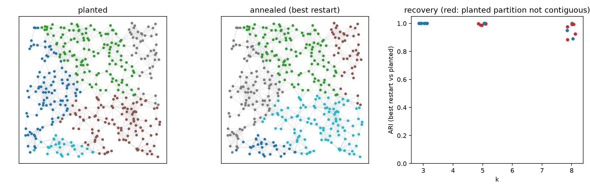

# Annealer validation on planted partitions

Generated by `python -m src.cluster.validate`. Benchmark: `src/cluster/synthetic.py` —
random geometric graph (n≈400) split into k Voronoi zones; price gap high on crossing
edges (×15 vs inside, lognormal noise σ=0.3), susceptance lognormal (σ=0.8) and
independent of the zones; both normalised to mean 1; α = 1; λ_b = 0.1, floor 2 %;
λ_c ramps from 0.1 to the automatic contiguity guarantee; 8 restarts; schedule from
`config/default.yaml`.

Energies of the planted partition are evaluated at the same final λ_c. When the planted
Voronoi partition is itself non-contiguous on the sampled graph (red in the figure) it is
not a valid target under the contiguity constraint, so those cases are listed separately.

**Contiguous planted cases (15):** mean ARI 0.989, min 0.890; best restart reaches the planted energy or lower in 13/15; worst excess 9.21; every restart contiguous in 15/15.

**All cases (24):** mean ARI 0.982; all restarts contiguous in 24/24.

Design history (kept because it matters for trusting the real runs):

1. Single-node flips alone froze at ≈T0/4 with disconnected fragments locked in; the best
   of 6 restarts missed the planted energy in 5/6 cases and ended non-contiguous.
2. Adding **fragment moves** (a whole non-largest component of a zone offered to its best
   adjacent zone, Metropolis-accepted, once per temperature step) recovered the planted
   partition in most cases.
3. Some fragments cost more than a fixed λ_c,final = 5 or 50 to attach (boundary weight
   60–340); these are k-frustrated states (one label spread over two planted regions).
   λ_c,final is therefore set automatically above the bound on any Potts + balance change
   (Σ|w| + 2λ_b + 1), which makes the T=0 fragment pass always restore contiguity.
4. Starting the λ_c ramp high hurts (ARI 0.99 → 0.92 → 0.73 for λ_c0 = 0.1, 0.5, 2):
   strong early contiguity pressure freezes the chain. Default λ_c0 = 0.1.

|   seed |   k |   n | truth_contiguous   |   ari_best |   ari_median_restart |    E_best |   E_truth |   E_best_minus_truth |   E_spread |   frac_restarts_at_best | all_contiguous   |   wall_s |
|-------:|----:|----:|:-------------------|-----------:|---------------------:|----------:|----------:|---------------------:|-----------:|------------------------:|:-----------------|---------:|
|      0 |   3 | 399 | True               |      1     |                1     | -1122.77  | -1122.77  |               -0     |     25.397 |                   0.75  | True             |    7.89  |
|      0 |   5 | 399 | False              |      0.988 |                0.988 | -1164.18  |  4054.73  |            -5218.91  |     16.176 |                   0.625 | True             |    8.572 |
|      0 |   8 | 399 | False              |      0.884 |                0.865 | -1361.09  |  7109.15  |            -8470.24  |     47.448 |                   0.125 | True             |    8.681 |
|      1 |   3 | 400 | True               |      1     |                1     | -1161.52  | -1161.52  |               -0     |     15.169 |                   0.75  | True             |    8.181 |
|      1 |   5 | 400 | True               |      1     |                0.838 | -1257.58  | -1257.58  |               -0     |     27.375 |                   0.25  | True             |    7.798 |
|      1 |   8 | 400 | False              |      0.924 |                0.808 | -1306.29  |  4178.34  |            -5484.64  |     36.104 |                   0.125 | True             |    8.316 |
|      2 |   3 | 400 | True               |      1     |                1     | -1121.64  | -1121.64  |               -0     |     43.695 |                   0.75  | True             |    8.765 |
|      2 |   5 | 400 | True               |      1     |                1     | -1214.78  | -1214.78  |               -0     |      0     |                   1     | True             |    7.478 |
|      2 |   8 | 400 | True               |      1     |                0.878 | -1384.7   | -1384.7   |                0     |     63.606 |                   0.125 | True             |    8.378 |
|      3 |   3 | 400 | True               |      1     |                1     | -1114.83  | -1114.83  |               -0     |     19.058 |                   0.625 | True             |    8.009 |
|      3 |   5 | 400 | True               |      0.995 |                0.995 | -1333.23  | -1331.79  |               -1.438 |     28.315 |                   0.75  | True             |    8.34  |
|      3 |   8 | 400 | True               |      0.95  |                0.879 | -1340.24  | -1348.04  |                7.799 |     37.432 |                   0.125 | True             |    8.027 |
|      4 |   3 | 400 | True               |      1     |                0.599 |  -953.851 |  -953.851 |                0     |     55.877 |                   0.125 | True             |    9.312 |
|      4 |   5 | 400 | False              |      0.998 |                0.998 | -1120.3   |  1338.3   |            -2458.6   |    133.083 |                   0.625 | True             |    7.709 |
|      4 |   8 | 400 | False              |      0.993 |                0.857 | -1318.01  |  1398.86  |            -2716.86  |     35.995 |                   0.25  | True             |    7.407 |
|      5 |   3 | 399 | True               |      1     |                0.564 |  -927.865 |  -927.865 |                0     |     55.402 |                   0.125 | True             |    9.707 |
|      5 |   5 | 399 | False              |      0.997 |                0.785 | -1056.86  |  1377.22  |            -2434.08  |     78.313 |                   0.125 | True             |    6.597 |
|      5 |   8 | 399 | False              |      0.992 |                0.783 | -1194.24  |  1397.18  |            -2591.42  |     57.338 |                   0.125 | True             |    6.415 |
|      6 |   3 | 400 | True               |      1     |                0.725 |  -933.203 |  -933.203 |               -0     |     19.833 |                   0.5   | True             |    8.458 |
|      6 |   5 | 400 | False              |      0.986 |                0.906 | -1192.37  |  3913.58  |            -5105.94  |     25.343 |                   0.25  | True             |    7.702 |
|      6 |   8 | 400 | False              |      0.976 |                0.786 | -1299.84  |  4125.9   |            -5425.74  |     36.658 |                   0.125 | True             |    6.826 |
|      7 |   3 | 399 | True               |      1     |                0.887 | -1171.89  | -1171.89  |               -0     |     34.924 |                   0.375 | True             |    9.173 |
|      7 |   5 | 399 | True               |      1     |                0.852 | -1292.07  | -1292.07  |                0     |     89.872 |                   0.125 | True             |    9.341 |
|      7 |   8 | 399 | True               |      0.89  |                0.828 | -1311.52  | -1320.73  |                9.211 |     29.75  |                   0.125 | True             |    8.582 |
