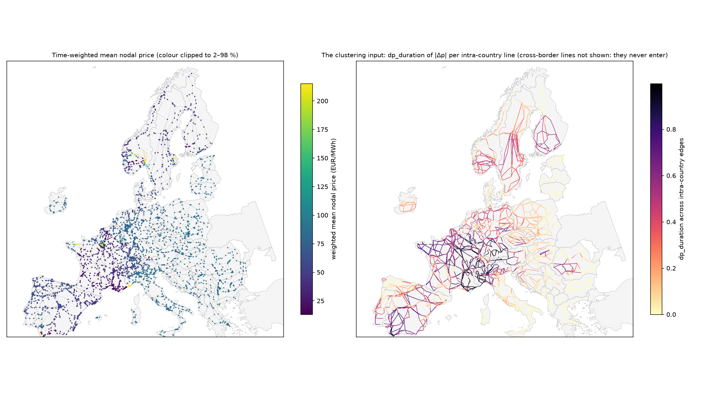

# Nodal-price solve report

Generated by `python -m src.report solve`. DC-OPF per hour (`src/solve/lp.py`, checked
against `pypsa.Network.optimize()`: identical objective and prices to 1e-3 EUR/MWh on
check hours).

- snapshots solved: **8760**, not optimal: **0** []
- hours that needed a solver retry (cold restart / interior point): [['2019-01-01 00:00:00', 'ipm', 'ok'], ['2019-01-23 20:00:00', 'ipm', 'ok'], ['2019-02-15 16:00:00', 'ipm', 'ok']]
- median solve time per hour: 0.097 s

## Load shedding

Shedding (> 1.0 MW) occurs in **8523 of 8760 hours** (97.3%), 15.61 TWh in total, at 52 buses.

| country   |   hours |    GWh |   buses |
|:----------|--------:|-------:|--------:|
| DE        |    8420 | 7163.5 |       2 |
| ES        |    6688 | 1791.8 |       1 |
| FR        |    6501 | 4311.4 |      36 |
| IE        |     680 |   26.1 |       1 |
| IT        |      51 |    1.1 |       4 |
| NO        |    3030 | 1393.7 |       4 |
| SE        |    5581 |  924.3 |       4 |

**Chronic pockets** (shedding in ≥ 50 % of hours): buses whose 220 kV+ connection
cannot carry their allocated load even at low demand. These are artefacts of truncating
the grid at 220 kV (the 110 kV networks that also feed cities are absent) combined with
GDP-weighted, point-in-polygon load allocation (a small, rich NUTS3 region such as a city
puts its whole load on the one bus inside it). A Voronoi-overlap allocation (PyPSA-Eur's
`redistribute_attribute`) was tested and **did not remove them** (it moved them).

| bus                              |   hours |    GWh | country   |   lon |   lat |
|:---------------------------------|--------:|-------:|:----------|------:|------:|
| way/24237879-220                 |    8383 | 5939.6 | DE        |  11.3 |  48   |
| virtual_way/30859575:1-220       |    7613 | 1223.8 | DE        |  11.3 |  47.6 |
| way/44633677-220                 |    6688 | 1791.8 | ES        |  -6.2 |  36.5 |
| virtual_relation/8384686:f:1-225 |    6501 |  636.9 | FR        |  -1.6 |  48.1 |
| way/294798805-220                |    5581 |  304.8 | SE        |  18.1 |  60   |

**Decision:** shedding occurs in almost every hour, so excluding shedding snapshots would
discard almost the whole year. Policy `clip`: prices are clipped
to ±500 EUR/MWh before any statistic (above the most expensive
real generator, below the shedding cost). With the default *duration* statistic (share of
hours with |Δp| > threshold) clipping only affects hours where both ends exceed the cap.

## Prices

Raw price range -1765 .. 11234 EUR/MWh; share of bus-hours above +500: 0.0113, below −500: 0.0006. Prices beyond the most expensive generator and negative prices are genuine DC-OPF
outcomes under binding line limits (loop-flow effects), amplified around shedding pockets.

| country   |   mean_of_bus_means |   min_bus_mean |   max_bus_mean |
|:----------|--------------------:|---------------:|---------------:|
| AL        |                84.7 |           84.5 |           84.8 |
| AT        |                77   |           48.7 |           83.9 |
| BA        |                85.5 |           85.1 |           86.8 |
| BE        |                74.5 |           39.2 |           89.8 |
| BG        |                84.4 |           84.3 |           84.4 |
| CH        |                59.3 |           34.6 |           92.3 |
| CZ        |                85   |           84.2 |           86.5 |
| DE        |                87.7 |           -0.8 |         2940.1 |
| DK        |                56.2 |           49.4 |           59   |
| EE        |                87.4 |           87.4 |           87.4 |
| ES        |                60   |         -457.6 |         2340.9 |
| FI        |                46.1 |           24.9 |           81   |
| FR        |               106.5 |         -246.8 |         2269   |
| GR        |                84.5 |           84.4 |           84.5 |
| HR        |                85.8 |           84.3 |           87.7 |
| HU        |                85.3 |           84.1 |           93.7 |
| IE        |                89.2 |           79.4 |          328   |
| IT        |               100.1 |           42.5 |          623   |
| LT        |                87.4 |           87.3 |           87.5 |
| LU        |               134.8 |          101   |          167.2 |
| LV        |                87.4 |           87.3 |           87.4 |
| ME        |                84.9 |           84.8 |           85   |
| MK        |                84.5 |           84.5 |           84.6 |
| NL        |                71.4 |           60.2 |           76.8 |
| NO        |                97.5 |         -474.8 |         1110   |
| PL        |                87   |           83.2 |           89.9 |
| PT        |                59.5 |           57.1 |           69.7 |
| RO        |                84.1 |           45.9 |           87.8 |
| RS        |                85.1 |           84.3 |           85.5 |
| SE        |                98.6 |           27.3 |         1938.5 |
| SI        |                84.9 |           83.8 |           86.6 |
| SK        |                85.2 |           84.4 |           85.8 |
| XK        |                84.7 |           84.6 |           84.9 |

## Annual energy by carrier (TWh)

| country   |   CCGT |   OCGT |   biomass |   coal |   gas_steam |   geothermal |   lignite |   load_shedding |   nuclear |   offwind |   oil |   onwind |   reservoir |   ror |   solar |
|:----------|-------:|-------:|----------:|-------:|------------:|-------------:|----------:|----------------:|----------:|----------:|------:|---------:|------------:|------:|--------:|
| AL        |    0   |    0   |       0   |    0   |         0   |          0   |       0   |             0   |       0   |       0   |   0   |      0   |        12.8 |   0.9 |     1   |
| AT        |   10.1 |    0   |       1.3 |    0   |         0   |          0   |       0   |             0   |       0   |       0   |   0   |      9.6 |        50.5 |   6.1 |     9.6 |
| BA        |    0   |    0   |       0   |    0   |         0   |          0   |       0.1 |             0   |       0   |       0   |   0   |      0.1 |        12.6 |   0   |     0.7 |
| BE        |    6.2 |    0   |       2   |    0   |         0   |          0   |       0   |             0   |      28.2 |       7.2 |   0   |      7.5 |         0.1 |   0.1 |     9.6 |
| BG        |    0.2 |    0   |       0   |    4.8 |         0   |          0   |       0   |             0   |      15.5 |       0   |   0   |      1.3 |        13.6 |   0.2 |     5.9 |
| CH        |    0.1 |    0   |       1.6 |    0   |         0   |          0   |       0   |             0   |      23   |       0   |   0   |      0   |        53   |  15.3 |     0.1 |
| CZ        |    4.2 |    0   |       0.3 |    5.4 |         0   |          0   |       4.6 |             0   |      30.8 |       0   |   0   |      0.8 |         4.4 |   0   |     4   |
| DE        |   44.9 |    0.4 |      55.6 |   35.9 |         0   |          0.2 |      35.7 |             7.2 |       0   |      32.1 |   0.3 |    111.9 |         2.1 |  10.1 |    88.7 |
| DK        |    0.6 |    0   |       9.8 |    1.4 |         0   |          0   |       0   |             0   |       0   |       9.8 |   0   |     10.5 |         0   |   0   |     3.7 |
| EE        |    0.3 |    0   |       0.4 |    0   |         0   |          0   |       0   |             0   |       0   |       0   |   0   |      1.5 |         0   |   0   |     0.8 |
| ES        |   17.1 |    0   |       4.1 |    2   |         0   |          0   |       0   |             1.8 |      48.1 |       0   |   0   |     69.8 |        46.7 |   0.7 |    54   |
| FI        |    1.5 |    0   |      21.1 |    0.8 |         0   |          0   |       0   |             0   |      31.2 |       0.3 |   0   |     22.7 |         6.9 |   4.7 |     1   |
| FR        |    5.7 |    0   |       3   |    1.2 |         2.1 |          0   |       0   |             4.3 |     413.9 |       3.4 |   3.8 |     47.8 |        19.3 |  15.3 |    27.7 |
| GR        |   10.4 |    0   |       0.1 |    0   |         0   |          0   |       0   |             0   |       0   |       0   |   0   |     11.1 |        19.5 |   0   |    12.6 |
| HR        |    0.4 |    0   |       0   |    1.5 |         0   |          0.3 |       0   |             0   |       0   |       0   |   0   |      3.1 |        10.7 |   1   |     1   |
| HU        |    8.1 |    0   |       1.7 |    0   |         0   |          0   |       0.7 |             0   |      15   |       0   |   0   |      0.7 |         0.2 |   0.1 |     7.9 |
| IE        |   15.4 |    0   |       0.6 |    5   |         0.1 |          0   |       0.1 |             0   |       0   |       0   |   0   |     12   |         0.3 |   0.6 |     1.1 |
| IT        |   68.3 |    0   |       3.4 |   30.3 |         0   |          5.8 |       0   |             0   |       0   |       0.1 |   0   |     24.8 |        39   |  20   |    46   |
| LT        |    0.1 |    0   |       0.8 |    0   |         0   |          0   |       0   |             0   |       0   |       0   |   0   |      5.1 |         0.8 |   0   |     2.2 |
| LU        |    0   |    0   |       0.1 |    0   |         0   |          0   |       0   |             0   |       0   |       0   |   0   |      0.5 |         0   |   0   |     0.6 |
| LV        |    1.6 |    0   |       0.1 |    0   |         0   |          0   |       0   |             0   |       0   |       0   |   0   |      0.4 |         0   |   2   |     0.6 |
| ME        |    0   |    0   |       0   |    0   |         0   |          0   |       0   |             0   |       0   |       0   |   0   |      0   |         2.6 |   0   |     0.1 |
| MK        |    0.3 |    0   |       0   |    0   |         0   |          0   |       0   |             0   |       0   |       0   |   0   |      0   |         2.8 |   0.3 |     1.2 |
| NL        |   22.9 |    0   |       8.3 |   14.6 |         0   |          0   |       0   |             0   |       3.5 |      15.7 |   0   |     16.6 |         0   |   0   |    23.7 |
| NO        |    0   |    0   |       0   |    0   |         0   |          0   |       0   |             1.4 |       0   |       0.3 |   0   |     11.9 |       108.2 |   7.4 |     0.6 |
| PL        |   11   |    0   |       3.8 |   75.5 |         0   |          0   |       1.2 |             0   |       0   |       0   |   0   |     26.3 |         1.5 |   0.2 |    21.2 |
| PT        |    7.5 |    0   |       2.3 |    0   |         0   |          0.2 |       0   |             0   |       0   |       0.1 |   0   |     14.7 |        10.9 |   2.4 |     8.5 |
| RO        |    2.1 |    0   |       0.2 |    0.4 |         0   |          0   |       0   |             0   |      10.5 |       0   |   0   |      6.9 |        24.4 |   9.2 |     5   |
| RS        |    0.3 |    0   |       0.2 |    0   |         0   |          0   |       0.4 |             0   |       0   |       0   |   0   |      1.4 |        11.3 |   1.2 |     0.2 |
| SE        |    0.8 |    0   |      18.2 |    0   |         0   |          0   |       0   |             0.9 |      52.4 |       0.5 |   0.1 |     40.7 |        37.4 |   8.8 |     4.2 |
| SI        |    0.1 |    0   |       0   |    0.4 |         0   |          0   |       0.1 |             0   |       5.4 |       0   |   0   |      0   |         1.9 |   3   |     1.6 |
| SK        |    1.4 |    0   |       0   |    1.1 |         0   |          0   |       0   |             0   |      21.8 |       0   |   0   |      0   |         0.9 |   3.4 |     0.8 |
| XK        |    0   |    0   |       0   |    0   |         0   |          0   |       0   |             0   |       0   |       0   |   0   |      0   |         0.3 |   0.1 |     0   |

Hydro (reservoir + run-of-river) is unconstrained in energy (no storage modelled); compare
with Eurostat natural-hydro generation in `reports/data.md` (hydro CF table).

