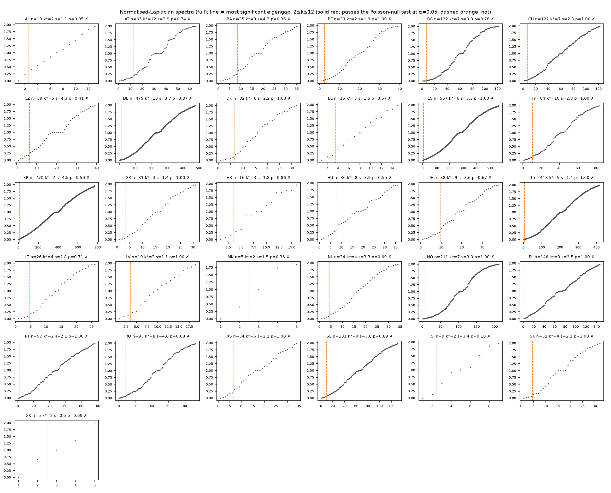
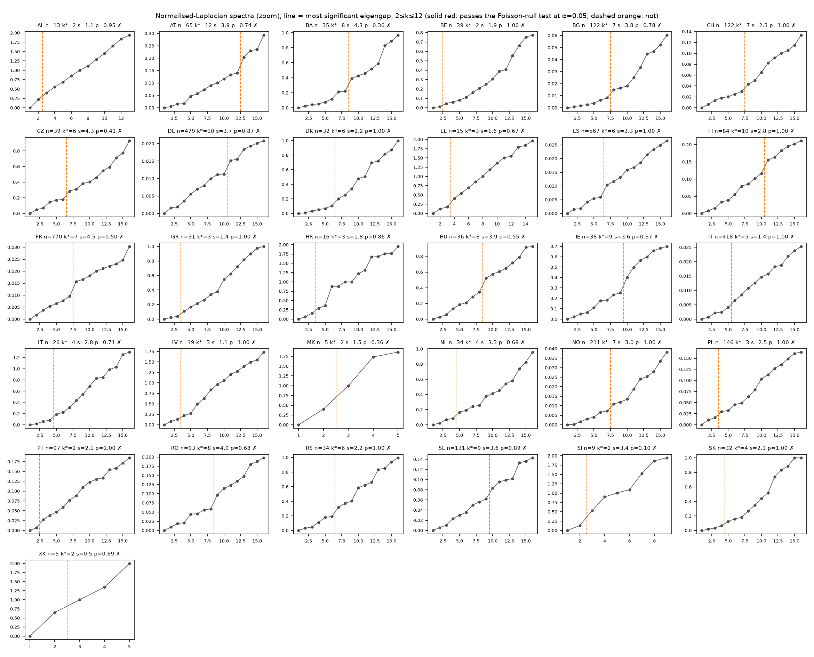

# Laplacian spectra and the choice of k

Generated by `python -m src.cluster.kselect`. Graph: intra-country edges weighted by the
normalised (post-remedy) susceptance J̃; HVDC edges weighted at the country's median J̃;
normalised Laplacian `I − D^-1/2 W D^-1/2`. Elbow: for 2 ≤ k ≤ 12, the gap λ_(k+1) − λ_k divided by the median of its neighbouring gaps
(±3 indices). The plain largest gap is biased to k_max on near-planar graphs, whose
spacing grows with index, so it is reported (`k_largest_gap`) but not used. *Convincing*
if the local significance s exceeds a null threshold: for Poisson (exponential) level
spacing P(gap > s·median) = 2^-s, so with m candidate gaps a family-wise
α = 0.05 test needs s ≥ log2(m/α) (≈ 7.8 for m = 11); `p_poisson_fwer` =
min(1, m·2^-s). (A fixed threshold s ≥ 3 was tried first: under this null it is exceeded
somewhere in 2..12 about 3/4 of the time by chance, and it 'found' 12 zones in Austria.)
Otherwise the documented fallback
k = 3 is used. The search is capped at k ≤ max(2, n/4) (at least ~4
buses per zone): on small graphs a 'gap' near k ≈ n is not a zoning signal.

**0 of 31 countries have a convincing elbow.** Where it is not
convincing the k used is a default, not a finding. Expect weak signals: transmission graphs
are near-planar meshes without natural community structure in susceptance alone.

| country   |   n_nodes |   k_elbow |    gap |   significance |   threshold |   p_poisson_fwer | convincing   |   k_used |   k_largest_gap |   gap_k1 |   lambda2 | note                                       |
|:----------|----------:|----------:|-------:|---------------:|------------:|-----------------:|:-------------|---------:|----------------:|---------:|----------:|:-------------------------------------------|
| AL        |        13 |         2 | 0.1745 |         1.0777 |      5.3219 |           0.9475 | False        |        3 |               2 |   0.2211 |    0.2211 | FALLBACK k=3: no gap >= 5.3x local spacing |
| AT        |        65 |        12 | 0.0635 |         3.8882 |      7.7814 |           0.7429 | False        |        3 |              12 |   0.005  |    0.005  | FALLBACK k=3: no gap >= 7.8x local spacing |
| BA        |        35 |         8 | 0.1689 |         4.2868 |      7.1293 |           0.3586 | False        |        3 |               8 |   0.0235 |    0.0235 | FALLBACK k=3: no gap >= 7.1x local spacing |
| BE        |        39 |         2 | 0.0335 |         1.8776 |      7.3219 |           1      | False        |        3 |               9 |   0.0123 |    0.0123 | FALLBACK k=3: no gap >= 7.3x local spacing |
| BG        |       122 |         7 | 0.0069 |         3.8087 |      7.7814 |           0.785  | False        |        3 |              12 |   0.0009 |    0.0009 | FALLBACK k=3: no gap >= 7.8x local spacing |
| CH        |       122 |         7 | 0.0137 |         2.3456 |      7.7814 |           1      | False        |        3 |              10 |   0.0063 |    0.0063 | FALLBACK k=3: no gap >= 7.8x local spacing |
| CZ        |        39 |         6 | 0.1059 |         4.2954 |      7.3219 |           0.4074 | False        |        3 |               6 |   0.0467 |    0.0467 | FALLBACK k=3: no gap >= 7.3x local spacing |
| DE        |       479 |        10 | 0.0038 |         3.6604 |      7.7814 |           0.87   | False        |        3 |              10 |   0.0016 |    0.0016 | FALLBACK k=3: no gap >= 7.8x local spacing |
| DK        |        32 |         6 | 0.0978 |         2.2116 |      7.1293 |           1      | False        |        3 |               6 |   0.0086 |    0.0086 | FALLBACK k=3: no gap >= 7.1x local spacing |
| EE        |        15 |         3 | 0.2295 |         1.5865 |      5.3219 |           0.6659 | False        |        3 |               3 |   0.1247 |    0.1247 | FALLBACK k=3: no gap >= 5.3x local spacing |
| ES        |       567 |         6 | 0.0045 |         3.2806 |      7.7814 |           1      | False        |        3 |               6 |   0.0016 |    0.0016 | FALLBACK k=3: no gap >= 7.8x local spacing |
| FI        |        84 |        10 | 0.039  |         2.83   |      7.7814 |           1      | False        |        3 |              10 |   0.0085 |    0.0085 | FALLBACK k=3: no gap >= 7.8x local spacing |
| FR        |       770 |         7 | 0.0062 |         4.4538 |      7.7814 |           0.5019 | False        |        3 |               7 |   0.0018 |    0.0018 | FALLBACK k=3: no gap >= 7.8x local spacing |
| GR        |        31 |         3 | 0.0703 |         1.4361 |      6.9069 |           1      | False        |        3 |               7 |   0.0219 |    0.0219 | FALLBACK k=3: no gap >= 6.9x local spacing |
| HR        |        16 |         3 | 0.1323 |         1.8014 |      5.9069 |           0.8607 | False        |        3 |               3 |   0.064  |    0.064  | FALLBACK k=3: no gap >= 5.9x local spacing |
| HU        |        36 |         8 | 0.176  |         3.8725 |      7.3219 |           0.5462 | False        |        3 |               8 |   0.026  |    0.026  | FALLBACK k=3: no gap >= 7.3x local spacing |
| IE        |        38 |         9 | 0.1493 |         3.5703 |      7.3219 |           0.6735 | False        |        3 |               9 |   0.024  |    0.024  | FALLBACK k=3: no gap >= 7.3x local spacing |
| IT        |       418 |         5 | 0.0024 |         1.4197 |      7.7814 |           1      | False        |        3 |              11 |   0.0007 |    0.0007 | FALLBACK k=3: no gap >= 7.8x local spacing |
| LT        |        26 |         4 | 0.1058 |         2.808  |      6.6439 |           0.714  | False        |        3 |               4 |   0.0199 |    0.0199 | FALLBACK k=3: no gap >= 6.6x local spacing |
| LV        |        19 |         3 | 0.0892 |         1.1336 |      5.9069 |           1      | False        |        3 |               3 |   0.0787 |    0.0787 | FALLBACK k=3: no gap >= 5.9x local spacing |
| MK        |         5 |         2 | 0.5958 |         1.474  |      4.3219 |           0.36   | False        |        2 |               2 |   0.4042 |    0.4042 | FALLBACK k=2: no gap >= 4.3x local spacing |
| NL        |        34 |         4 | 0.0817 |         3.3365 |      7.1293 |           0.693  | False        |        3 |               8 |   0.023  |    0.023  | FALLBACK k=3: no gap >= 7.1x local spacing |
| NO        |       211 |         7 | 0.0037 |         3.0228 |      7.7814 |           1      | False        |        3 |              10 |   0.0002 |    0.0002 | FALLBACK k=3: no gap >= 7.8x local spacing |
| PL        |       146 |         3 | 0.0137 |         2.455  |      7.7814 |           1      | False        |        3 |               9 |   0.0107 |    0.0107 | FALLBACK k=3: no gap >= 7.8x local spacing |
| PT        |        97 |         2 | 0.0204 |         2.1042 |      7.7814 |           1      | False        |        3 |               8 |   0.0069 |    0.0069 | FALLBACK k=3: no gap >= 7.8x local spacing |
| RO        |        93 |         8 | 0.0378 |         4.0227 |      7.7814 |           0.6768 | False        |        3 |               8 |   0.009  |    0.009  | FALLBACK k=3: no gap >= 7.8x local spacing |
| RS        |        34 |         6 | 0.1263 |         2.1762 |      7.1293 |           1      | False        |        3 |               6 |   0.0312 |    0.0312 | FALLBACK k=3: no gap >= 7.1x local spacing |
| SE        |       131 |         9 | 0.0216 |         3.62   |      7.7814 |           0.8947 | False        |        3 |               9 |   0.0056 |    0.0056 | FALLBACK k=3: no gap >= 7.8x local spacing |
| SI        |         9 |         2 | 0.4015 |         3.3705 |      4.3219 |           0.0967 | False        |        2 |               2 |   0.131  |    0.131  | FALLBACK k=2: no gap >= 4.3x local spacing |
| SK        |        32 |         4 | 0.0564 |         2.1216 |      7.1293 |           1      | False        |        3 |               7 |   0.0168 |    0.0168 | FALLBACK k=3: no gap >= 7.1x local spacing |
| XK        |         5 |         2 | 0.3486 |         0.5352 |      4.3219 |           0.6901 | False        |        2 |               2 |   0.6514 |    0.6514 | FALLBACK k=2: no gap >= 4.3x local spacing |
